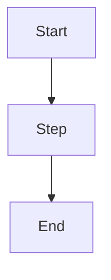

# {Entry Title}

> **TL;DR** — One-sentence summary that answers "what is this and why do I care?"

## 🎯 Context / Why this matters

Brief explanation of the situation or problem this addresses.

## 📖 The details

The bulk of the content — clearly written, broken into short sections.

### Sub-section A

Content...

### Sub-section B

Content...

## 🧪 Examples

Concrete examples, code snippets, or scenarios.

```language
// example code or config
```

## 📊 Diagram



> Replace with whatever diagram type fits best: flowchart, sequence, class, state, ER, gantt, etc.

## 💡 Key takeaways

- Bullet 1
- Bullet 2
- Bullet 3

## ⚠️ Pitfalls / Watch out

- Common mistake 1
- Common mistake 2

## 🔗 Related entries

- [Other entry name](../category/other-entry.md)

## 📚 References

- External link 1
- Internal doc / Confluence page
- Slack thread / ticket
