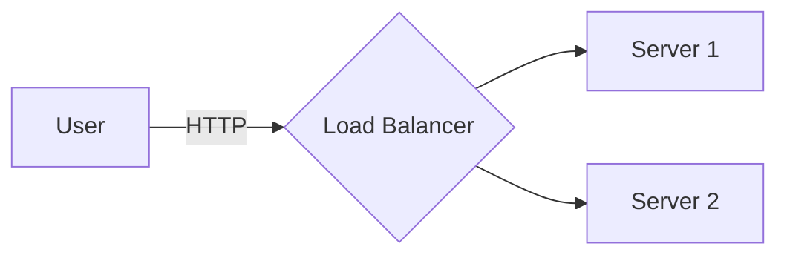

# 🤖 Prompt para OTRO modelo (ChatGPT, Gemini, etc.)

> Este prompt le pide al otro modelo que produzca **solo el contenido markdown del capítulo** — sin tocar archivos ni renderizar diagramas. Ese trabajo lo hago yo después.

---

## PROMPT ↓↓↓ (copiá y pegá esto en el otro modelo, después pegá el texto del capítulo)

Te voy a pasar el texto crudo de un capítulo de un libro de system design. Generame **un único bloque de markdown** con el capítulo procesado siguiendo estas reglas. **No me hagas preguntas, no expliques nada — solo escribí el markdown.**

### Estructura exacta

```markdown
---
title: <Título del capítulo>
category: concepts
tags: [system-design, <otros tags relevantes>]
created: <YYYY-MM-DD de hoy>
updated: <YYYY-MM-DD de hoy>
status: active
---

# Chapter N — <Título>

[⬅ Back to KB index](../../README.md)

> **TL;DR (added)** — <1-3 oraciones tuyas resumiendo el capítulo>

---

## 📖 In this chapter

0. [🎓 For Dummies — empezá por acá](#-for-dummies--empezá-por-acá)
1. [<sección 1>](#<anchor>)
2. [<sección 2>](#<anchor>)
...
N. [⭐ Amplification — <título> (added)](#-amplification--<anchor>)

---

## 🎓 For Dummies — empezá por acá

<contenido del For Dummies — ver reglas abajo>

---

<TEXTO ORIGINAL DEL CAPÍTULO, parafraseado solo donde sea necesario>

<bloques ⭐ Amplification intercalados>

---

## Reference materials

<refs originales + "Original chapter source: ...">
```

### Reglas del 🎓 For Dummies (la parte más importante)

Es lo primero que el lector va a leer. Tiene que ser tan claro que un junior que nunca vio el tema lo entienda.

- **Idioma**: español/spanglish, casual, tutéame ("vos", "decime", "mirá")
- **Lleva con una analogía cotidiana fuerte** — algo que se pueda imaginar:
  - 🍕 asado, pizza, biblioteca, banco, boliche, cocina, restaurante
  - 🎟️ sillas musicales, fichas de casino, billetera, balde con pinchazo
  - 📅 caja registradora, contador, portero
  - 🔁 reloj, ring, círculo
- **Estructura típica**:
  1. *¿Qué es esto?* — la idea en 1-2 oraciones + analogía fuerte
  2. *¿Para qué sirve?* — el problema que resuelve, en lenguaje cotidiano
  3. *Las 3-5 cosas que tenés que saber de memoria* — con tablas o recipientes
  4. *Ejemplo paso a paso* — desmenuzado, sin saltar pasos
  5. *Trucos rápidos* — cheat sheet de números/reglas
  6. *Las 3 trampas comunes* — pitfalls con ⚠️
  7. Cierre: *"¿Listo para la versión completa? ⬇️"*
- **Si hay algoritmos o conceptos múltiples, dale UNA analogía POR CADA UNO**.
  Ejemplos reales:
  - Token bucket → "billetera de fichas"
  - Leaking bucket → "balde con pinchazo"
  - Fixed window → "contador que se resetea"
  - Sliding log → "portero que anota todo"
  - Sliding counter → "promedio inteligente"
  - Consistent hashing → "pizza con porteros"

### Reglas para evitar bloqueos por content policy

El contenido técnico se preserva al 100%. **Las partes narrativas/anecdóticas se parafrasean** en tus propias palabras.

Cosas que típicamente disparan filtros y hay que reescribir:

- ❌ Anécdotas con personajes específicos (estudiantes nombrados, animales antropomorfizados)
- ❌ Directivas en mayúsculas dirigidas a personas nombradas ("DON'T be like X")
- ❌ Escenarios dramáticos de aula, examen, evaluación negativa
- ❌ Lenguaje agresivo o despectivo aunque sea metafórico

Ejemplo de paraphrase:

| Original | Reescrito |
|----------|-----------|
| "DON'T be like Jimmy" + anécdota del aula con tigre | "There's a stereotype of the eager student who blurts out the first answer. In school that earns gold stars. In a system design interview, it does the opposite." |

**Si dudás, parafraseá. Es preferible parafrasear de más.**

### Diagramas → bloques mermaid

Cada figura del original (Figure 1, Figure 2, etc.) la traducís a un bloque ` ```mermaid ` en el markdown.

- Para flujos / arquitecturas → `flowchart TD` o `flowchart LR`
- Para interacciones cliente-servidor con tiempo → `sequenceDiagram`
- Para decisiones → `flowchart TD` con diamonds `{...}`
- Para comparaciones de estados → `stateDiagram-v2`
- **Si la figura es un anillo circular o algo radial** (hash ring, mapa geográfico) → escribí ` ```python-ring ` (en vez de mermaid) y dentro describí en texto qué tiene que dibujar el ring (servers en qué ángulos, keys en qué ángulos, qué resaltar). Yo me encargo después de generar el PNG con Python.

Ejemplo:

```` 

````

Para rings:

```` 
```python-ring
servers: s0 at 30°, s1 at 130°, s2 at 220°, s3 at 320°
keys: k0 at 0°, k1 at 90°, k2 at 180°, k3 at 280°
highlight: clockwise lookup arrows from each key to next server
caption: Each key → first server clockwise
```
````

**No pre-renderices nada**. Solo escribí los bloques. El usuario que recibe esto los renderiza después.

### Reglas de las ⭐ Amplifications

Después de cada sección importante del original, agregá un bloque que **sume valor**:

- Tablas comparativas que el original no tiene
- Updates modernos (qué cambió desde que se escribió el libro)
- Trade-offs explícitos (pro/con)
- Ejemplos de producción real (Cassandra, AWS, GitHub, Stripe, etc.)
- Pitfalls de la vida real
- Pseudo-código mínimo
- Cheat sheets memorizables
- Preguntas típicas de follow-up de entrevistas

Formato:

```markdown
> ### ⭐ Amplification — <título descriptivo>
>
> <contenido>
```

### Tono general

- For Dummies: **español casual, spanglish ok**
- Resto: **inglés, mismo idioma del original**
- Emojis con propósito: 🎓 ⭐ 🍕 ⚠️ 💡 ✅ ❌ 📊
- Tablas siempre que ayuden a escanear

### Output esperado

**Un único bloque markdown completo**, listo para que yo lo copie y se lo pase al modelo que renderiza diagramas y guarda archivos. Sin explicaciones, sin "acá está tu capítulo", sin nada extra. Solo el markdown.

---

## ⬇️ AHORA PEGÁ EL TEXTO DEL CAPÍTULO ABAJO ⬇️

```
[acá pega el texto del capítulo del libro]
```
