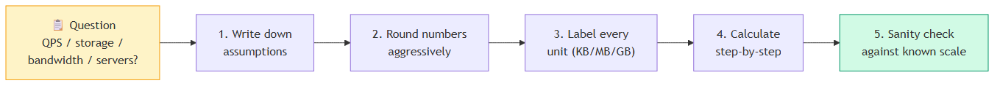
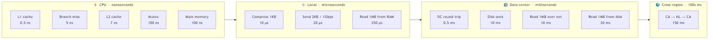
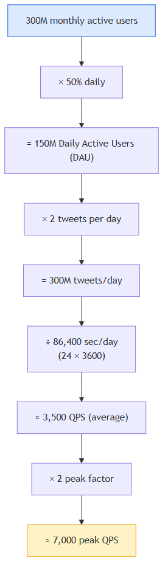
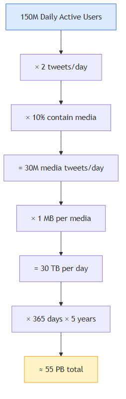

# Chapter 2 — Back-of-the-envelope Estimation

[⬅ Back to KB index](../../README.md)

> **TL;DR (added)** — Back-of-the-envelope estimation is the skill of computing system capacity (QPS, storage, bandwidth, server count) using rounded numbers and a few memorized constants. You don't need precision — you need a good *feel* for the order of magnitude. It's the foundation of every system design interview and a daily tool for sizing real systems.

---

## 📖 In this chapter

0. [🎓 For Dummies — empezá por acá](#-for-dummies--empezá-por-acá) ← **si es la primera vez, leé esto primero**
1. [Power of two](#power-of-two)
2. [Latency numbers every programmer should know](#latency-numbers-every-programmer-should-know)
3. [Availability numbers](#availability-numbers)
4. [Example: Estimate Twitter QPS and storage requirements](#example-estimate-twitter-qps-and-storage-requirements)
5. [Tips](#tips)
6. [Reference materials](#reference-materials)
7. [⭐ Amplification — Estimation methodology and cheat sheets (added)](#-amplification--estimation-methodology-and-cheat-sheets-added)

---

## 🎓 For Dummies — empezá por acá

### ¿Qué es "back-of-the-envelope estimation"?

Es **hacer cuentas rápidas en una servilleta** para saber qué tan grande necesita ser un sistema. No precisión — solo orden de magnitud.

🍕 **Analogía**: organizás un asado para 50 personas. ¿Cuánta carne comprás? No vas a pesar exacto lo que come cada uno. Hacés *"500g × 50 = 25 kg, compro 30 por las dudas"*. Listo. Eso es back-of-the-envelope.

En sistemas en vez de carne estimás 4 cosas:

1. **QPS** = pedidos por segundo (queries per second)
2. **Storage** = cuánto disco necesito
3. **Bandwidth** = cuánta data viaja por la red
4. **Servers** = cuántas computadoras necesito

### ¿Para qué sirve?

Antes de construir algo querés saber: *"¿necesito 1 servidor o 1,000?"*. Si tu cuenta dice "1 millón de servidores" tu diseño está mal. Si dice "1 servidor para 8 mil millones de usuarios" también. Es un **sanity check**.

### Las 3 cosas que tenés que saber de memoria

#### 1. Tamaños de datos (pensalos como recipientes)

| | Tamaño | Analogía |
|---|---|---|
| **1 KB** | 1,000 bytes | 🥤 vaso (≈ una página de texto) |
| **1 MB** | 1,000 KB | 🪣 balde (≈ una foto) |
| **1 GB** | 1,000 MB | 🛁 bañera (≈ una peli SD) |
| **1 TB** | 1,000 GB | 🏊 pileta (≈ 250,000 fotos) |
| **1 PB** | 1,000 TB | 🌊 lago (≈ 13 años de video HD) |

Cada paso = **× 1,000**.

#### 2. Latency (qué tan rápido es cada cosa)

| Cosa | Tiempo | Analogía |
|---|---|---|
| Cache del CPU | nanosegundos (ns) | leer una palabra que tenés enfrente |
| RAM | 100 ns | agarrar un libro de tu biblioteca |
| SSD | microsegundos | ir a la biblioteca del barrio |
| Disco rígido viejo | 10 ms | ir a la biblioteca del otro barrio |
| Red dentro del datacenter | 0.5 ms | mensaje al depto de al lado |
| Cruzar continentes | 150 ms | llamada telefónica a Holanda |

🎯 **Regla clave**: cada nivel siguiente es ~1,000× más lento. Por eso importa tanto cachear y usar CDN cerca del usuario.

#### 3. Los "nueves" de availability

Cuánto tiempo al año está roto tu sistema:

| Nines | % | Roto al año |
|---|---|---|
| 2 nueves | 99% | 3.65 días 😬 |
| 3 nueves | 99.9% | 8.76 horas |
| 4 nueves | 99.99% | 52 minutos |
| 5 nueves | 99.999% | 5 minutos 💪 |

Cada nueve más = **10× más plata y esfuerzo**.

### 🐦 El ejemplo de Twitter, paso a paso

**Pregunta**: ¿cuántos tweets por segundo?

**Paso 1 — Asumí (números redondos)**:
- 300 millones de usuarios totales
- La mitad usa Twitter cada día → 150M usuarios activos diarios
- Cada uno tweetea 2 veces al día

**Paso 2 — Multiplicá**:
```
150,000,000 usuarios × 2 tweets = 300,000,000 tweets/día
```

**Paso 3 — Convertí a "por segundo"**:
```
1 día = 86,400 segundos (redondeá a ~100,000 para hacer fácil)
300,000,000 ÷ 100,000 ≈ 3,000 tweets/segundo
```

**Paso 4 — Hora pico** (multiplicá × 2):
```
3,000 × 2 ≈ 6,000 tweets/segundo en pico
```

¡Listo! Esa es tu estimación. No es exacta — es aproximada — pero te dice el orden de magnitud para diseñar.

### 📦 Para storage (cuánto disco)

**Pregunta**: ¿cuánto disco para guardar fotos por 5 años?

```
150M usuarios × 2 tweets × 10% con foto = 30M fotos/día
30M fotos × 1 MB cada una = 30 TB/día
30 TB × 365 días × 5 años ≈ 55 PB
```

### 🪜 Los 5 pasos siempre

1. **Anotá tus suposiciones** — "asumo X usuarios"
2. **Redondeá** — 86,400 → 100,000. No pierdas tiempo en precisión
3. **Etiquetá unidades** — "5" no significa nada, "5 MB" sí
4. **Calculá paso a paso** — un número a la vez
5. **Sanity check** — "¿1 EB/día para una app de chat? Mmm sospechoso"

### 💡 Trucos rápidos

- ⚡ Multiplicá QPS × 2 para hora pico
- 📚 Lecturas:escrituras suelen ser 10:1 (la gente lee más de lo que escribe)
- 💾 Cada servidor aguanta ~1,000-10,000 QPS
- 🔁 Multiplicá storage × 3 si replicás (común para alta disponibilidad)

### ¿Listo para la versión completa?

Ahora que tenés la idea, leé el resto del capítulo abajo. Si te perdés, volvé acá. ⬇️

---

In a system design interview, sometimes you are asked to estimate system capacity or performance requirements using a back-of-the-envelope estimation. According to Jeff Dean, Google Senior Fellow, "back-of-the-envelope calculations are estimates you create using a combination of thought experiments and common performance numbers to get a good feel for which designs will meet your requirements" [1].

You need to have a good sense of scalability basics to effectively carry out back-of-the-envelope estimation. The following concepts should be well understood: power of two [2], latency numbers every programmer should know, and availability numbers.

> ### ⭐ Amplification — the estimation methodology
>
> Before diving into the numbers, here's the systematic process I'll reference throughout. Every estimation question follows roughly the same 5-step flow:
>
> 
>
> | Step | What to do | Why |
> |------|-----------|-----|
> | 1. Assumptions | Write down every number you assume (DAU, payload size, growth) | Forces you to make them explicit; the interviewer can challenge them; you can change one and re-derive |
> | 2. Round | 86,400 sec/day → ~100,000; 365 days → ~400 | You're not computing taxes — you're sizing infrastructure. ±20% is fine |
> | 3. Label units | "5" is meaningless. "5 MB" is a number | Saves you from off-by-1000 errors |
> | 4. Calculate | Step by step, one transformation at a time | Mistakes get caught in review |
> | 5. Sanity-check | Compare to known reference points | "Is 30 TB/day plausible? YouTube uploads ~720k hours/day…" |

---

## Power of two

Although data volume can become enormous when dealing with distributed systems, calculation all boils down to the basics. To obtain correct calculations, it is critical to know the data volume unit using the power of 2. A byte is a sequence of 8 bits. An ASCII character uses one byte of memory (8 bits). Below is a table explaining the data volume unit (Table 1).

### Table 1 — Data volume units

| Power | Approximate value | Full name | Short name |
|-------|-------------------|-----------|------------|
| 10    | 1 Thousand        | 1 Kilobyte | 1 KB |
| 20    | 1 Million         | 1 Megabyte | 1 MB |
| 30    | 1 Billion         | 1 Gigabyte | 1 GB |
| 40    | 1 Trillion        | 1 Terabyte | 1 TB |
| 50    | 1 Quadrillion     | 1 Petabyte | 1 PB |

> ### ⭐ Amplification — KB vs KiB, and the prefix beyond Petabyte
>
> **The 1000 vs 1024 trap.** Two prefix systems exist and people mix them up constantly:
>
> | Prefix | Decimal (SI) | Binary (IEC) | Difference at this scale |
> |--------|-------------|--------------|--------------------------|
> | Kilo   | KB = 10³ = 1,000 bytes | KiB = 2¹⁰ = 1,024 bytes | 2.4% |
> | Mega   | MB = 10⁶ | MiB = 2²⁰ = 1,048,576 | 4.9% |
> | Giga   | GB = 10⁹ | GiB = 2³⁰ ≈ 1.074 × 10⁹ | 7.4% |
> | Tera   | TB = 10¹² | TiB = 2⁴⁰ ≈ 1.1 × 10¹² | 10% |
> | Peta   | PB = 10¹⁵ | PiB = 2⁵⁰ ≈ 1.126 × 10¹⁵ | 12.6% |
>
> 🧪 **Real-world example**: that "1 TB" SSD shows as "931 GiB" in your OS — same bytes, different prefix system. For estimation interviews, **always use decimal (1 KB = 1,000)** unless the question specifies binary.
>
> **Beyond Petabyte** (you'll see these eventually):
> - Exabyte (EB) = 10¹⁸ — Google's monthly search index
> - Zettabyte (ZB) = 10²¹ — total annual internet traffic
> - Yottabyte (YB) = 10²⁴ — way beyond current scale
>
> 🧪 **Memorize for sizing**: 1 GB ≈ 1,000 MP3 songs · 1 TB ≈ 250,000 photos · 1 PB ≈ 13 years of HD video.

---

## Latency numbers every programmer should know

Dr. Dean from Google reveals the length of typical computer operations in 2010 [1]. Some numbers are outdated as computers become faster and more powerful. However, those numbers should still be able to give us an idea of the fastness and slowness of different computer operations.

### Table 2 — Operation latencies

| Operation name | Time |
|---|---|
| L1 cache reference | 0.5 ns |
| Branch mispredict | 5 ns |
| L2 cache reference | 7 ns |
| Mutex lock/unlock | 100 ns |
| Main memory reference | 100 ns |
| Compress 1K bytes with Zippy | 10,000 ns = 10 µs |
| Send 2K bytes over 1 Gbps network | 20,000 ns = 20 µs |
| Read 1 MB sequentially from memory | 250,000 ns = 250 µs |
| Round trip within the same datacenter | 500,000 ns = 500 µs |
| Disk seek | 10,000,000 ns = 10 ms |
| Read 1 MB sequentially from the network | 10,000,000 ns = 10 ms |
| Read 1 MB sequentially from disk | 30,000,000 ns = 30 ms |
| Send packet CA (California) → Netherlands → CA | 150,000,000 ns = 150 ms |

**Notes**

- ns = nanosecond, µs = microsecond, ms = millisecond
- 1 ns = 10⁻⁹ seconds
- 1 µs = 10⁻⁶ seconds = 1,000 ns
- 1 ms = 10⁻³ seconds = 1,000 µs = 1,000,000 ns

A Google software engineer built a tool to visualize Dr. Dean's numbers. The tool also takes the time factor into consideration. Figure 1 shows the visualized latency numbers as of 2020 (source of figures: reference material [3]).

### Figure 1 — Latency tiers (operations grouped by speed)



By analyzing the numbers in Figure 1, we get the following conclusions:

- Memory is fast but the disk is slow.
- Avoid disk seeks if possible.
- Simple compression algorithms are fast.
- Compress data before sending it over the internet if possible.
- Data centers are usually in different regions, and it takes time to send data between them.

> ### ⭐ Amplification — human-scaled latency (the ratio is what matters)
>
> Numbers in nanoseconds are abstract. Scale them up so **1 ns = 1 second**, then they map to human time. This is the *single most useful trick* for understanding why disk and cross-region latency dominate everything:
>
> | Operation | Real time | Scaled (1 ns = 1 sec) |
> |-----------|-----------|------------------------|
> | L1 cache reference | 0.5 ns | **0.5 seconds** |
> | Branch mispredict | 5 ns | 5 seconds |
> | L2 cache reference | 7 ns | 7 seconds |
> | Main memory | 100 ns | **1.5 minutes** |
> | Send 2KB over 1Gbps | 20 µs | 5.5 hours |
> | Read 1MB from RAM | 250 µs | **3 days** |
> | DC round-trip | 500 µs | 6 days |
> | Disk seek | 10 ms | **4 months** |
> | Read 1MB from network | 10 ms | 4 months |
> | Read 1MB from disk | 30 ms | **1 year** |
> | CA → NL → CA | 150 ms | **5 years** |
>
> 💡 **Punchline**: a single cross-continent round trip is to a CPU what *waiting 5 years* is to you. This is why CDNs, caches, and async processing matter so much.
>
> **What changed since 2010**:
> - **SSDs replaced spinning disks** in most datacenters → "disk seek" is now ~16 µs (random read on SSD), not 10 ms. 600× faster.
> - **NVMe** dropped sequential reads further: 1 MB from NVMe ≈ 1 ms (vs 30 ms for spinning).
> - **Network within DC** still ~500 µs — physics hasn't changed.
> - **Cross-region** still ~100–200 ms — limited by the speed of light. CA→NL is ~6,000 miles × 2 = 12,000 mi @ ~125,000 mi/s through fiber = ~95 ms theoretical minimum. The other 50 ms is routing/queuing.
>
> ⚠️ **Speed of light limit**: light travels ~300 km in 1 ms. Two servers 300 km apart can NEVER round-trip in less than ~2 ms, no matter how good your hardware is.

---

## Availability numbers

High availability is the ability of a system to be continuously operational for a desirably long period of time. High availability is measured as a percentage, with 100% means a service that has 0 downtime. Most services fall between 99% and 100%.

A service level agreement (SLA) is a commonly used term for service providers. This is an agreement between you (the service provider) and your customer, and this agreement formally defines the level of uptime your service will deliver. Cloud providers Amazon [4], Google [5] and Microsoft [6] set their SLAs at 99.9% or above. Uptime is traditionally measured in nines. The more the nines, the better. As shown in Table 3, the number of nines correlate to the expected system downtime.

### Table 3 — Availability vs downtime

| Availability % | Downtime per day | Downtime per week | Downtime per month | Downtime per year |
|----------------|------------------|--------------------|---------------------|-------------------|
| 99%      | 14.40 minutes      | 1.68 hours       | 7.31 hours    | 3.65 days  |
| 99.99%   | 8.64 seconds       | 1.01 minutes     | 4.38 minutes  | 52.60 minutes |
| 99.999%  | 864.00 milliseconds | 6.05 seconds    | 26.30 seconds | 5.26 minutes |
| 99.9999% | 86.40 milliseconds | 604.80 ms       | 2.63 seconds  | 31.56 seconds |

> ### ⭐ Amplification — what each level of 9s actually requires
>
> **Filling in the gap** (the original table jumps from 99% to 99.99% — here's the in-between):
>
> | Nines | Availability | Downtime/year | Realistic for |
> |-------|--------------|----------------|---------------|
> | 2 nines | 99%      | 3.65 days   | Hobby / internal tools |
> | 3 nines | 99.9%    | 8.76 hours  | Small business SaaS |
> | 4 nines | 99.99%   | 52.6 min    | Production B2B SaaS |
> | 5 nines | 99.999%  | 5.26 min    | Critical systems (telephony, payments) |
> | 6 nines | 99.9999% | 31.5 sec    | Stock exchanges, mission-critical |
>
> 💡 **Each extra 9 is roughly 10× harder and ~10× more expensive.** Going from 99.9% to 99.99% might mean adding a second region. Going to 99.999% means you can't even take systems down for deployment without orchestrated zero-downtime procedures.
>
> **Composability rule** — if a request hits 3 services in series, total availability is the *product*:
>
> | Component | Availability |
> |-----------|--------------|
> | Service A | 99.9% |
> | Service B | 99.9% |
> | Service C | 99.9% |
> | **End-to-end** | 99.9% × 99.9% × 99.9% = **99.7%** |
>
> ⚠️ Adding dependencies multiplies failure surface. To beat this, you add **redundancy** (parallel paths) — two 99% components in parallel give you 1 - (1-0.99)² = 99.99%.
>
> **Cloud SLA reality check**: AWS/GCP/Azure offer 99.99% for most regional services, but only when used correctly (multi-AZ deployment, etc.). Ignoring the fine print = you don't actually get the SLA.

---

## Example: Estimate Twitter QPS and storage requirements

Please note the following numbers are for this exercise only as they are not real numbers from Twitter.

**Assumptions:**

- 300 million monthly active users.
- 50% of users use Twitter daily.
- Users post 2 tweets per day on average.
- 10% of tweets contain media.
- Data is stored for 5 years.

**Estimations:**

### Query per second (QPS) estimate

- Daily active users (DAU) = 300 million * 50% = **150 million**
- Tweets QPS = 150 million * 2 tweets / 24 hour / 3600 seconds = **~3,500**
- Peak QPS = 2 * QPS = **~7,000**



### Storage estimate

We will only estimate media storage here.

**Average tweet size:**

| Field | Size |
|-------|------|
| `tweet_id` | 64 bytes |
| `text` | 140 bytes |
| `media` | 1 MB |

- Media storage: 150 million * 2 * 10% * 1 MB = **30 TB per day**
- 5-year media storage: 30 TB * 365 * 5 = **~55 PB**



> ### ⭐ Amplification — extending the Twitter estimate
>
> The original chapter stops at QPS and media storage. In a real interview you'd be asked to push further — here are the next 3 numbers and how to derive them:
>
> **1. Bandwidth (egress)**
>
> Reads usually dominate: assume 10:1 read:write ratio (people consume more than they post).
>
> | Step | Calculation | Result |
> |------|-------------|--------|
> | Tweet size (text only) | 64 + 140 ≈ 200 bytes | 200 B |
> | Read QPS | 7,000 peak × 10 | 70,000 QPS |
> | Text egress | 70,000 × 200 B | 14 MB/s |
> | Media egress (10% × 1 MB × read amplification) | 7,000 × 0.1 × 1 MB × 10 | 7 GB/s |
> | **Total egress** | dominated by media | **~7 GB/s = 56 Gbps** |
>
> **2. Cache size** (rule of thumb: cache 20% of daily reads, 80/20 rule)
>
> | Step | Calculation | Result |
> |------|-------------|--------|
> | Daily reads | 70,000 QPS × 86,400 sec | 6 B reads/day |
> | Daily unique tweets read | assume 1B (de-dup) | 1 B |
> | Cache 20% of those | 200 M tweets × 200 B | 40 GB hot tweet cache |
>
> **3. Number of servers**
>
> Assume each web server handles 1,000 QPS (typical for moderate work).
>
> | Step | Calculation | Result |
> |------|-------------|--------|
> | Peak total QPS (read + write) | 7,000 + 70,000 | 77,000 QPS |
> | Servers needed | 77,000 / 1,000 | **77 servers** |
> | + redundancy (×2 for fault tolerance) | 77 × 2 | **~150 servers** |
>
> 💡 **The pattern**: QPS → Bandwidth → Cache → Servers. Master this chain and you can size any system.

---

## Tips

Back-of-the-envelope estimation is all about the process. Solving the problem is more important than obtaining results. Interviewers may test your problem-solving skills. Here are a few tips to follow:

- **Rounding and Approximation.** It is difficult to perform complicated math operations during the interview. For example, what is the result of "99987 / 9.1"? There is no need to spend valuable time to solve complicated math problems. Precision is not expected. Use round numbers and approximation to your advantage. The division question can be simplified as follows: "100,000 / 10".

- **Write down your assumptions.** It is a good idea to write down your assumptions to be referenced later.

- **Label your units.** When you write down "5", does it mean 5 KB or 5 MB? You might confuse yourself with this. Write down the units because "5 MB" helps to remove ambiguity.

- **Commonly asked back-of-the-envelope estimations:** QPS, peak QPS, storage, cache, number of servers, etc. You can practice these calculations when preparing for an interview. Practice makes perfect.

Congratulations on getting this far! Now give yourself a pat on the back. Good job!

---

## Reference materials

- [1] J. Dean. *Google Pro Tip: Use Back-Of-The-Envelope-Calculations To Choose The Best Design*: http://highscalability.com/blog/2011/1/26/google-pro-tip-use-back-of-the-envelope-calculations-to-choo.html
- [2] System design primer: https://github.com/donnemartin/system-design-primer
- [3] Latency Numbers Every Programmer Should Know (interactive): https://colin-scott.github.io/personal_website/research/interactive_latency.html
- [4] Amazon Compute Service Level Agreement: https://aws.amazon.com/compute/sla/
- [5] Compute Engine Service Level Agreement (SLA): https://cloud.google.com/compute/sla
- [6] SLA summary for Azure services: https://azure.microsoft.com/en-us/support/legal/sla/summary/
- Original chapter source: *System Design Interview – An Insider's Guide* (Alex Xu), Chapter 2.

---

## ⭐ Amplification — Estimation methodology and cheat sheets (added)

### 🧠 Magic numbers worth memorizing

These come up so often they belong in muscle memory:

| Constant | Value | Use |
|----------|-------|-----|
| Seconds in a day | 86,400 ≈ **10⁵** | Convert daily volume → QPS |
| Seconds in a year | 31.5 M ≈ **3 × 10⁷** | Convert yearly storage → bytes |
| Days in a year | 365 ≈ **400** (round up for headroom) | Yearly multipliers |
| Read:write ratio (typical web) | **10:1** to 100:1 | Cache sizing, replica count |
| Peak factor | **~2×** average | Provisioning |
| 80/20 rule | 20% of items get 80% of traffic | Cache hit rate, hotspot analysis |
| 1 server typical capacity | **1,000 – 10,000 QPS** | Server count estimation |
| TCP packet size | ~1.5 KB MTU | Packet count |
| Standard HTTP response | ~10 KB | Bandwidth estimation |
| One image | ~200 KB – 1 MB | Storage per upload |
| One video min | ~10 MB | Video storage |

### 📐 Common calculation patterns

**Pattern 1 — Daily volume → QPS**

```
QPS = (DAU × actions/user) / 86,400
peak_QPS = 2 × QPS
```

**Pattern 2 — QPS → storage per day**

```
storage/day = QPS × 86,400 × avg_record_size
```

**Pattern 3 — QPS → bandwidth**

```
bandwidth = QPS × avg_response_size × read_amplification
```

**Pattern 4 — Total storage with retention**

```
total = storage/day × retention_days × replication_factor
```

**Pattern 5 — Number of servers**

```
servers = peak_QPS / per_server_QPS_capacity
+ ~50–100% redundancy buffer
```

### 🎯 Common interview question types

| Question | What they want to hear |
|----------|------------------------|
| "Estimate QPS for X" | Pattern 1 + reasonable peak factor |
| "How much storage in 5 years?" | Pattern 2 + Pattern 4 with retention |
| "How big should the cache be?" | Apply 80/20 rule to working set |
| "How many servers?" | Pattern 5 + redundancy |
| "Network bandwidth?" | Pattern 3 + identify dominant payload (text vs media) |
| "Database size?" | Records/day × retention + indexes (~30% extra) |

### ⚠️ Common pitfalls

- ❌ **Forgetting peak factor.** Average QPS ≠ what you provision for.
- ❌ **Mixing decimal and binary prefixes.** Pick one (decimal is easier).
- ❌ **Forgetting replication.** A 30 TB workload often becomes 90 TB with 3× replication.
- ❌ **Forgetting indexes/metadata.** A "100 GB of records" database is closer to 130–150 GB on disk.
- ❌ **Ignoring read amplification.** Reads usually dominate writes by 10–100×.
- ❌ **Sub-second precision.** "3,472 QPS" is suspicious. "~3,500 QPS" is professional.
- ❌ **No sanity check.** "1 EB per day for a chat app" should set off alarms.

### 🧪 Sanity-check reference points (real-world scale)

| System | Approximate scale (use to sanity-check your estimates) |
|--------|-------------------------------------------------------|
| Google search | ~100,000 QPS |
| Twitter/X tweets | ~6,000 tweets/sec average |
| YouTube uploads | ~720,000 hours/day |
| Instagram photos | ~95M/day |
| Netflix peak streaming | ~15% of internet traffic |
| WhatsApp messages | ~100B/day |
| Gmail users | ~1.8B |
| Facebook DAU | ~2B |

If your estimate is wildly different from these reference points, double-check your assumptions.
