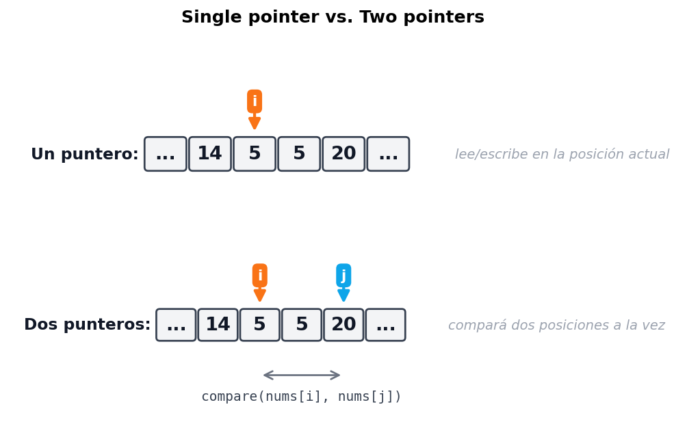
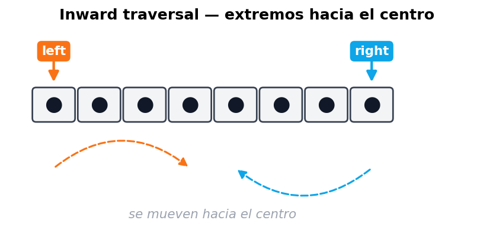
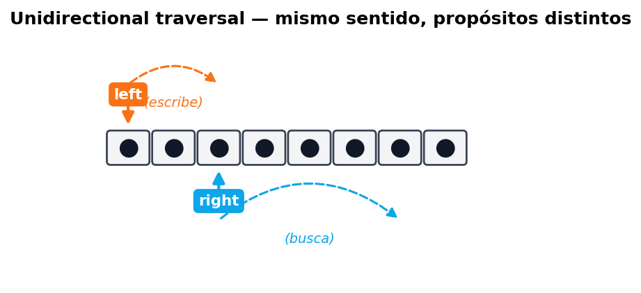
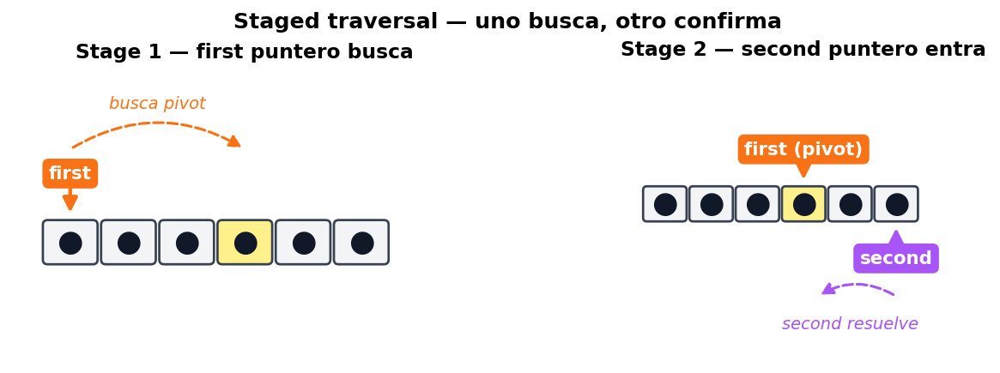
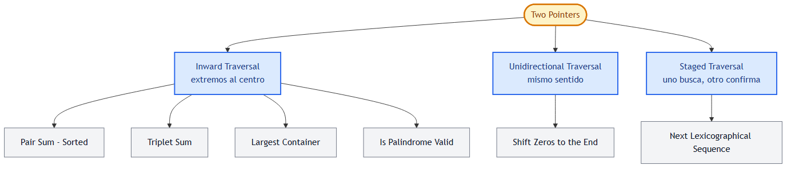

# Chapter 1 — Two Pointers

> 📍 **Cap. 1 / Book III** — Two Pointers · _Capítulo raíz_ · [Primer problema: Pair Sum ➡](./pair-sum-sorted.md) · [📚 KB Index](../../../../README.md)

> **TL;DR** — Two Pointers reemplaza un doble for-loop O(n²) por dos índices que se mueven a lo largo de una estructura lineal en O(n). Funciona cuando el input tiene **dinámica predecible** (sorted array, palíndromo simétrico, posiciones complementarias) y la pregunta es del tipo "encontrar un par/triplete" o "reordenar in-place".

---

## 📑 In this chapter

0. [🎓 For Dummies — empezá por acá](#-for-dummies--empezá-por-acá)
1. [Qué es un "puntero" en este contexto](#qué-es-un-puntero-en-este-contexto)
2. [Por qué dos punteros vencen al doble for-loop](#por-qué-dos-punteros-vencen-al-doble-for-loop)
3. [Las tres estrategias canónicas](#las-tres-estrategias-canónicas)
   - [Inward traversal](#inward-traversal-extremos-hacia-el-centro)
   - [Unidirectional traversal](#unidirectional-traversal-mismo-sentido)
   - [Staged traversal](#staged-traversal-uno-busca-otro-confirma)
4. [Cuándo usar Two Pointers](#cuándo-usar-two-pointers)
5. [Ejemplo del mundo real: garbage collection](#ejemplo-del-mundo-real-garbage-collection)
6. [Mapa del capítulo](#mapa-del-capítulo)
7. [⭐ Amplification: decision matrix](#-amplification-decision-matrix)
8. [⚠️ Pitfalls comunes](#️-pitfalls-comunes)
9. [References](#references)

### 🧭 Navegación rápida — los 6 problemas

| # | Problema | Strategy | Difficulty |
|---|----------|----------|-----------|
| 1 | [Pair Sum — Sorted](./pair-sum-sorted.md) | Inward | 🟢 Easy |
| 2 | [Triplet Sum (3Sum)](./triplet-sum.md) | Inward + outer loop | 🟡 Medium |
| 3 | [Largest Container](./largest-container.md) | Inward | 🟡 Medium |
| 4 | [Is Palindrome Valid](./is-palindrome-valid.md) | Inward | 🟢 Easy |
| 5 | [Shift Zeros to the End](./shift-zeros-to-the-end.md) | Unidirectional | 🟢 Easy |
| 6 | [Next Lexicographical Sequence](./next-lexicographical-sequence.md) | Staged | 🟡 Medium |

---

## 🎓 For Dummies — empezá por acá

Imaginate que tenés una **fila ordenada** de gente con un cartel con la edad. Te piden encontrar **dos personas cuya edad sume 50**.

**Brute force (cómo lo haría alguien sin pensar):** agarrás a cada persona, y para esa persona vas a comparar contra todas las demás. Si hay 100 personas, eso son 100 × 100 = **10.000 comparaciones**. O sea, te morís de aburrimiento.

**Two pointers (la posta):** poneé un dedo al inicio (la persona más joven) y otro al final (la más vieja). Sumá las dos edades:

- **¿La suma da menos que 50?** → necesitás más edad → movés el dedo de la **izquierda** una posición a la derecha (a alguien más viejo).
- **¿La suma da más que 50?** → te pasaste → movés el dedo de la **derecha** una posición a la izquierda (a alguien más joven).
- **¿Da exactamente 50?** → bingo, encontraste el par.

En una sola pasada (≈100 movimientos en vez de 10.000) terminaste. **Eso es two pointers**: convertís O(n²) en O(n) **aprovechando que el input está ordenado** (la "dinámica predecible").

### La idea en una analogía aún más cotidiana

Pensalo como una **balanza de farmacia antigua**:
- A la izquierda ponés la cabeza de la fila (los livianos).
- A la derecha la cola de la fila (los pesados).
- Si la balanza marca menos de lo que querés, **sacás un liviano y ponés uno un poco más pesado** (mover left).
- Si marca de más, **sacás un pesado y ponés uno un poco más liviano** (mover right).
- Si marca justo, listo.

Cada movimiento te acerca a la respuesta de forma garantizada. Nunca tenés que volver atrás.

### Las 3 trampas más comunes

- ⚠️ **Pensar que sirve para arrays sin orden.** Si el array no es sorted (o no tiene otra dinámica predecible como simetría), mover el puntero no te garantiza acercarte a la respuesta. Two pointers **no es magia**: necesita un input con estructura.
- ⚠️ **Olvidarse de la condición de salida.** Casi siempre es `while left < right`. Si usás `<=`, comparás un elemento contra sí mismo (y eso a veces rompe la lógica, ej: pair-sum donde no podés usar el mismo índice dos veces).
- ⚠️ **Mover los dos punteros cuando solo deberías mover uno.** En problemas como pair-sum solo se mueve uno por iteración (decidido por la comparación). Si los movés a los dos siempre, te saltás respuestas válidas.

¿Listo para la versión completa? ⬇️

---

## Qué es un "puntero" en este contexto

Un **puntero** acá no es un puntero de C/C++. Es simplemente una **variable que guarda un índice o posición** dentro de una estructura lineal (array, string, linked list).

Con un solo puntero podés hacer una pasada simple y leer/escribir en esa posición. Con **dos**, desbloqueás la capacidad de **comparar dos elementos al mismo tiempo** sin tener que rebobinar:



---

## Por qué dos punteros vencen al doble for-loop

La forma "naive" de comparar todas las parejas es:

```javascript
for (let i = 0; i < n; i++) {
    for (let j = i + 1; j < n; j++) {
        compare(nums[i], nums[j]);
    }
}
```

Esto cuesta **O(n²)** porque revisa cada par. El problema: **no aprovecha información** que el input pueda tener.

Two pointers explota una **dinámica predecible** en el input. El ejemplo más típico es un sorted array: si movés un puntero a la derecha, **garantizás** que el valor en la nueva posición es **mayor o igual** que el anterior. Esa garantía es lo que te permite **descartar combinaciones enteras** sin probarlas.

> **Regla de oro:** si podés explicar por qué mover el puntero **descarta** un subconjunto entero de respuestas posibles, two pointers va a funcionar. Si no podés, probablemente necesites otro pattern (hash map, sliding window, DP).

---

## Las tres estrategias canónicas

### Inward traversal (extremos hacia el centro)

Los punteros arrancan en los **extremos opuestos** y se mueven hacia adentro.



**Cuándo usarla:** problemas donde necesitás comparar elementos de **extremos opuestos**:
- [Pair Sum - Sorted](./pair-sum-sorted.md) (sumar puntas).
- [Is Palindrome Valid](./is-palindrome-valid.md) (comparar simetría).
- [Largest Container](./largest-container.md) (área entre dos columnas).
- [Triplet Sum](./triplet-sum.md) (después de fijar `a`, busca par con inward).

**Decisión típica:** según la comparación entre `nums[left]` y `nums[right]`, movés `left++`, `right--`, o ambos.

---

### Unidirectional traversal (mismo sentido)

Los dos punteros arrancan **en el mismo extremo** y se mueven en el **mismo sentido**, pero a velocidades distintas o con propósitos distintos.



**Cuándo usarla:** problemas donde **uno de los punteros busca** información y el **otro mantiene el estado** (típicamente la próxima posición de escritura):
- [Shift Zeros to the End](./shift-zeros-to-the-end.md) (`right` busca no-cero, `left` marca dónde escribir).
- Remove duplicates from sorted array.
- Merge sorted arrays in-place.

**Diferencia clave con sliding window:** en sliding window los dos punteros forman una "ventana" que se mueve. En unidirectional two-pointer **no necesariamente** mantenés un rango contiguo entre ambos: podés sobrescribir.

---

### Staged traversal (uno busca, otro confirma)

El **primer puntero** recorre el array buscando una condición. Cuando la encuentra, **el segundo puntero** entra en escena y hace una operación adicional.



**Cuándo usarla:** problemas en **dos fases**, donde la segunda fase depende de algo que descubrió la primera:
- [Next Lexicographical Sequence](./next-lexicographical-sequence.md) (primero buscar el pivot, luego buscar el rightmost successor).
- Algunas variantes de partitioning.

---

## Cuándo usar Two Pointers

Indicadores fuertes de que el problema admite two pointers:

| Indicador | Por qué |
|-----------|---------|
| Input es **lineal** (array, string, linked list) | Two pointers necesita una estructura recorrible por índice. |
| Input está **sorted** o tiene **simetría** (palíndromo) | La dinámica predecible te permite descartar pares al moverte. |
| Te piden **un par / triplete / k-tupla** que cumple una condición | Naturalmente mapea a "fijar uno, buscar el otro con dos punteros". |
| Te piden **modificar el array in-place** (mover, eliminar, particionar) | Unidirectional two-pointer suele resolverlo sin memoria extra. |
| El brute force es **O(n²)** y necesitás **O(n)** o **O(n log n)** | Two pointers es la herramienta canónica de reducción. |

Si **ninguno** de estos aplica, probablemente two pointers no es el pattern. Mirá si encaja hash map (búsqueda O(1)), sliding window (subarray contiguo con condición), o binary search (búsqueda en sorted con descarte logarítmico).

---

## Ejemplo del mundo real: garbage collection

En **memory compaction** (parte clave del garbage collection), el goal es liberar memoria contigua eliminando los huecos que dejan los objetos muertos.

Two pointers lo resuelve elegantemente:

```
Heap antes de compactar (O = vivo, X = muerto):

  [ O   X   O   X   X   O   O   X   O ]

Dos punteros:
   - free  → próxima posición libre donde escribir
   - scan  → recorre el heap buscando objetos vivos

Heap después:

  [ O   O   O   O   O   _   _   _   _ ]
                        ▲
                        free apunta acá → todo lo de la derecha es libre
```

Es **literalmente shift-zeros-to-the-end** pero con objetos vivos en lugar de números no-cero. La técnica es la misma.

Otros ejemplos del mundo real:
- **Database compaction** (LSM trees, RocksDB) — mismo patrón aplicado a SSTables.
- **Buffer compaction** en networking (TCP receive buffer reordering).
- **String trimming / deduplication** in-place en parsers.

---

## Mapa del capítulo



| # | Problema | Estrategia | Dificultad | Link |
|---|----------|------------|------------|------|
| 1 | Pair Sum - Sorted | Inward | 🟢 Easy | [pair-sum-sorted.md](./pair-sum-sorted.md) |
| 2 | Triplet Sum | Inward + outer loop | 🟡 Medium | [triplet-sum.md](./triplet-sum.md) |
| 3 | Largest Container | Inward | 🟡 Medium | [largest-container.md](./largest-container.md) |
| 4 | Is Palindrome Valid | Inward | 🟢 Easy | [is-palindrome-valid.md](./is-palindrome-valid.md) |
| 5 | Shift Zeros to the End | Unidirectional | 🟢 Easy | [shift-zeros-to-the-end.md](./shift-zeros-to-the-end.md) |
| 6 | Next Lexicographical Sequence | Staged | 🟡 Medium | [next-lexicographical-sequence.md](./next-lexicographical-sequence.md) |

> El pattern de two pointers es muy amplio. Variantes más especializadas se tratan en capítulos separados:
> - **Fast and Slow Pointers** (Cap. 4) — punteros que se mueven a velocidades distintas (cycle detection).
> - **Sliding Windows** (Cap. 5) — los dos punteros mantienen un rango contiguo con una condición.

---

## ⭐ Amplification: decision matrix

Cuando ves un problema nuevo, esta tabla te ayuda a elegir la estrategia:

| Pista en el enunciado | Estrategia probable |
|-----------------------|---------------------|
| "sorted array" + "find pair / triplet that sums to X" | **Inward** — pair sum o triplet sum |
| "palindrome" / "símetrico" / "comparar punta con cola" | **Inward** — comparación directa |
| "área / volumen / container" entre dos elementos | **Inward** — largest container, trapping rain water |
| "modificar in-place" / "remove / shift / partition" | **Unidirectional** — un puntero lee, el otro escribe |
| "remove duplicates from sorted array" | **Unidirectional** clásico |
| "next permutation" / "rearrange" siguiendo una regla local | **Staged** — encontrar pivot y luego ajustar |
| "sort 0s, 1s, 2s in place" (Dutch flag) | **Tres punteros** (variante de unidirectional) |
| "find pair in unsorted array" | **NO two pointers** — probablemente hash map |
| "longest substring with condition" | **NO two pointers clásico** — sliding window |

### Heurística rápida (3 preguntas)

1. **¿El input es lineal y tiene orden o simetría?** → Two pointers viable.
2. **¿El brute force es O(n²) por probar todas las parejas?** → Two pointers va a bajar a O(n).
3. **¿Necesito modificar in-place o encontrar un par/triplete?** → Two pointers casi seguro.

Si las 3 dan "sí", apuntá a two pointers. Si la #1 da "no", probablemente necesites otro pattern (hash map para unsorted, DP para problemas con subestructura).

---

## ⚠️ Pitfalls comunes

- **No verificar que el array esté sorted.** Pair sum **necesita** sorted. Si en la entrevista te dan unsorted, primero ordenás (O(n log n)) o usás hash map (O(n) pero con espacio extra). Aclaralo siempre con el entrevistador.
- **Off-by-one en la condición de salida.** Casi siempre `while left < right`. Usar `<=` te hace comparar `nums[i]` consigo mismo, lo cual rompe pair-sum (no podés usar el mismo elemento dos veces como pareja).
- **Mover ambos punteros cuando solo deberías mover uno.** En pair-sum, si la suma es chica solo movés `left`. Si movés ambos te saltás el valor correcto.
- **Confundir two pointers con sliding window.** La diferencia: en sliding window los punteros mantienen un **rango contiguo** que representa una "ventana" del input; en two pointers los punteros pueden estar lejos y no representan una ventana, sino dos posiciones independientes que comparás.
- **Olvidar dedup en problemas con duplicados.** Triplet sum requiere skip explícito de valores repetidos para evitar triplets duplicados en la salida.
- **No considerar arrays vacíos / de 1 elemento.** Always test: `[]`, `[x]`, `[x, x]` antes de submitter.

---

## References

- Coding Interview Patterns — Capítulo "Two Pointers"
- LeetCode tag [two-pointers](https://leetcode.com/tag/two-pointers/)
- Capítulos relacionados:
  - [Fast and Slow Pointers](../04-fast-and-slow-pointers/) — variante con velocidades distintas
  - [Sliding Windows](../05-sliding-windows/) — variante con rango contiguo

---

> 📍 **Cap. 1 / Book III** — Two Pointers · [Primer problema: Pair Sum ➡](./pair-sum-sorted.md) · [📚 KB Index](../../../../README.md)
