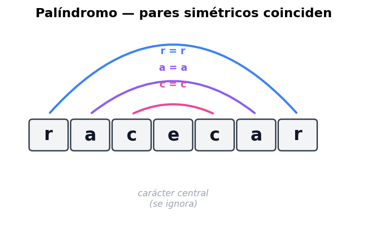
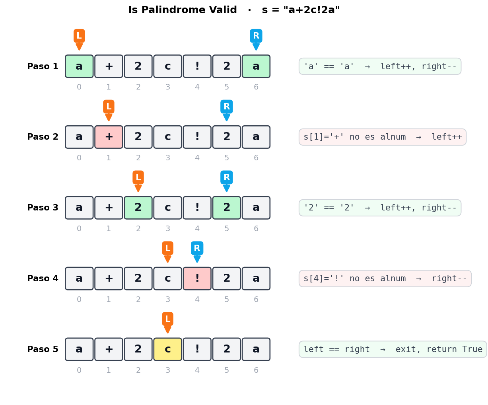
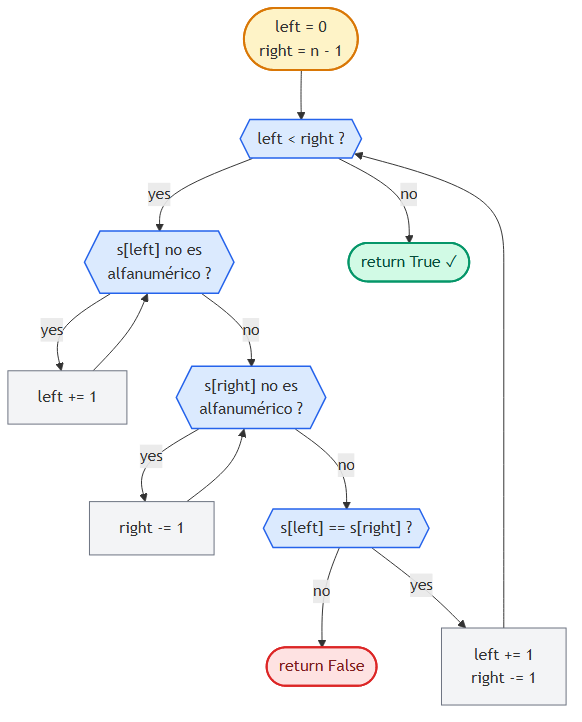

# Is Palindrome Valid

> 📍 **Two Pointers · Problema 4/6** · [⬅ Largest Container](./largest-container.md) · [🏠 Chapter](./introduction.md) · [Shift Zeros ➡](./shift-zeros-to-the-end.md) · [📚 KB Index](../../../../README.md)

> **TL;DR** — Verificar si un string es palíndromo **ignorando** caracteres no alfanuméricos. Two pointers desde los extremos: si ambos son alfanuméricos y coinciden, ambos avanzan al centro; si no coinciden, no es palíndromo. Skip de no-alfanuméricos antes de comparar. **O(n) tiempo, O(1) espacio.**

---

## 📑 In this entry

0. [🎓 For Dummies — empezá por acá](#-for-dummies--empezá-por-acá)
1. [Problema](#problema)
2. [Qué es un palíndromo (con simetría)](#qué-es-un-palíndromo-con-simetría)
3. [Estrategia: dos punteros que se encuentran en el medio](#estrategia-dos-punteros-que-se-encuentran-en-el-medio)
4. [Manejo de caracteres no alfanuméricos](#manejo-de-caracteres-no-alfanuméricos)
5. [Trace paso a paso](#trace-paso-a-paso)
6. [Decision flowchart](#decision-flowchart)
7. [Implementación](#implementación)
8. [Complexity Analysis](#complexity-analysis)
9. [Test Cases](#test-cases)
10. [⭐ Amplification: variantes y casos especiales](#-amplification-variantes-y-casos-especiales)
11. [⚠️ Pitfalls](#️-pitfalls)
12. [Interview Tips](#interview-tips)

---

## 🎓 For Dummies — empezá por acá

**Analogía:** un palíndromo es una palabra-espejo. Se lee igual de izquierda a derecha y de derecha a izquierda. Ejemplos: `racecar`, `neuquen`, `anita lava la tina`, `arribaba la birra`.

Imaginá la palabra escrita en una hoja, y **doblás la hoja por la mitad**: si todas las letras de cada lado se superponen perfectamente, es palíndromo.

**¿Cómo lo verificás algorítmicamente?** Poneé un dedo al principio y otro al final:
- ¿La letra de la izquierda y la de la derecha **son la misma**? Sí → ambos dedos hacia adentro un paso.
- ¿No coinciden? → no es palíndromo, terminás.
- ¿Los dedos se cruzaron? → revisaste todo, sí es palíndromo.

**¿Y los espacios y signos de puntuación?** Los **ignorás**. La frase `"a dog! a panic in a pagoda."` es palíndromo porque **solo contando letras y números** queda `adogapanicinapagoda` ↔ `adogapanicinapagoda`. Cuando un dedo cae en un signo, simplemente lo saltás (movés el dedo un paso más).

### Trampas comunes

- ⚠️ **Olvidar la condición `left < right` dentro de los while-skips.** Si el string es puro signos (`"!?,."`), `left` puede pasarse de `right`. Si no chequeás, intentás comparar índices invertidos.
- ⚠️ **Comparar con sensibilidad a mayúsculas.** `"Aa"` ¿es palíndromo? Depende del enunciado. La mayoría de variantes piden case-insensitive, pero **siempre preguntá**. En el código se resuelve con `.lower()` o usando `Character.toLowerCase()`.
- ⚠️ **Pensar que "no alfanuméricos" significa "solo espacios".** No: incluye signos de puntuación, emojis, acentos según el enunciado. Regex `[a-zA-Z0-9]` (JS) o `char.IsLetterOrDigit` (C#) cubre letras + dígitos. Si el problema permite Unicode con acentos, depende de la implementación del lenguaje.

¿Listo para la versión completa? ⬇️

---

## Problema

Dado un string, determiná si es palíndromo después de **eliminar todos los caracteres no alfanuméricos**. Un carácter es alfanumérico si es una letra o un número.

### Ejemplo 1

```
Input:  s = "a dog! a panic in a pagoda."
Output: True
Explicación: ignorando espacios y signos queda "adogapanicinapagoda",
             que se lee igual al revés.
```

### Ejemplo 2

```
Input:  s = "abc123"
Output: False
Explicación: ignorando signos queda "abc123", que al revés es "321cba" ≠ "abc123".
```

### Constraints

El string puede incluir letras inglesas en minúscula, números, espacios y puntuación.

---

## Qué es un palíndromo (con simetría)

Un palíndromo se lee igual de adelante hacia atrás:

```
"racecar"   ─reverse─►   "racecar"   ✓
```

La propiedad clave: **el primer carácter es igual al último, el segundo al penúltimo, etc.** Visualmente, los pares simétricos coinciden:



Cuando la longitud es **impar**, hay un carácter central que se compara consigo mismo (no afecta la decisión, lo podemos saltear). Cuando es **par**, los dos punteros se cruzan sin coincidir, lo que también es señal de éxito.

---

## Estrategia: dos punteros que se encuentran en el medio

Two pointers **inward traversal** es el match perfecto para esto:

```
   left                           right
    ▼                              ▼
[ a    b    c    d    c    b    a ]
                 ^
                 (después de varias iteraciones,
                  los dos llegan al medio)
```

Lógica básica (sin considerar signos):

1. `left = 0`, `right = len(s) - 1`.
2. Mientras `left < right`:
   - Si `s[left] != s[right]` → no es palíndromo, return `False`.
   - Si `s[left] == s[right]` → `left++`, `right--`.
3. Si salimos del while sin returnear `False` → return `True`.

---

## Manejo de caracteres no alfanuméricos

Como hay que ignorar signos y espacios, **antes de comparar**, avanzamos los punteros hasta que ambos apunten a un carácter alfanumérico:

```
Skip desde la izquierda:
  while s[left] no es alfanumérico:
      left += 1

Skip desde la derecha:
  while s[right] no es alfanumérico:
      right -= 1
```

**⚠️ Cuidado con los bordes:** mientras hacés skip, podés pasarte. Si el string es `"!?,."` (puros signos), `left` pasaría de `right`. Por eso los `while` internos siempre llevan también `left < right`:

```javascript
while (left < right && !isAlnum(s[left])) left++;
while (left < right && !isAlnum(s[right])) right--;
```

---

## Trace paso a paso

Ejemplo: `s = "a+2c!2a"` (versión compacta, sin espacios).



**Resultado:** `True`. El string, ignorando signos, es `a2c2a`, que es palíndromo.

---

## Decision flowchart



---

## Implementación

### JavaScript

```javascript
function isPalindromeValid(s) {
    const isAlnum = (c) => /[a-zA-Z0-9]/.test(c);
    let left = 0, right = s.length - 1;
    while (left < right) {
        // Skip caracteres no alfanuméricos desde la izquierda.
        while (left < right && !isAlnum(s[left])) left++;
        // Skip caracteres no alfanuméricos desde la derecha.
        while (left < right && !isAlnum(s[right])) right--;
        // Comparar caracteres alfanuméricos.
        if (s[left] !== s[right]) return false;
        left++;
        right--;
    }
    return true;
}
```

### C#

```csharp
public bool IsPalindromeValid(string s) {
    int left = 0, right = s.Length - 1;
    while (left < right) {
        // Skip caracteres no alfanuméricos desde la izquierda.
        while (left < right && !char.IsLetterOrDigit(s[left])) left++;
        // Skip caracteres no alfanuméricos desde la derecha.
        while (left < right && !char.IsLetterOrDigit(s[right])) right--;
        // Comparar caracteres alfanuméricos.
        if (s[left] != s[right]) return false;
        left++;
        right--;
    }
    return true;
}
```

> **Nota sobre case-sensitivity:** el enunciado original asume todo lowercase. Si el problema permite mayúsculas, agregá `.toLowerCase()` (JS) o `char.ToLower()` (C#) al comparar, o normalizá el string al inicio.

---

## Complexity Analysis

| Métrica | Valor | Por qué |
|---------|-------|---------|
| **Tiempo** | O(n) | Cada carácter del string se visita **a lo sumo una vez** (sea por `left` o por `right`). Los while-skips internos no convierten esto en O(n²) porque cada skip avanza un puntero que **nunca retrocede**. |
| **Espacio** | O(1) | Solo variables `left` y `right`. No allocamos arrays auxiliares. |

> **Por qué los while anidados NO son O(n²):** parece que tenés un while afuera y dos while adentro, pero la suma total de iteraciones de **todos** los whiles es ≤ n. Cada paso adelante de `left` (o atrás de `right`) cuenta como una iteración total — el costo se amortiza.

### Comparación con la versión naive

| Approach | Tiempo | Espacio | Notas |
|----------|--------|---------|-------|
| Filtrar + reversed comparison | O(n) | **O(n)** | Crear string filtrado y compararlo con su reverso. Más fácil de leer pero usa memoria extra. |
| **Two pointers** | **O(n)** | **O(1)** | Misma performance, espacio constante. **Preferida en entrevista.** |

```javascript
// Versión naive (educativa, NO óptima en espacio):
function isPalindromeNaive(s) {
    const filtered = s.toLowerCase().replace(/[^a-z0-9]/g, "");
    return filtered === [...filtered].reverse().join("");
}
```

---

## Test Cases

| Input | Expected | Descripción |
|-------|----------|-------------|
| `""` | `True` | String vacío: trivialmente palíndromo. |
| `"a"` | `True` | Un solo carácter. |
| `"aa"` | `True` | Palíndromo de longitud par mínima. |
| `"ab"` | `False` | Dos caracteres distintos. |
| `"!,(?)"` | `True` | Solo signos: queda "" → palíndromo. |
| `"12.02.2021"` | `True` | Palíndromo con números: `12022021` ↔ `12022021`. |
| `"21.02.2021"` | `False` | No-palíndromo con números. |
| `"hello, world!"` | `False` | Frase normal no-palíndromo. |
| `"A man, a plan, a canal: Panama"` | `True`* | Caso clásico — *requiere case-insensitive*. |
| `"a dog! a panic in a pagoda."` | `True` | Caso del enunciado. |
| `"race a car"` | `False` | Casi palíndromo. |

> *Para `"A man, a plan, a canal: Panama"` el enunciado de este ejercicio asume lowercase, así que con la implementación de arriba **devolvería False** (porque `'A' != 'a'`). Hay que normalizar a lowercase si el problema lo permite.

---

## ⭐ Amplification: variantes y casos especiales

### Variante 1: Valid Palindrome II (LeetCode #680)

*"Podés borrar **a lo sumo un carácter**. ¿Podés volverlo palíndromo?"*

Idea: cuando los dos punteros no coinciden, **probás dos opciones**: saltarte `left` o saltarte `right`. Si **alguna** de las dos vuelve palíndromo lo que queda, devolvés `True`.

```javascript
function validPalindromeII(s) {
    const isPal = (l, r) => {
        while (l < r) {
            if (s[l] !== s[r]) return false;
            l++; r--;
        }
        return true;
    };

    let left = 0, right = s.length - 1;
    while (left < right) {
        if (s[left] !== s[right]) {
            // Probar saltar uno de los dos lados.
            return isPal(left + 1, right) || isPal(left, right - 1);
        }
        left++; right--;
    }
    return true;
}
```

Sigue siendo O(n) tiempo (en el peor caso una sola "branch" extra).

### Variante 2: Longest Palindromic Substring (LeetCode #5)

Esto **NO** es two pointers puro — es **expand around center**: para cada índice `i`, intentás expandir un palíndromo desde el centro hacia afuera. Lo incluyo porque suele aparecer como follow-up.

```javascript
function longestPalindrome(s) {
    const expand = (l, r) => {
        while (l >= 0 && r < s.length && s[l] === s[r]) {
            l--; r++;
        }
        return s.slice(l + 1, r);
    };
    let best = "";
    for (let i = 0; i < s.length; i++) {
        // Centro impar (un solo char) y par (dos chars).
        for (const cand of [expand(i, i), expand(i, i + 1)]) {
            if (cand.length > best.length) best = cand;
        }
    }
    return best;
}
```

Tiempo O(n²), espacio O(1). Para O(n) verdadero hay que mirar **algoritmo de Manacher**, pero rara vez se pide en entrevistas.

### Variante 3: palindrome ignorando solo case (sin signos)

Si te dicen *"todos los caracteres cuentan, solo ignorá case"*, sacás los while-skips y dejás solo:

```javascript
function isPalindromeCaseInsensitive(s) {
    let left = 0, right = s.length - 1;
    while (left < right) {
        if (s[left].toLowerCase() !== s[right].toLowerCase()) return false;
        left++; right--;
    }
    return true;
}
```

### Variante 4: linked list palindrome

Para una **linked list** no podés indexar, así que cambia el approach:

1. Encontrar el medio (slow/fast pointers — ver [Cap. 4](../04-fast-and-slow-pointers/)).
2. Reverse la segunda mitad in-place.
3. Comparar la primera mitad con la segunda mitad reversed.

O(n) tiempo, O(1) espacio.

### Follow-ups típicos

- *"¿Y si el string es muy largo y solo tenés streaming?"* — No podés hacer two pointers porque no podés moverte hacia atrás. Hay que parsear hacia adelante y guardar todo (O(n) espacio).
- *"¿Y si querés ignorar también los caracteres acentuados?"* — Normalizar primero (`s.normalize("NFKD").replace(/[̀-ͯ]/g, "")` en JS; `s.Normalize(NormalizationForm.FormD)` + filtrar combining marks en C#).

---

## ⚠️ Pitfalls

- **Olvidar `left < right` dentro de los while-skips.** Sin esa guarda, en strings con puros signos te pasás de los bordes y rompés.
- **Asumir que el input es ya lowercase.** Aclarar con el entrevistador. Si no lo es, normalizar.
- **No considerar string vacío.** `""` es palíndromo por convención. Algunas tests lo verifican.
- **Hacer dos pasadas (filtrar + reversar)** cuando la consigna pide O(1) espacio.
- **Confundir "alfanumérico" con "letra".** "Alfanumérico" incluye dígitos (regex `[a-zA-Z0-9]` o `char.IsLetterOrDigit`); "letra" no (`[a-zA-Z]` o `char.IsLetter`). Lee bien el problema.
- **No saltarse el medio en longitudes impares.** En realidad **no hace falta saltarlo**: cuando `left == right` se sale del while sin compararlo, así que está cubierto naturalmente.

---

## Interview Tips

**Tip 1 — Aclará constraints antes de tipear.**
- ¿Hay caracteres no alfanuméricos? ¿Cómo los trato?
- ¿Hay diferencia entre mayúsculas y minúsculas?
- ¿Hay Unicode / acentos / emojis?
- ¿Qué devuelvo para `""`?

**Tip 2 — Confirmá el uso de built-ins.**
Regex `/[a-zA-Z0-9]/` (JS) o `char.IsLetterOrDigit()` (C#) — son **azúcar** que vale la pena. Pero el entrevistador puede pedirte implementarla a mano:

```javascript
function isAlnum(c) {
    return (c >= 'a' && c <= 'z') || (c >= 'A' && c <= 'Z') || (c >= '0' && c <= '9');
}
```

```csharp
bool IsAlnum(char c) =>
    (c >= 'a' && c <= 'z') || (c >= 'A' && c <= 'Z') || (c >= '0' && c <= '9');
```

Mostrar que **sabés cómo está construida** (rangos ASCII) suma puntos.

**Tip 3 — Habla de la invariante.**
Decí: *"En cada iteración, todo lo de afuera de [left, right] ya fue verificado y matchea. Si llego al centro sin contradicción, todo el string es palíndromo."* Eso muestra que entendés por qué funciona, no solo que lo memorizaste.

**Tip 4 — Si el follow-up es "implementá `isAlnum` por tu cuenta", no entres en pánico.**
Es un check de char ranges. Tres comparaciones encadenadas con `or`.

---

## References

- LeetCode — [#125 Valid Palindrome](https://leetcode.com/problems/valid-palindrome/)
- LeetCode — [#680 Valid Palindrome II](https://leetcode.com/problems/valid-palindrome-ii/) (con eliminación de un carácter)
- LeetCode — [#5 Longest Palindromic Substring](https://leetcode.com/problems/longest-palindromic-substring/) (follow-up)
- Coding Interview Patterns — capítulo "Two Pointers" → "Is Palindrome Valid"
- Entradas relacionadas:
  - [Introduction to Two Pointers](./introduction.md)
  - [Pair Sum - Sorted](./pair-sum-sorted.md) (otro inward traversal)

---

> 📍 **Two Pointers · Problema 4/6** · [⬅ Largest Container](./largest-container.md) · [🏠 Chapter](./introduction.md) · [Shift Zeros ➡](./shift-zeros-to-the-end.md) · [📚 KB Index](../../../../README.md)
