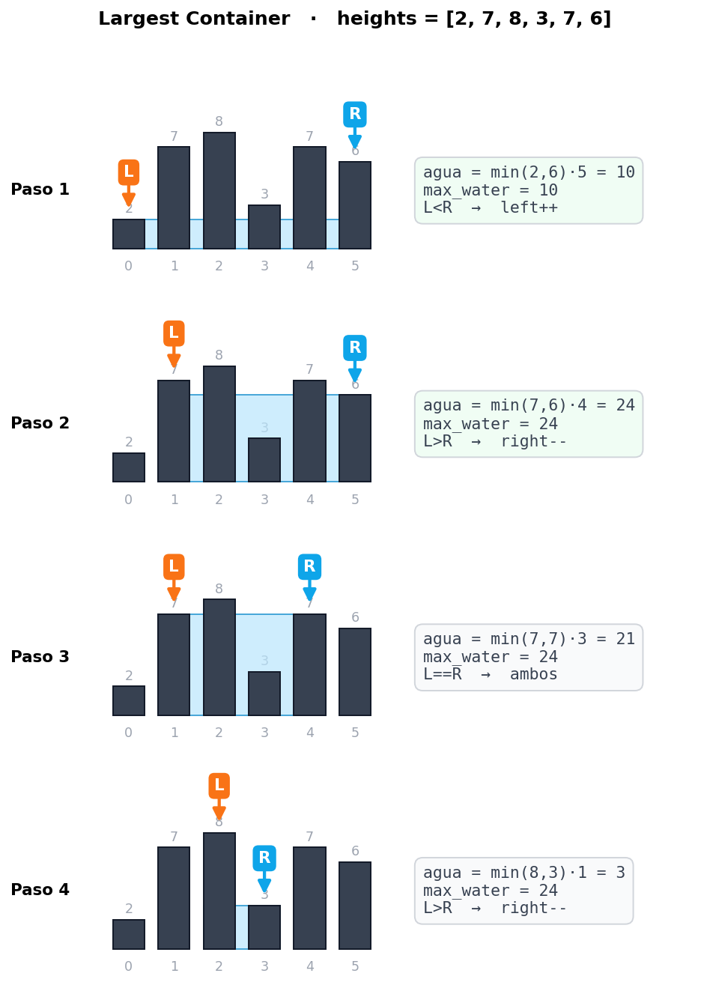
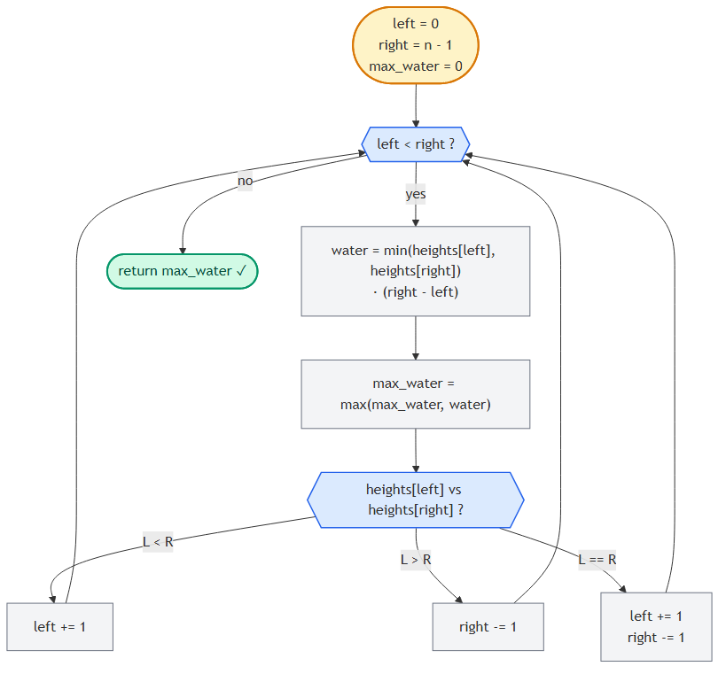

# Largest Container (Container With Most Water)

> 📍 **Two Pointers · Problema 3/6** · [⬅ Triplet Sum](./triplet-sum.md) · [🏠 Chapter](./introduction.md) · [Is Palindrome Valid ➡](./is-palindrome-valid.md) · [📚 KB Index](../../../../README.md)

> **TL;DR** — Dado un array donde cada valor es la altura de una columna, encontrá el par de columnas que **contengan más agua** (área = `min(altura) × ancho`). Two pointers desde los extremos: empezás con el ancho máximo, y movés siempre el puntero de la **columna más baja** hacia adentro, esperando encontrar una más alta. **O(n) tiempo, O(1) espacio.**

---

## 📑 In this entry

0. [🎓 For Dummies — empezá por acá](#-for-dummies--empezá-por-acá)
1. [Problema](#problema)
2. [Cómo se calcula el agua](#cómo-se-calcula-el-agua)
3. [Brute force O(n²) y por qué no alcanza](#brute-force-on-y-por-qué-no-alcanza)
4. [La intuición clave: maximizar ancho primero](#la-intuición-clave-maximizar-ancho-primero)
5. [Por qué siempre se mueve la columna más baja](#por-qué-siempre-se-mueve-la-columna-más-baja)
6. [Trace paso a paso](#trace-paso-a-paso)
7. [Decision flowchart](#decision-flowchart)
8. [Implementación](#implementación)
9. [Complexity Analysis](#complexity-analysis)
10. [Test Cases](#test-cases)
11. [⭐ Amplification: Trapping Rain Water (variante hermana)](#-amplification-trapping-rain-water-variante-hermana)
12. [⚠️ Pitfalls](#️-pitfalls)
13. [Interview Tips](#interview-tips)

---

## 🎓 For Dummies — empezá por acá

**Analogía:** imaginá una **fila de paredes verticales de distintas alturas**, todas paradas sobre el suelo. Querés llenar de agua **el espacio entre dos paredes** (cualquier par). El agua queda **contenida** entre las dos paredes y el suelo. Tu pregunta: ¿qué par de paredes guarda **la mayor cantidad de agua**?

```
Altura
  8 |       ▓
  7 |    ▓  ▓     ▓
  6 |    ▓  ▓     ▓  ▓
  5 |    ▓  ▓     ▓  ▓
  4 |    ▓  ▓     ▓  ▓
  3 |    ▓  ▓  ▓  ▓  ▓
  2 | ▓  ▓  ▓  ▓  ▓  ▓
  1 | ▓  ▓  ▓  ▓  ▓  ▓
    +─────────────────
      0  1  2  3  4  5      heights = [2, 7, 8, 3, 7, 6]
```

**Dos verdades obvias:**
1. El agua llega **a la altura de la pared más baja** del par. Si una pared mide 2 y la otra 8, el agua llega a 2 — todo lo que esté arriba se rebalsa.
2. La cantidad de agua es **`altura × ancho`**, donde `ancho` es la distancia entre las dos paredes.

**¿Cómo encontrar el mejor par sin probar todos?**

Empezá con **el par más ancho posible**: la primera pared y la última. Ese es tu primer candidato. Después, **acercá los punteros**, pero hay que elegir cuál mover:

- Si la pared izquierda es **más baja** → movés el puntero **izquierdo** hacia adentro. ¿Por qué? Porque la pared baja **es la que limita** el agua. Si moveras la alta, el ancho disminuye y la altura no mejora (sigue limitada por la baja).
- Si la pared derecha es **más baja** → movés el puntero **derecho** hacia adentro.
- Si ambas miden lo mismo → movés cualquiera (o las dos), porque el ancho va a bajar de todos modos y solo una pared más alta no alcanza para subir el agua.

En cada paso, calculás el área del par actual y la comparás con el máximo registrado.

### Trampas comunes

- ⚠️ **Querer mover siempre el mismo lado.** No: la regla es *mover el lado **más bajo***, no "siempre el izquierdo" o "siempre el derecho".
- ⚠️ **Pensar que es "trapping rain water".** Son problemas **distintos**. Largest Container = encontrar **un solo par** que maximice el área. Trapping Rain Water = sumar el agua que queda en **todos los huecos** entre todas las columnas. Ver [Amplification](#-amplification-trapping-rain-water-variante-hermana).
- ⚠️ **No actualizar el máximo en cada iteración.** Hay que comparar el área de cada par contra el máximo, **antes** de mover los punteros.

¿Listo para la versión completa? ⬇️

---

## Problema

Te dan un array de números, cada uno representando la **altura** de una línea vertical en un gráfico. Un "container" se forma con cualquier par de líneas más el eje X. Devolvé la **cantidad de agua que el contenedor más grande puede sostener**.

### Ejemplo

```
Input:  heights = [2, 7, 8, 3, 7, 6]
Output: 24
```

El par óptimo es `heights[1] = 7` y `heights[4] = 7`:
- altura = `min(7, 7) = 7`
- ancho = `4 - 1 = 3`
- agua = `7 × 3 = 21`

Espera... 21, no 24. Déjenme recalcular. El par óptimo es `heights[1] = 7` y `heights[5] = 6`:
- altura = `min(7, 6) = 6`
- ancho = `5 - 1 = 4`
- agua = `6 × 4 = **24**` ✓

---

## Cómo se calcula el agua

Para dos columnas en posiciones `i` y `j` con alturas `heights[i]` y `heights[j]`:

```
agua = min(heights[i], heights[j]) × (j - i)
```

- `min(heights[i], heights[j])`: la altura de la **más baja**, porque arriba de esa altura el agua se rebalsa por el lado bajo.
- `(j - i)`: el **ancho** entre las dos columnas.

### Ejemplo visual

```
Altura
  4 | ▓                                  ░░░░░░░░░░
  3 | ▓        ░░░░░░░░░░░░░░░░░░░░░░░░  ▓░░░░░░░░░
  2 | ▓░░░░░░░░░░░░░░░░░░░░░░░░░░░░░░░░░░▓░░░░░░░░░
  1 | ▓░░░░░░░░░░░░░░░░░░░░░░░░░░░░░░░░░░▓░░░░░░░░░
    +─────────────────────────────────────────────
      0           1           2           3
                   ◄────── ancho = 2 ──────►

  heights[0]=4, heights[2]=3
  agua = min(4, 3) × (2 - 0) = 3 × 2 = 6
```

---

## Brute force O(n²) y por qué no alcanza

Probás todas las parejas y te quedás con el área máxima:

```javascript
function largestContainerBruteForce(heights) {
    const n = heights.length;
    let maxWater = 0;
    for (let i = 0; i < n; i++) {
        for (let j = i + 1; j < n; j++) {
            const water = Math.min(heights[i], heights[j]) * (j - i);
            maxWater = Math.max(maxWater, water);
        }
    }
    return maxWater;
}
```

**Tiempo:** O(n²). Para `n = 10⁵`, eso es 10¹⁰ operaciones. Inviable.

---

## La intuición clave: maximizar ancho primero

Queremos **maximizar `min(altura) × ancho`**. Las dos cantidades cambian de manera distinta cuando movemos punteros:

| Movimiento | Ancho | Altura |
|------------|-------|--------|
| Mover puntero hacia adentro | **disminuye** siempre | puede subir o bajar |

**Estrategia:** empezamos con el ancho **máximo posible** (`right - left = n - 1`). Después, cada movimiento sacrifica ancho con la **esperanza** de ganar más altura. La pregunta es: ¿qué puntero mover para maximizar las chances de ganar altura?

Como el ancho **siempre baja** al movernos hacia adentro, la única forma de aumentar el área es **subir la altura**. Y la altura está limitada por la columna **más baja**.

---

## Por qué siempre se mueve la columna más baja

Supongamos `heights[left] < heights[right]`. La altura del agua está dictada por `heights[left]`. Tenemos dos opciones:

**Opción A — mover `left++`:** la nueva `heights[left]` puede ser **mayor** que la anterior, igual, o menor. Existe la posibilidad de **subir la altura del agua** si encontramos algo más alto. ✓

**Opción B — mover `right--`:** la altura sigue limitada por `heights[left]` (que no cambió). Aunque la nueva `heights[right]` fuera enorme, **el agua no sube** porque depende del lado bajo. Y el ancho sí baja. **Garantiza un área menor o igual.** ✗

Por lo tanto: **mover el puntero del lado bajo es la única jugada que puede mejorar el área**. La del lado alto solo puede empeorar.

```
heights[left]=2  ◄  heights[right]=8

  ▓                              ▓
  ▓                              ▓
  ▓                              ▓
  ▓                              ▓
  ▓                              ▓
  ▓                              ▓
  ▓░░░░░░░░░░░░░░░░░░░░░░░░░░░░░░▓
   ▲                              ▲
  left                          right

agua actual = min(2, 8) × (5) = 10

Si muevo left  → la altura puede subir si la próxima pared es ≥ 2
Si muevo right → la altura sigue siendo 2 (limitada por left), y el ancho baja
                 → área garantizadamente menor
```

### ¿Y si las dos son iguales?

Si `heights[left] == heights[right]`, la altura está limitada por las **dos**. Mover **una sola** no sirve: aunque la nueva pared sea más alta, la otra sigue siendo el techo. La única forma de subir la altura es **mover ambas** (o, equivalentemente, mover una sabiendo que en la próxima iteración igual vas a tener que mover la otra). Por eficiencia, movés ambas a la vez.

---

## Trace paso a paso

Ejemplo: `heights = [2, 7, 8, 3, 7, 6]`. Esperamos `max_water = 24`.



**Resultado:** `max_water = 24` ✓

**Solo 4 iteraciones** para un array de 6 elementos, vs **15 comparaciones** del brute force (6×5/2). El ahorro escala linealmente.

---

## Decision flowchart



---

## Implementación

### JavaScript

```javascript
function largestContainer(heights) {
    let maxWater = 0;
    let left = 0, right = heights.length - 1;
    while (left < right) {
        // Calcular agua con el par actual.
        const water = Math.min(heights[left], heights[right]) * (right - left);
        maxWater = Math.max(maxWater, water);
        // Mover el puntero del lado más bajo (o ambos si están empatados).
        if (heights[left] < heights[right]) {
            left++;
        } else if (heights[left] > heights[right]) {
            right--;
        } else {
            left++;
            right--;
        }
    }
    return maxWater;
}
```

### C#

```csharp
public int LargestContainer(int[] heights) {
    int maxWater = 0;
    int left = 0, right = heights.Length - 1;
    while (left < right) {
        // Calcular agua con el par actual.
        int water = Math.Min(heights[left], heights[right]) * (right - left);
        maxWater = Math.Max(maxWater, water);
        // Mover el puntero del lado más bajo (o ambos si están empatados).
        if (heights[left] < heights[right]) {
            left++;
        } else if (heights[left] > heights[right]) {
            right--;
        } else {
            left++;
            right--;
        }
    }
    return maxWater;
}
```

> **Variante de código:** podés simplificar la triple decisión a **siempre mover el más bajo y, si empatan, mover cualquiera**. Es equivalente porque cuando empatan, el siguiente paso de todos modos va a comparar y mover. Pero el código de arriba es más explícito sobre la lógica.

---

## Complexity Analysis

| Métrica | Valor | Por qué |
|---------|-------|---------|
| **Tiempo** | O(n) | Cada iteración mueve `left++`, `right--`, o ambos. Como nunca retroceden, el total de movimientos es ≤ n. |
| **Espacio** | O(1) | Solo `max_water`, `left`, `right`, `water`. No depende de n. |

### Demostración informal de correctness

Cuando movemos el puntero del lado bajo (digamos `left`), descartamos **todos los pares `(left, j)` con `j` entre `left+1` y `right`**. ¿Por qué es seguro?

- Para cualquier `j` entre `left+1` y `right`, el ancho `(j - left)` es **menor** que `(right - left)`.
- La altura sigue limitada por `heights[left]` (que es la más baja del par actual) o por algo más bajo todavía si `heights[j] < heights[left]`.
- En cualquier caso, `min × ancho < min × (right - left) = water` actual.

Por lo tanto, mover `left` no descarta una solución mejor. **Lo mismo con `right`.** Como cada iteración descarta un puntero (y todas sus combinaciones con ese índice), el algoritmo es correcto.

---

## Test Cases

| Input | Expected | Descripción |
|-------|----------|-------------|
| `[]` | 0 | Array vacío. |
| `[1]` | 0 | Un solo elemento — no se puede formar contenedor. |
| `[0, 1, 0]` | 0 | Sin contenedores que sostengan agua (la columna del medio "tapa"). |
| `[3, 3, 3, 3]` | 9 | Todas iguales: `3 × 3 = 9` (de índice 0 a 3). |
| `[1, 2, 3]` | 2 | Estrictamente creciente. Mejor par: `(0, 2)` → `min(1, 3) × 2 = 2`. |
| `[3, 2, 1]` | 2 | Estrictamente decreciente. Mejor: `(0, 2)` → `min(3, 1) × 2 = 2`. |
| `[2, 7, 8, 3, 7, 6]` | 24 | Caso del enunciado. |
| `[1, 8, 6, 2, 5, 4, 8, 3, 7]` | 49 | Caso clásico de LeetCode #11 (par `(1, 8)` → `min(8, 7) × 7 = 49`). |
| `[1, 1]` | 1 | Mínimo válido: `min(1,1) × 1 = 1`. |

---

## ⭐ Amplification: Trapping Rain Water (variante hermana)

Frecuentemente confundido con Largest Container, pero es **otro problema**.

### Diferencia conceptual

| | Largest Container | Trapping Rain Water |
|---|---|---|
| Pregunta | ¿Cuál es el **par único** que sostiene **más agua**? | ¿Cuánta agua **total** queda atrapada **entre todas las columnas**? |
| Salida | un solo número (el área máxima) | un solo número (suma de toda el agua atrapada) |
| Modelo | el agua llena el espacio entre **dos** paredes | el agua queda atrapada **encima de cada columna**, limitada por las paredes más altas a su izquierda y derecha |
| LeetCode | #11 | #42 |

### Trapping Rain Water — solución con two pointers

Para cada columna `i`, el agua que queda encima es:

```
agua[i] = min(max_left[i], max_right[i]) - heights[i]
```

donde `max_left[i]` es la altura máxima a la izquierda de `i`, y `max_right[i]` análogo a la derecha.

```javascript
function trap(heights) {
    if (heights.length === 0) return 0;
    let left = 0, right = heights.length - 1;
    let maxLeft = 0, maxRight = 0;
    let water = 0;
    while (left < right) {
        if (heights[left] < heights[right]) {
            if (heights[left] >= maxLeft) {
                maxLeft = heights[left];
            } else {
                water += maxLeft - heights[left];
            }
            left++;
        } else {
            if (heights[right] >= maxRight) {
                maxRight = heights[right];
            } else {
                water += maxRight - heights[right];
            }
            right--;
        }
    }
    return water;
}
```

**Tiempo:** O(n). **Espacio:** O(1). Mismo "shape" del algoritmo (two pointers desde extremos), pero la lógica interna es distinta.

### Cuándo es "container" vs "rain water"

- *"How much water can the **container** hold?"* → Largest Container (par único).
- *"How much rain water gets **trapped**?"* → Trapping Rain Water (suma total).

Lee el enunciado dos veces — los problemas se confunden mucho.

---

## ⚠️ Pitfalls

- **Mover siempre el mismo puntero.** La regla es *mover el lado más bajo*, no "siempre left" o "siempre right".
- **Olvidar `max_water = max(...)`.** Sin esto, devolvés el agua del **último** par, no el máximo.
- **Condición de salida `left <= right`.** Cuando `left == right`, el ancho es 0 → agua 0. No rompe nada pero tampoco aporta. Quedate con `left < right`.
- **Confundir con Trapping Rain Water.** Algoritmos parecidos, problemas distintos. (Ver Amplification.)
- **No considerar arrays con 0 o 1 elemento.** Devolver 0 directamente sin entrar al while está cubierto naturalmente por la condición.
- **Pensar que el óptimo siempre involucra la columna más alta.** Falso. En `[1, 100, 1, 1, 1, 100, 1]` el óptimo no involucra los 100s solos, sino el par `(1, 5)` con altura limitada por `min(100, 100) = 100` y ancho 4 → área 400.

---

## Interview Tips

**Tip 1 — Dibujá el histograma antes de codear.**
Es un problema visual. Tomate 30 segundos en hacer un dibujo en la pizarra/papel/Whimsical. El entrevistador ve que pensás antes de tipear.

**Tip 2 — Justificá la decisión "mover el más bajo".**
Decí en voz alta: *"Si muevo el alto, la altura sigue limitada por el bajo y el ancho disminuye → área garantizadamente menor o igual. Si muevo el bajo, la altura puede subir."* Mostrar el razonamiento es lo que diferencia este problema.

**Tip 3 — No pares en el primer match.**
A diferencia de pair-sum, **no devolvés en cuanto encontrás un área buena**: tenés que recorrer hasta que los punteros se cruzen, porque puede haber un par mejor más adentro.

**Tip 4 — Si te preguntan trapping rain water como follow-up, pensalo distinto.**
No es "mover el más bajo y listo". Necesitás trackear `max_left` y `max_right`. Comentá la diferencia explícitamente.

**Tip 5 — La complexity es O(n), aclaralo.**
Cada iteración mueve al menos un puntero. Como `left` solo crece y `right` solo decrece y se cruzan a lo sumo una vez, total ≤ n iteraciones.

---

## References

- LeetCode — [#11 Container With Most Water](https://leetcode.com/problems/container-with-most-water/)
- LeetCode — [#42 Trapping Rain Water](https://leetcode.com/problems/trapping-rain-water/) (variante distinta)
- Coding Interview Patterns — capítulo "Two Pointers" → "Largest Container"
- Entradas relacionadas:
  - [Introduction to Two Pointers](./introduction.md)
  - [Pair Sum - Sorted](./pair-sum-sorted.md)

---

> 📍 **Two Pointers · Problema 3/6** · [⬅ Triplet Sum](./triplet-sum.md) · [🏠 Chapter](./introduction.md) · [Is Palindrome Valid ➡](./is-palindrome-valid.md) · [📚 KB Index](../../../../README.md)
