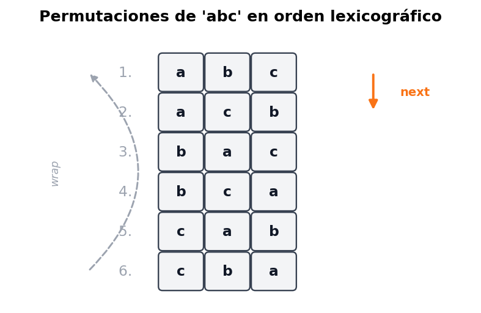
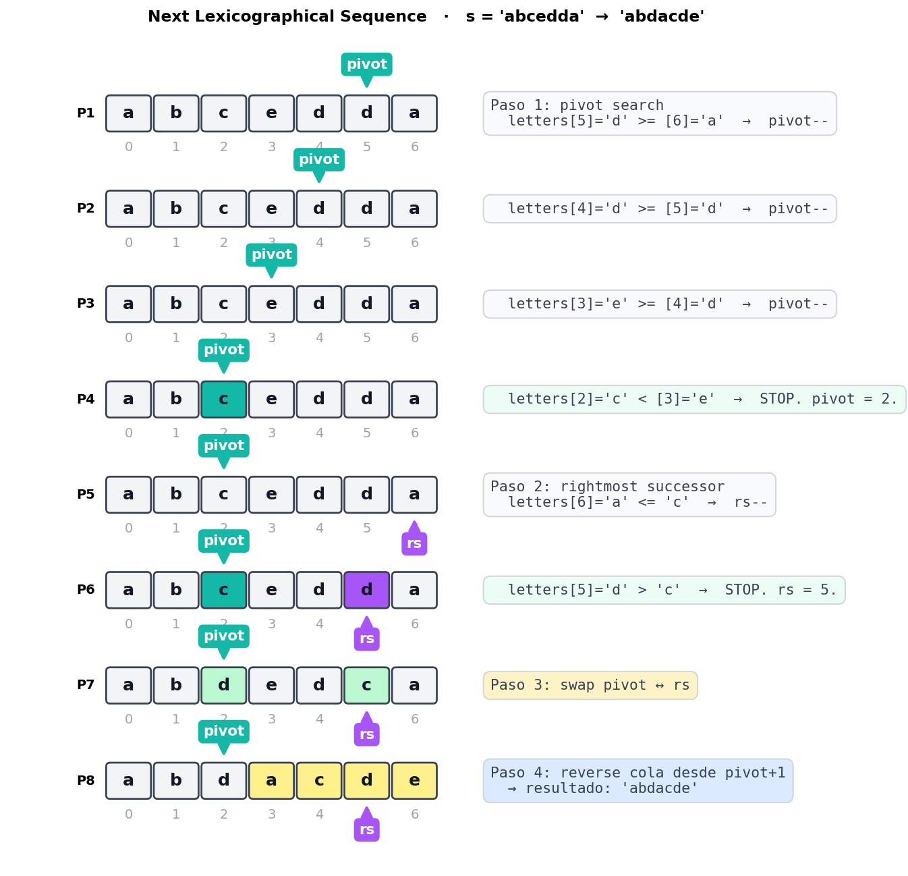
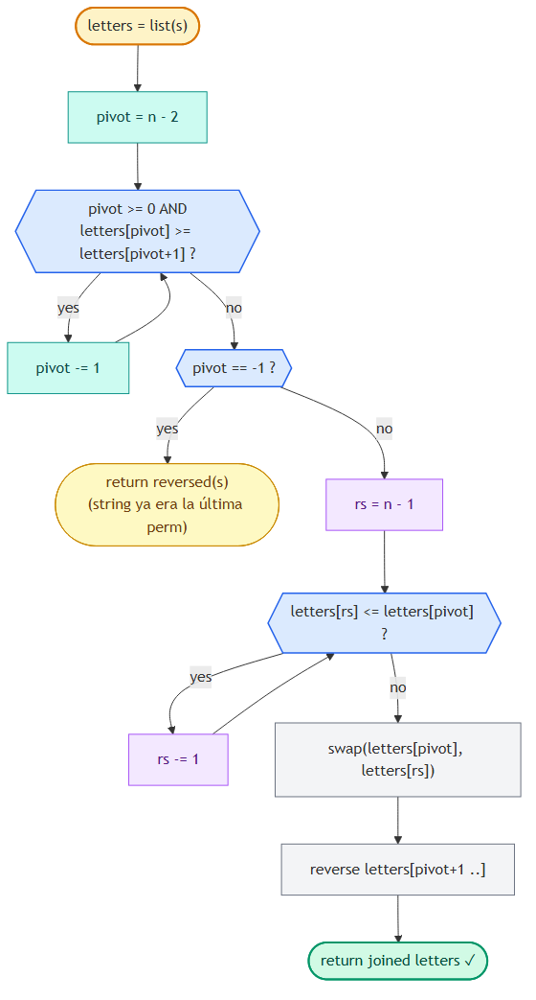

# Next Lexicographical Sequence (Next Permutation)

> 📍 **Two Pointers · Problema 6/6** · [⬅ Shift Zeros](./shift-zeros-to-the-end.md) · [🏠 Chapter](./introduction.md) · _Fin del capítulo_ · [📚 KB Index](../../../../README.md)

> **TL;DR** — Encontrar la **siguiente permutación en orden lexicográfico** de un string (o array). Algoritmo en 4 pasos: (1) buscar el **pivot** desde la derecha — primer carácter que rompe el orden no-creciente; (2) buscar el **rightmost successor** — primer carácter desde la derecha mayor al pivot; (3) **swap** pivot ↔ rightmost successor; (4) **reverse** la cola después del pivot. Si no hay pivot, el string ya es la última permutación → devolver la primera (reversa). **O(n) tiempo, O(n) espacio (por la lista mutable).**

---

## 📑 In this entry

0. [🎓 For Dummies — empezá por acá](#-for-dummies--empezá-por-acá)
1. [Problema](#problema)
2. [Qué significa "siguiente permutación lexicográfica"](#qué-significa-siguiente-permutación-lexicográfica)
3. [Insight 1: el cambio se hace lo más a la derecha posible](#insight-1-el-cambio-se-hace-lo-más-a-la-derecha-posible)
4. [Insight 2: la última permutación es non-increasing](#insight-2-la-última-permutación-es-non-increasing)
5. [El algoritmo en 4 pasos](#el-algoritmo-en-4-pasos)
6. [Trace paso a paso](#trace-paso-a-paso)
7. [Algorithm flowchart](#algorithm-flowchart)
8. [Implementación](#implementación)
9. [Por qué reverse y no sort](#por-qué-reverse-y-no-sort)
10. [Complexity Analysis](#complexity-analysis)
11. [Test Cases](#test-cases)
12. [⭐ Amplification: variantes y conexiones](#-amplification-variantes-y-conexiones)
13. [⚠️ Pitfalls](#️-pitfalls)
14. [Interview Tips](#interview-tips)

---

## 🎓 For Dummies — empezá por acá

**Analogía:** imaginá las **permutaciones de un string** como las páginas de un diccionario. Si el string es `"abc"`, las permutaciones ordenadas alfabéticamente son:

```
1. abc
2. acb
3. bac
4. bca
5. cab
6. cba   ← última
```

Te dan una de esas permutaciones (digamos `acb`), y te piden que devuelvas **la siguiente** en el diccionario (`bac`). Si te dan la última (`cba`), volvés al principio (`abc`).

**¿Cómo lo hacés sin generar todas las permutaciones?** Hay un truco mecánico de 4 pasos. Pensalo así:

Tenés un **odómetro de palabras** (como el cuentakilómetros del auto, pero con letras). Para incrementarlo en 1, **siempre** mové la rueda más a la derecha que **se pueda mover**. Una rueda "se puede mover" si todavía no llegó al máximo de su tramo.

```
ej: abcedda  →  ¿cuál es el siguiente?

      "ya están maximizados"
              ▼ ▼ ▼ ▼
     a  b  c  e  d  d  a
              ▲
              c es la rueda que sí se puede subir
              (porque hay algo más grande a su derecha)
```

**Los 4 pasos:**

1. **Pivot:** desde la derecha, encontrá el **primer carácter** que es **menor** que el siguiente. Ese es el "primer dígito que sí se puede subir". En `abcedda`, es la `c` en posición 2 (porque `c < e`).
2. **Rightmost successor:** desde la derecha, encontrá el **primer carácter** que sea **mayor que el pivot**. Ese es el "valor mínimo necesario para subir el pivot". En `abcedda`, es la primera `d` (la del medio, posición 5).
3. **Swap:** intercambiás pivot ↔ rightmost successor. `abcedda` → `abdedca`.
4. **Reverse:** la **cola después del pivot** queda en orden no-creciente (eso es por construcción). Para que la nueva permutación sea **la mínima posible** después del swap, hay que **revertir esa cola** para que quede en orden creciente. `abdedca` → `abdacde`.

Resultado: `abcedda` → `abdacde`.

### ¿Por qué funciona?

- **El swap aumenta el valor del pivot** lo mínimo posible (porque elegimos el successor más a la derecha que sea mayor).
- **El reverse minimiza la cola** después del nuevo pivot (porque la cola estaba non-increasing y revertirla la hace non-decreasing → la permutación más chica).

Resultado: la permutación inmediatamente siguiente. **No te saltás ninguna**, no devolvés una más grande de lo necesario.

### Trampas comunes

- ⚠️ **Confundir "non-increasing" con "decreasing".** *Decreasing* significa estrictamente `>`. *Non-increasing* significa `>=`. La cola maximizada permite **iguales adyacentes** (ej: `dda`). Si usás `>` en el pivot search, fallás cuando hay duplicados.
- ⚠️ **Usar sort en vez de reverse en el paso 4.** Sort funciona pero es O(n log n) extra. Como la cola **ya es non-increasing**, revertirla es O(n) y da el mismo resultado.
- ⚠️ **No manejar el caso "ya es la última permutación".** Si todo el string es non-increasing, no hay pivot. La consigna dice: devolver la primera permutación (que es la string revertida).

¿Listo para la versión completa? ⬇️

---

## Problema

Dado un string de letras inglesas en minúscula, reordená los caracteres para formar **la siguiente permutación en orden lexicográfico** (alfabético). Si el string ya es la última permutación posible, devolvé la **primera** (la mínima).

### Ejemplos

```
Input:  s = "abcd"
Output: "abdc"
Explicación: "abdc" es la siguiente permutación después de "abcd".
```

```
Input:  s = "dcba"
Output: "abcd"
Explicación: "dcba" es la última permutación → volvemos a la primera.
```

### Constraints

- El string tiene al menos un carácter.
- Solo letras inglesas en minúscula.

---

## Qué significa "siguiente permutación lexicográfica"

Considerá todas las permutaciones de `"abc"` listadas en orden alfabético:



La **siguiente permutación** de `"abc"` es `"acb"`. La de `"acb"` es `"bac"`. Y así. Cuando llegás a `"cba"` (la última), la consigna pide volver al principio.

**Puntos clave:**
- La siguiente permutación es **lexicográficamente mayor** que la original.
- Es la **menor** entre las que son mayores.
- Usa **exactamente las mismas letras** (es una permutación, no una transformación arbitraria).

---

## Insight 1: el cambio se hace lo más a la derecha posible

Para que la siguiente permutación sea **lo más cercana posible** a la original, el cambio debe involucrar **caracteres lo más a la derecha posible**.

Comparemos dos formas de "aumentar" `abcde`:

```
Cambio cerca de la derecha (preferible):
  a b c d e   →   a b c e d        (incremento chico)

Cambio cerca de la izquierda (peor):
  a b c d e   →   b a c d e        (incremento grande)
```

Ambos son mayores que `abcde`, pero el primero es **más cercano**. La intuición: cambiar caracteres a la izquierda da saltos enormes (todo lo que viene después puede ser cualquier cosa); cambiar a la derecha da el incremento mínimo.

**Conclusión:** rearrange solo los caracteres **al final del string** (la "cola" o "suffix"), si es posible. La pregunta ahora es: **¿cuán larga es esa cola?**

---

## Insight 2: la última permutación es non-increasing

Una observación clave: **la última permutación de un conjunto de caracteres es siempre non-increasing**.

Ejemplo: con las letras `{a, b, c, c}`, la última permutación posible es `ccba` (la "más grande" alfabéticamente). Esa cadena es non-increasing: `c >= c >= b >= a`.

```
ej:   abcc   →   …   →   ccba   ← última, non-increasing
```

**Por qué importa esto:** si la **cola** del string ya es non-increasing, **no podemos rearrengarla para hacerla más grande**: ya está al máximo. Hay que extender el "área de cambio" más a la izquierda hasta encontrar un carácter que **sí se pueda subir**. Ese carácter es el **pivot**.

```
Ejemplo: s = "abcedda"

posición:     0  1  2  3  4  5  6
caracteres:   a  b  c  e  d  d  a
                          └────────┘
                          cola non-increasing (e d d a)
                       └─────────────┘
                       pero "e" rompe el orden? No, "e d d a" es non-increasing.
                    └────────────────┘
                    "c e d d a"  ← acá "c < e" rompe el non-increasing.
                                    'c' es el pivot.
```

**El pivot** es el primer carácter (desde la derecha) que **rompe el orden non-increasing**. Es el carácter que vamos a subir.

### ¿Y si no hay pivot?

Si recorrés todo el string desde la derecha y nunca encontrás un carácter menor que el siguiente, **todo el string es non-increasing** → es **la última permutación**. La consigna dice: devolver la primera, o sea **revertir** el string (la primera permutación de un conjunto de caracteres es non-decreasing).

```
ej:  s = "dcba"   →   no hay pivot   →   reverse  →  "abcd"
```

---

## El algoritmo en 4 pasos

### Paso 1 — Localizar el pivot

Recorré desde la **derecha** (empezando en `len-2`, no `len-1`, porque comparás con el siguiente). Detenete en el primer índice donde `s[pivot] < s[pivot+1]`.

```javascript
let pivot = letters.length - 2;
while (pivot >= 0 && letters[pivot] >= letters[pivot + 1]) {
    pivot--;
}
```

Si `pivot == -1`, no hubo pivot → string ya es la última permutación → devolver `reverse(s)`.

### Paso 2 — Encontrar el rightmost successor

El **rightmost successor** del pivot es el carácter más a la derecha que sea **estrictamente mayor** al pivot. Como la cola después del pivot es non-increasing, recorré desde la derecha y parate en el primer carácter mayor.

```javascript
let rightmostSuccessor = letters.length - 1;
while (letters[rightmostSuccessor] <= letters[pivot]) {
    rightmostSuccessor--;
}
```

> **Por qué "rightmost":** elegir el successor más a la derecha (el menor candidato válido) genera el incremento más chico posible para el pivot, que es lo que queremos.

### Paso 3 — Swap

Intercambiá pivot y rightmost successor:

```javascript
[letters[pivot], letters[rightmostSuccessor]] = [letters[rightmostSuccessor], letters[pivot]];
```

Después de esto, el carácter en la posición del pivot es **mayor** que antes, y la **cola sigue siendo non-increasing** (lo demostramos abajo).

### Paso 4 — Reverse la cola

La cola después del pivot es non-increasing, lo cual significa que es **la permutación más grande** de esos caracteres. Para que la nueva permutación total sea la **mínima posible** mayor que la original, queremos que esa cola sea la **más chica posible**. La permutación más chica de un conjunto de caracteres es **non-decreasing**, que se obtiene **revirtiendo** la non-increasing actual.

```javascript
// Reverse in-place desde pivot+1 hasta el final:
let l = pivot + 1, r = letters.length - 1;
while (l < r) {
    [letters[l], letters[r]] = [letters[r], letters[l]];
    l++; r--;
}
```

> **Reverse, no sort:** la cola ya está non-increasing, así que `reverse` la convierte en non-decreasing en O(n). Sort haría lo mismo en O(n log n) — menos eficiente.

---

## Trace paso a paso

Ejemplo: `s = "abcedda"`. Esperamos `"abdacde"`. Cada paso visualizado:



**Resultado:** `"abdacde"` ✓

**Verificación:** ¿es `"abdacde"` la siguiente permutación después de `"abcedda"`? Comparemos carácter a carácter:
- `a == a`
- `b == b`
- `d > c` ← acá se dispara el "mayor"

Como en la posición 2 ya pasamos a algo mayor, **todas las strings con prefijo `"abd..."` son mayores que `"abcedda"`**. La menor de esas es la que tiene la cola más chica posible: `"acde"` (los caracteres restantes en orden ascendente). Eso es exactamente lo que generamos.

---

## Algorithm flowchart



---

## Implementación

### JavaScript

```javascript
function nextLexicographicalSequence(s) {
    const letters = s.split('');
    // Paso 1: localizar el pivot (primer char desde la derecha que rompe non-increasing).
    let pivot = letters.length - 2;
    while (pivot >= 0 && letters[pivot] >= letters[pivot + 1]) {
        pivot--;
    }
    // Si no hay pivot, el string ya es la última permutación.
    if (pivot === -1) {
        return letters.reverse().join('');
    }
    // Paso 2: encontrar el rightmost successor del pivot.
    let rs = letters.length - 1;
    while (letters[rs] <= letters[pivot]) {
        rs--;
    }
    // Paso 3: swap pivot y rightmost successor.
    [letters[pivot], letters[rs]] = [letters[rs], letters[pivot]];
    // Paso 4: reverse la cola para minimizarla.
    let l = pivot + 1, r = letters.length - 1;
    while (l < r) {
        [letters[l], letters[r]] = [letters[r], letters[l]];
        l++; r--;
    }
    return letters.join('');
}
```

### C#

```csharp
public string NextLexicographicalSequence(string s) {
    char[] letters = s.ToCharArray();
    // Paso 1: localizar el pivot (primer char desde la derecha que rompe non-increasing).
    int pivot = letters.Length - 2;
    while (pivot >= 0 && letters[pivot] >= letters[pivot + 1]) {
        pivot--;
    }
    // Si no hay pivot, el string ya es la última permutación.
    if (pivot == -1) {
        Array.Reverse(letters);
        return new string(letters);
    }
    // Paso 2: encontrar el rightmost successor del pivot.
    int rs = letters.Length - 1;
    while (letters[rs] <= letters[pivot]) {
        rs--;
    }
    // Paso 3: swap pivot y rightmost successor.
    (letters[pivot], letters[rs]) = (letters[rs], letters[pivot]);
    // Paso 4: reverse la cola para minimizarla.
    Array.Reverse(letters, pivot + 1, letters.Length - pivot - 1);
    return new string(letters);
}
```

---

## Por qué reverse y no sort

Después del swap del paso 3, la cola sigue siendo **non-increasing**. Vamos a probarlo informalmente:

- Antes del swap, la cola era `c_{p+1}, c_{p+2}, ..., c_{n-1}` con `c_{p+1} >= c_{p+2} >= ... >= c_{n-1}`.
- El rightmost successor era `c_{rs}` con `c_{rs} > c_{pivot}` y `c_{rs+1} <= c_{pivot}`.
- Después del swap, en la posición `rs` quedó `c_{pivot}` (el original). Como `c_{rs-1} >= c_{rs} > c_{pivot}`, se mantiene `c_{rs-1} >= c_{pivot}`. Y `c_{pivot} >= c_{rs+1}` por lo que vimos.
- O sea, la cola sigue ordenada non-increasing.

Una secuencia non-increasing **revertida** queda non-decreasing — y la **mínima** permutación de ese set de caracteres es exactamente la non-decreasing.

Por eso `reverse` (O(n)) es suficiente. **Usar `sort` es correcto pero innecesariamente costoso** (O(n log n)).

---

## Complexity Analysis

| Métrica | Valor | Por qué |
|---------|-------|---------|
| **Tiempo** | O(n) | Tres pasadas en el peor caso: (1) buscar pivot, (2) buscar rightmost successor, (3) reverse. Cada una es ≤ n. Total: 3n = O(n). |
| **Espacio** | O(n) | En JavaScript y C# los strings son **inmutables**, así que tenemos que crear un array mutable de caracteres (`s.split('')` en JS, `s.ToCharArray()` en C#) que ocupa O(n). En lenguajes con buffers mutables (`StringBuilder` con índices, `char[]` en C nativo) se reduce a O(1) sobre el buffer original. |

---

## Test Cases

| Input | Expected | Descripción |
|-------|----------|-------------|
| `"a"` | `"a"` | Un solo carácter — trivialmente la última permutación → reverse de `"a"` = `"a"`. |
| `"aaaa"` | `"aaaa"` | Todos repetidos → no hay pivot → reverse de `"aaaa"` = `"aaaa"`. |
| `"ab"` | `"ba"` | Dos chars en orden asc → siguiente es desc. |
| `"ba"` | `"ab"` | Última permutación → primera. |
| `"abcd"` | `"abdc"` | Caso del enunciado. |
| `"dcba"` | `"abcd"` | Última permutación → primera. |
| `"abcedda"` | `"abdacde"` | Caso del trace de arriba. |
| `"ynitsed"` | `"ynsdeit"` | Caso del original. |
| `"aab"` | `"aba"` | Con duplicados — el algoritmo respeta. |
| `"abdc"` | `"acbd"` | Pivot interno. |
| `"abc"` | `"acb"` | Caso simple. |

---

## ⭐ Amplification: variantes y conexiones

### Variante 1: Next Permutation sobre array de números (LeetCode #31)

**Mismo algoritmo**, mismo código (cambiando `letters` por `nums`). De hecho, esto es lo que pide LeetCode #31:

```
Input:  nums = [1, 2, 3]
Output: [1, 3, 2]
```

```
Input:  nums = [3, 2, 1]
Output: [1, 2, 3]
```

```
Input:  nums = [1, 1, 5]
Output: [1, 5, 1]
```

### Variante 2: Previous Permutation (la inversa)

*"Devolvé la permutación **anterior**."*

Mismo esqueleto pero invertido:
- **Pivot:** primer carácter desde la derecha que es **mayor** que el siguiente (rompe non-decreasing).
- **Rightmost predecessor:** primer carácter desde la derecha que es **menor** que el pivot.
- **Swap.**
- **Reverse** la cola (que ahora era non-decreasing) para hacerla non-increasing (la máxima posible).

### Variante 3: k-th Permutation Sequence (LeetCode #60)

*"Dada una colección `[1, 2, ..., n]`, devolvé la k-ésima permutación."*

Acá **no usás next-permutation iterativo** (sería O(k×n), inviable para k grande). Se calcula directamente con factoriales: la primera posición se determina con `(k-1) / (n-1)!`, la segunda con `(k-1) % (n-1)! / (n-2)!`, etc.

### Variante 4: Permutations (todas) (LeetCode #46)

Para generar **todas** las permutaciones de un array, hay dos approaches estándar:

1. **Backtracking** (DFS con swap). O(n × n!).
2. **Iterativo con next-permutation:** ordená el array, después llamá `nextLexicographicalSequence` repetidamente hasta volver a la inicial. O(n × n!).

### Conexión con built-ins de otros lenguajes

- **C++ STL** tiene **`std::next_permutation`** built-in que implementa exactamente este algoritmo. Devuelve `false` si la entrada ya era la última permutación.
- **JavaScript y C#** no tienen built-in nativo, pero el algoritmo es **lo suficientemente corto** (≈15 líneas) como para tipearlo de memoria en una entrevista. Confirmar siempre con el entrevistador si está permitido escribir el helper.

### Por qué este algoritmo es elegante

Es un caso emblemático de **staged traversal**:
1. **Stage 1:** un puntero busca el pivot (recorre desde la derecha).
2. **Stage 2:** otro puntero busca el rightmost successor (también desde la derecha).
3. Después: swap + reverse, ambos en O(n).

Tres "pasadas" simples, cada una con un objetivo claro. La belleza está en **descubrir** la estructura (pivot + cola maximizada), no en ningún truco oscuro.

---

## ⚠️ Pitfalls

- **Confundir non-increasing (≥) con decreasing (>).** El pivot search usa `>=`, no `>`. Con `>` fallás en strings con duplicados adyacentes (ej: `"abdd"` daría pivot = -1 incorrectamente porque `'d' > 'd'` es false).
- **Usar `<` en vez de `<=` en el rightmost successor.** El successor debe ser **estrictamente** mayor al pivot. La condición de loop es `letters[rs] <= letters[pivot]` (skip while less-or-equal), o equivalentemente `letters[rs] > letters[pivot]` (stop when greater).
- **Usar sort en vez de reverse en el paso 4.** Funciona pero desperdicia O(n log n).
- **No manejar el caso pivot == -1.** El loop while puede dejar pivot en `-1` si toda la string es non-increasing. Hay que checkear y devolver el reverse.
- **Hacer reverse de toda la string en vez de solo la cola.** En JS `letters.reverse()` revierte TODO el array — para revertir solo `[pivot+1 .. end]` usá un loop de two pointers manual o `letters.splice(pivot+1).reverse().forEach(...)`. En C# usá `Array.Reverse(letters, pivot + 1, length - pivot - 1)` que toma offset + count.
- **Iniciar el pivot search en `len-1`.** Tiene que ser `len-2` porque comparás con `pivot+1`. Si arrancás en `len-1`, el primer acceso es `letters[len]` → IndexError.
- **Pensar que el string original tiene que estar ordenado.** No: la entrada es **cualquier permutación**. El algoritmo funciona desde cualquier estado del "odómetro".

---

## Interview Tips

**Tip 1 — Sé preciso con el lenguaje técnico.**
Decí *"non-increasing"* o *"non-decreasing"*, no *"decreasing"* o *"increasing"*. Las versiones estrictas no permiten iguales adyacentes; las non-* sí. Con duplicados, esa diferencia define si el algoritmo funciona o no.

**Tip 2 — Dibujá el odómetro.**
Es un problema visual. Mostrar el patrón "la cola está maximizada como un odómetro a 999, hay que subir el dígito anterior" hace que la lógica clickee enseguida.

**Tip 3 — Razoná el "por qué" de cada paso.**
- *Pivot:* el primer dígito que se puede subir.
- *Rightmost successor:* el incremento mínimo posible.
- *Reverse:* minimizar la cola para que la nueva permutación sea la mínima.

Si solo memorizás los pasos sin entender el por qué, en cualquier follow-up te trabás. Si entendés la lógica, **derivás** el algoritmo en lugar de recordarlo.

**Tip 4 — Aclará el formato de input/output.**
- ¿String o array de chars? (Cambia las primitivas — `string` es inmutable en JS y C#; necesitás convertir a `char[]` para mutar.)
- ¿Devolver nuevo string o modificar in-place? (LeetCode #31 pide in-place sobre el array.)
- ¿Solo letras minúsculas? ¿Hay restricciones en los caracteres?

**Tip 5 — Sabela en frío: O(n).**
Tres pasadas lineales, cada una a lo sumo `n`. No hay sort ocultos ni nada que la haga O(n log n).

**Tip 6 — Si te piden generar todas las permutaciones, NO uses next-permutation iterativo.**
Es O(n!) llamadas × O(n) cada una = O(n × n!), pero la constante es alta. Para "todas las permutaciones", backtracking puro es más limpio. Next-permutation brilla cuando querés **la siguiente** (o iterar **una a la vez** con poco espacio extra).

---

## References

- LeetCode — [#31 Next Permutation](https://leetcode.com/problems/next-permutation/) (versión sobre arrays)
- LeetCode — [#46 Permutations](https://leetcode.com/problems/permutations/)
- LeetCode — [#60 Permutation Sequence](https://leetcode.com/problems/permutation-sequence/)
- C++ STL — [`std::next_permutation`](https://en.cppreference.com/w/cpp/algorithm/next_permutation)
- Coding Interview Patterns — capítulo "Two Pointers" → "Next Lexicographical Sequence"
- Entradas relacionadas:
  - [Introduction to Two Pointers](./introduction.md) (la única strategy "staged" del capítulo)

---

> 📍 **Two Pointers · Problema 6/6** — _Fin del capítulo_ · [⬅ Shift Zeros](./shift-zeros-to-the-end.md) · [🏠 Chapter](./introduction.md) · [📚 KB Index](../../../../README.md)
>
> 🎯 **Próximos capítulos del libro:** [Hash Maps and Sets](../02-hash-maps-and-sets/) · [Linked Lists](../03-linked-lists/) · [Fast and Slow Pointers](../04-fast-and-slow-pointers/) (variante de two pointers)
