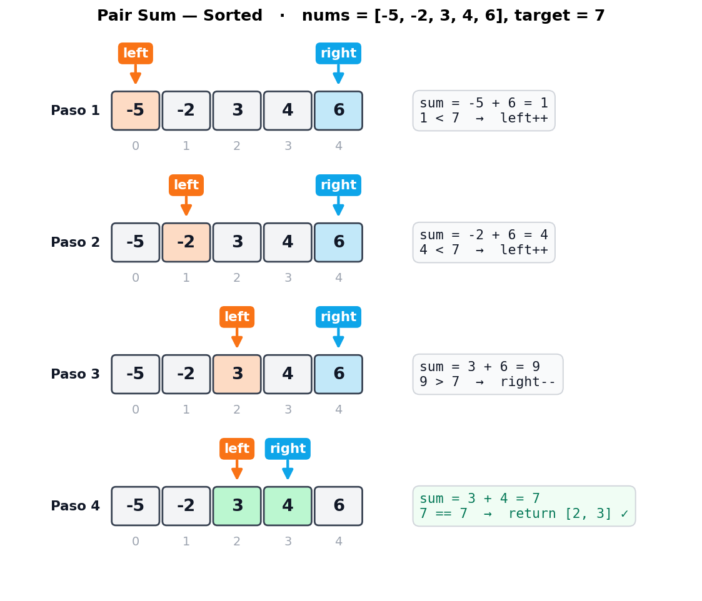
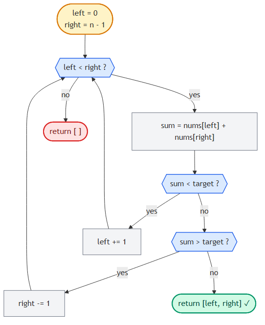

# Pair Sum — Sorted

> 📍 **Two Pointers · Problema 1/6** · [⬅ Introduction](./introduction.md) · [🏠 Chapter](./introduction.md) · [Triplet Sum ➡](./triplet-sum.md) · [📚 KB Index](../../../../README.md)

> **TL;DR** — Dado un array **ordenado ascendente** y un target, encontrar dos índices cuyos valores sumen el target. Two pointers desde los extremos: si la suma es chica, mover `left++`; si es grande, mover `right--`; si es igual, listo. **O(n) tiempo, O(1) espacio.**

---

## 📑 In this entry

0. [🎓 For Dummies — empezá por acá](#-for-dummies--empezá-por-acá)
1. [Problema](#problema)
2. [Brute force (y por qué no alcanza)](#brute-force-y-por-qué-no-alcanza)
3. [La intuición de two pointers](#la-intuición-de-two-pointers)
4. [Trace paso a paso](#trace-paso-a-paso)
5. [Decision flowchart](#decision-flowchart)
6. [Implementación](#implementación)
7. [Complexity Analysis](#complexity-analysis)
8. [Test Cases](#test-cases)
9. [⭐ Amplification: variantes y follow-ups](#-amplification-variantes-y-follow-ups)
10. [⚠️ Pitfalls](#️-pitfalls)
11. [Interview Tips](#interview-tips)

---

## 🎓 For Dummies — empezá por acá

**Analogía:** estás en una góndola del super con productos **ordenados de más barato a más caro** (de izquierda a derecha). Te dicen: "comprá dos productos que sumen exactamente $7".

**Forma boluda (brute force):** agarrás el primero, lo combinás con cada uno de los otros. Si no, agarrás el segundo, lo combinás con cada uno de los siguientes. Etc. Eso son **n × n** combinaciones.

**Forma piola (two pointers):**
- Una mano en el más barato (izquierda).
- La otra mano en el más caro (derecha).
- Sumás los precios:
  - Si **suma menos que $7** → la mano izquierda **se corre a la derecha** (a algo más caro). La mano derecha **no se mueve**, porque si la moviera a la izquierda, la suma sería **aún más chica**.
  - Si **suma más que $7** → la mano derecha **se corre a la izquierda** (a algo más barato).
  - Si **suma exacto** → bingo.

La pregunta clave: **¿por qué solo movés una mano por vez?** Porque la otra ya tiene la mejor opción posible en su dirección. Por ejemplo, si la suma es chica y movés `right` a la izquierda, la suma se hace **aún más chica** — eso nunca te va a acercar al target. La única jugada que sirve es subir la izquierda.

### Trampas comunes

- ⚠️ **No te olvides que el array tiene que estar sorted.** Si está unsorted, two pointers **no funciona** acá. Tendrías que ordenarlo primero (O(n log n)) o usar un hash map (O(n) tiempo + O(n) espacio).
- ⚠️ **`while left < right`, no `<=`.** Si usás `<=`, comparás un elemento contra sí mismo, y el problema dice "pair", o sea **dos índices distintos**.
- ⚠️ **Devolvé `[left, right]`, no `[nums[left], nums[right]]`.** El problema pide **índices**, no valores. Es un error clásico de leer rápido.

¿Listo para la versión completa? ⬇️

---

## Problema

Dado un array de enteros **ordenado ascendente** y un target, devolvé los **índices** de cualquier par de números que sumen el target. El orden de los índices en el resultado no importa. Si no hay par válido, devolvé un array vacío.

### Ejemplo 1

```
Input:  nums = [-5, -2, 3, 4, 6], target = 7
Output: [2, 3]
Explicación: nums[2] + nums[3] = 3 + 4 = 7
```

### Ejemplo 2

```
Input:  nums = [1, 1, 1], target = 2
Output: [0, 1]
Explicación: cualquier par de índices distintos cuyos valores sumen 2 es válido.
             [1, 0], [0, 2], [2, 0], [1, 2], [2, 1] también serían correctos.
```

---

## Brute force (y por qué no alcanza)

La solución obvia es probar todas las combinaciones con dos for-loops anidados:

```javascript
function pairSumSortedBruteForce(nums, target) {
    const n = nums.length;
    for (let i = 0; i < n; i++) {
        for (let j = i + 1; j < n; j++) {
            if (nums[i] + nums[j] === target) {
                return [i, j];
            }
        }
    }
    return [];
}
```

**Tiempo:** O(n²). **Espacio:** O(1).

Funciona, pero **no usa la información de que el array está sorted**. Cuando te dan datos con estructura, no aprovecharla en una entrevista es señal mala. ¿Cómo explotamos el orden?

---

## La intuición de two pointers

Empecemos con el **par más extremo posible**: el primer y el último elemento.

```
nums =  [ -5    -2    3     4    6  ]
índice:    0     1    2     3    4
           ▲                       ▲
          left                   right

         sum = nums[0] + nums[4] = -5 + 6 = 1
```

La suma es **1**, que es **menor** que el target **7**. ¿Cómo aumentamos la suma?

Tenemos dos opciones lógicas:
1. **Mover `left` a la derecha** → como el array está ordenado ascendente, el nuevo `nums[left]` es **≥** al anterior. La suma **aumenta o se queda igual**. ✓
2. **Mover `right` a la izquierda** → el nuevo `nums[right]` es **≤** al anterior. La suma **disminuye o se queda igual**. ✗ (eso nos aleja del target)

Conclusión: **si la suma es muy chica, movemos `left`**. Por simetría:

- Si la suma es **muy chica** → `left++` (subir el menor para subir la suma).
- Si la suma es **muy grande** → `right--` (bajar el mayor para bajar la suma).
- Si la suma es **igual al target** → encontramos el par, devolvemos `[left, right]`.

Cuando los punteros se cruzan (`left >= right`), recorrimos todo el espacio de pares posibles sin encontrar el target. Devolvemos `[]`.

> **Insight clave:** cada movimiento del puntero **descarta** un montón de pares de un saque. Cuando movés `left` a la derecha porque la suma era chica, estás diciendo "ningún par formado con `nums[left]` y un valor ≤ `nums[right]` puede sumar el target". Eso elimina toda una columna del espacio de búsqueda.

---

## Trace paso a paso

Ejemplo: `nums = [-5, -2, 3, 4, 6]`, `target = 7`.



**4 iteraciones para un array de 5 elementos.** Comparado con las **10 comparaciones** del brute force (5×4/2), el ahorro ya se nota. En arrays grandes la diferencia es brutal: 1.000.000 elementos serían 1.000.000 iteraciones vs 500.000.000.000.

---

## Decision flowchart



---

## Implementación

### JavaScript

```javascript
function pairSumSorted(nums, target) {
    let left = 0;
    let right = nums.length - 1;
    while (left < right) {
        const sum = nums[left] + nums[right];
        if (sum < target) {
            // Suma muy chica: subir el menor para que la suma crezca.
            left++;
        } else if (sum > target) {
            // Suma muy grande: bajar el mayor para que la suma decrezca.
            right--;
        } else {
            // Encontramos el par: devolver índices.
            return [left, right];
        }
    }
    return [];
}
```

### C#

```csharp
public int[] PairSumSorted(int[] nums, int target) {
    int left = 0, right = nums.Length - 1;
    while (left < right) {
        int sum = nums[left] + nums[right];
        if (sum < target) {
            // Suma muy chica: subir el menor para que la suma crezca.
            left++;
        } else if (sum > target) {
            // Suma muy grande: bajar el mayor para que la suma decrezca.
            right--;
        } else {
            // Encontramos el par: devolver índices.
            return new int[] { left, right };
        }
    }
    return Array.Empty<int>();
}
```

---

## Complexity Analysis

| Métrica | Valor | Por qué |
|---------|-------|---------|
| **Tiempo** | O(n) | En cada iteración movemos `left` o `right` (o ambos al encontrar el par y salir). Como `left` solo crece y `right` solo decrece, hacemos **a lo sumo n iteraciones** antes de que se crucen. |
| **Espacio** | O(1) | Solo guardamos las variables `left`, `right`, `sum`. No depende del tamaño del input. |

### Comparación con alternativas

| Approach | Tiempo | Espacio | Requiere sorted? |
|----------|--------|---------|------------------|
| Brute force (doble for) | O(n²) | O(1) | No |
| Hash map (`target - nums[i]`) | O(n) | O(n) | No |
| **Two pointers** | **O(n)** | **O(1)** | **Sí** |
| Sort + two pointers (si input unsorted) | O(n log n) | O(1) o O(n) según sort | — |

**Two pointers gana cuando el array ya viene sorted** (no pagás el sort) y querés O(1) espacio.

---

## Test Cases

| Input | Expected output | Descripción |
|-------|-----------------|-------------|
| `nums = []`, `target = 0` | `[]` | Array vacío. |
| `nums = [1]`, `target = 1` | `[]` | Un solo elemento — no hay par posible. |
| `nums = [2, 3]`, `target = 5` | `[0, 1]` | Dos elementos que suman al target. |
| `nums = [2, 4]`, `target = 5` | `[]` | Dos elementos que no suman al target. |
| `nums = [2, 2, 3]`, `target = 5` | `[0, 2]` o `[1, 2]` | Duplicados — cualquier par válido sirve. |
| `nums = [-1, 2, 3]`, `target = 2` | `[0, 2]` | Un valor negativo en el par. |
| `nums = [-3, -2, -1]`, `target = -5` | `[0, 1]` | Ambos valores negativos. |
| `nums = [1, 2, 3, 4, 5]`, `target = 100` | `[]` | Target imposible. |
| `nums = [0, 0]`, `target = 0` | `[0, 1]` | Caso borde con ceros. |

---

## ⭐ Amplification: variantes y follow-ups

### Variante 1: array unsorted

Si el input **no está sorted**, tenés dos caminos:

| Approach | Cuándo elegirlo |
|----------|-----------------|
| **Sort + two pointers** | Si **podés modificar el input** y el espacio es crítico. Costo: O(n log n) tiempo, O(1) o O(log n) espacio extra (depende del sort). Pero **perdés los índices originales** — si te piden los índices del array original, no sirve. |
| **Hash map** | Si te piden **índices originales** o el array no se puede modificar. Costo: O(n) tiempo y O(n) espacio. |

```javascript
// Hash map para array unsorted (Two Sum clásico de LeetCode)
function twoSum(nums, target) {
    const seen = new Map();
    for (let i = 0; i < nums.length; i++) {
        const complement = target - nums[i];
        if (seen.has(complement)) {
            return [seen.get(complement), i];
        }
        seen.set(nums[i], i);
    }
    return [];
}
```

### Variante 2: encontrar TODOS los pares (no solo uno)

```javascript
function allPairsSumSorted(nums, target) {
    const pairs = [];
    let left = 0, right = nums.length - 1;
    while (left < right) {
        const s = nums[left] + nums[right];
        if (s < target) {
            left++;
        } else if (s > target) {
            right--;
        } else {
            pairs.push([left, right]);
            left++;
            right--;
            // Saltar duplicados si el problema lo pide:
            while (left < right && nums[left] === nums[left - 1]) left++;
            while (left < right && nums[right] === nums[right + 1]) right--;
        }
    }
    return pairs;
}
```

Esta variante es la **base de [Triplet Sum](./triplet-sum.md)**.

### Variante 3: pair sum closest to target

¿Y si el target no existe pero querés el par **más cercano**? Mismo loop, pero llevás un `min_diff` y actualizás cuando encontrás un par mejor:

```javascript
function pairSumClosest(nums, target) {
    let left = 0, right = nums.length - 1;
    let best = null;
    let minDiff = Infinity;
    while (left < right) {
        const s = nums[left] + nums[right];
        const diff = Math.abs(s - target);
        if (diff < minDiff) {
            minDiff = diff;
            best = [left, right];
        }
        if (s < target) {
            left++;
        } else {
            right--;
        }
    }
    return best;
}
```

### Follow-ups típicos en entrevista

- *"¿Y si el array tiene duplicados?"* — Sigue funcionando para "encontrar UN par", pero para "encontrar TODOS los pares únicos" hay que skipear duplicados (ver Variante 2).
- *"¿Y si lo querés en un sorted linked list?"* — No podés indexar barato. Convertir a array (O(n) espacio) o usar el algoritmo lento de dos pasadas.
- *"¿Y si los elementos son flotantes y necesitás tolerancia (target ± epsilon)?"* — Cambiás los `==/<` por comparaciones con tolerancia. La lógica de movimiento se mantiene.

---

## ⚠️ Pitfalls

- **Asumir sorted sin confirmar.** En la entrevista, **siempre** preguntá: "¿el array viene sorted?" Si no, two pointers no aplica directamente.
- **Off-by-one en bordes.** `right = len(nums) - 1`, no `len(nums)`. Y la condición es `<`, no `<=`.
- **Devolver valores en lugar de índices.** El problema pide **índices**. Confirmar.
- **Olvidar `[]` cuando no hay solución.** Algunos test cases miden esto.
- **Mover ambos punteros al encontrar el par cuando se busca solo uno.** No hace falta: ya devolvimos.
- **Usar `<=` en el while.** Eso permite `left == right`, lo que compararía un elemento contra sí mismo. Si el problema permite usar el mismo índice dos veces, sí; si no (lo normal), `<`.

---

## Interview Tips

**Tip 1 — Aclará constraints antes de codear.**
Preguntas estándar: ¿el array está sorted? ¿hay duplicados? ¿pueden venir negativos? ¿qué devuelvo si no hay solución? ¿índices o valores? ¿múltiples pares o uno solo?

**Tip 2 — Considerá toda la información del enunciado.**
Cuando ves "sorted array" en el enunciado, eso es una **pista enorme**. Si tu solución no usa el orden, probablemente no es la óptima. El entrevistador te dejó esa palabra ahí a propósito.

**Tip 3 — Verbalizá la invariante.**
Decí en voz alta mientras codeás: *"left siempre apunta al menor candidato sin descartar; right siempre al mayor; cuando se cruzan, no queda nada por probar."* Mostrar que entendés **por qué** funciona vale más que el código.

**Tip 4 — Si el follow-up es Two Sum II vs Two Sum I (LeetCode), sabé la diferencia.**
- *Two Sum I* (LeetCode #1): array **unsorted**, devolver índices → hash map O(n)/O(n).
- *Two Sum II* (LeetCode #167): array **sorted**, devolver índices (1-indexed) → two pointers O(n)/O(1).

---

## References

- LeetCode — [#167 Two Sum II - Input Array Is Sorted](https://leetcode.com/problems/two-sum-ii-input-array-is-sorted/)
- LeetCode — [#1 Two Sum](https://leetcode.com/problems/two-sum/) (versión unsorted, hash map)
- Coding Interview Patterns — capítulo "Two Pointers" → "Pair Sum - Sorted"
- Entradas relacionadas:
  - [Introduction to Two Pointers](./introduction.md)
  - [Triplet Sum](./triplet-sum.md) (extiende este algoritmo a 3 elementos)

---

> 📍 **Two Pointers · Problema 1/6** · [⬅ Introduction](./introduction.md) · [🏠 Chapter](./introduction.md) · [Triplet Sum ➡](./triplet-sum.md) · [📚 KB Index](../../../../README.md)
