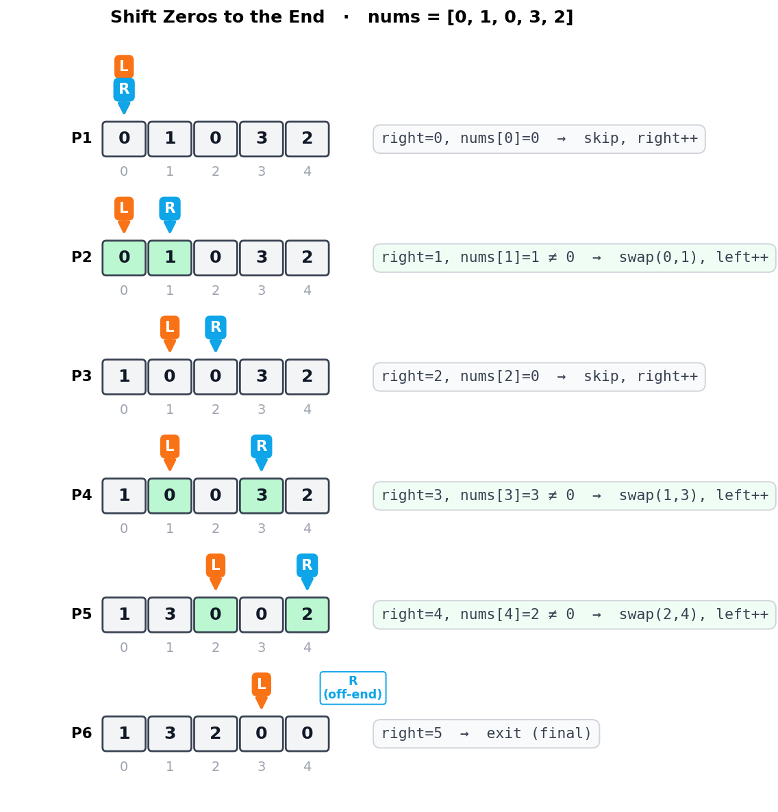
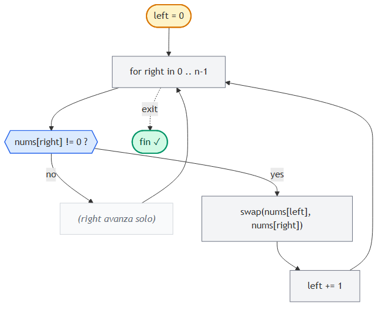

# Shift Zeros to the End (Move Zeroes)

> 📍 **Two Pointers · Problema 5/6** · [⬅ Is Palindrome Valid](./is-palindrome-valid.md) · [🏠 Chapter](./introduction.md) · [Next Lex Sequence ➡](./next-lexicographical-sequence.md) · [📚 KB Index](../../../../README.md)

> **TL;DR** — Mover todos los **ceros al final** de un array, manteniendo el **orden relativo de los no-ceros**, **in-place**. Two pointers **unidirectional**: `left` marca dónde escribir el próximo no-cero; `right` recorre buscando no-ceros para mover. Cada vez que `right` encuentra un no-cero, swap con `left` y avanzá ambos. **O(n) tiempo, O(1) espacio.**

---

## 📑 In this entry

0. [🎓 For Dummies — empezá por acá](#-for-dummies--empezá-por-acá)
1. [Problema](#problema)
2. [Approach naive (que falla la consigna in-place)](#approach-naive-que-falla-la-consigna-in-place)
3. [La idea: enfocate en los no-ceros](#la-idea-enfocate-en-los-no-ceros)
4. [Two pointers unidirectional](#two-pointers-unidirectional)
5. [Trace paso a paso](#trace-paso-a-paso)
6. [Algorithm flowchart](#algorithm-flowchart)
7. [Implementación](#implementación)
8. [Por qué `left ≤ right` siempre](#por-qué-left--right-siempre)
9. [Complexity Analysis](#complexity-analysis)
10. [Test Cases](#test-cases)
11. [⭐ Amplification: variantes y patrones relacionados](#-amplification-variantes-y-patrones-relacionados)
12. [⚠️ Pitfalls](#️-pitfalls)
13. [Interview Tips](#interview-tips)

---

## 🎓 For Dummies — empezá por acá

**Analogía:** tenés una **fila de bandejas** con manzanas y vacíos (las manzanas son los no-ceros, los vacíos son los ceros). Querés que **todas las manzanas queden a la izquierda** sin cambiar el orden entre ellas, y que los vacíos queden a la derecha. **Sin usar bandejas extras.**

```
Antes:    [ 0    🍎    0    🍎    🍎 ]
Después:  [ 🍎   🍎    🍎   0    0  ]
```

**Forma piola:** dos personas empujan las manzanas:
- **Persona LEFT** se queda parada en la próxima posición que tiene que recibir una manzana.
- **Persona RIGHT** camina por toda la fila buscando manzanas.
- Cada vez que RIGHT encuentra una manzana, **la cambia con lo que tenga LEFT en su posición** (puede ser un vacío o la misma manzana).
- Después, LEFT da un paso adelante (porque ya tiene su manzana), y RIGHT sigue caminando.

Cuando RIGHT terminó de recorrer toda la fila, **todas las manzanas quedaron contiguas a la izquierda** (en el orden original) y los vacíos quedaron solos a la derecha. ¡Magia!

**Truco mental clave:** en vez de "mover los ceros al final" (difícil), **mové los no-ceros al principio** (fácil). Los ceros van quedando solos al final por descarte.

### Trampas comunes

- ⚠️ **Mover `left` cuando RIGHT cae en cero.** No: `left` solo avanza cuando hubo swap (es decir, cuando RIGHT encontró un no-cero). Si RIGHT está en cero, RIGHT avanza solo.
- ⚠️ **Hacer swap con uno mismo cuando `left == right`.** No es bug funcional (el array no cambia), pero es trabajo perdido. La optimización `if right != left` lo evita.
- ⚠️ **Romper la consigna "in-place" creando un array nuevo.** Si el enunciado pide modificar el input, **no puedo allocar `temp` y devolverlo** — eso es trampa.

¿Listo para la versión completa? ⬇️

---

## Problema

Dado un array de enteros, modificá el array **in-place** para mover todos los ceros al final, manteniendo el **orden relativo** de los elementos no-cero.

### Ejemplo

```
Input:  nums = [0, 1, 0, 3, 2]
Output: [1, 3, 2, 0, 0]
```

### Constraints implícitas

- **In-place:** no podés devolver un array nuevo; tenés que mutar `nums`.
- **Orden de los no-ceros:** se preserva (`1, 3, 2` en el ejemplo).
- **Orden de los ceros:** irrelevante (todos son `0`, son indistinguibles).

---

## Approach naive (que falla la consigna in-place)

Crear un array auxiliar `temp` del mismo tamaño, copiar los no-ceros al frente, y rellenar el resto con ceros. Después, copiar `temp` de vuelta a `nums`:

```javascript
function shiftZerosNaive(nums) {
    const temp = new Array(nums.length).fill(0);
    let i = 0;
    for (const num of nums) {
        if (num !== 0) {
            temp[i] = num;
            i++;
        }
    }
    for (let j = 0; j < nums.length; j++) {
        nums[j] = temp[j];
    }
}
```

**Tiempo:** O(n). **Espacio:** O(n) ❌ (rompe la consigna in-place).

Pero **la idea es buena**: ignorar los ceros y solo mover los **no-ceros** al principio. Solo falta hacerlo sin allocar.

---

## La idea: enfocate en los no-ceros

Reformulá el problema: en vez de *"mover los ceros al final"*, hacé *"mover los no-ceros al principio en orden"*. Si lo lográs, los ceros quedan al final automáticamente (eran lo único que sobraba).

```
Input:        [ 0    1    0    3    2 ]
                    ▲         ▲    ▲
                    └─────────┴────┴───── son los no-ceros, en orden
                                          
Output:       [ 1    3    2    _    _ ]   ← no-ceros movidos al principio
                                  └────┴── posiciones que sobran → ceros
```

Si tuviera un cursor que indique *"acá va el próximo no-cero"*, y otro cursor que **busque** el próximo no-cero, podría escribirlo y avanzar el primer cursor. Eso es exactamente two pointers unidirectional.

---

## Two pointers unidirectional

**Convención:**
- `left`: posición donde **se va a escribir** el próximo no-cero. Empieza en `0`.
- `right`: cursor que **recorre** el array buscando no-ceros. Empieza en `0` y avanza siempre.

**Lógica por iteración:**

```
Si nums[right] == 0:
    No hago nada — solo avanzo right.

Si nums[right] != 0:
    Swap nums[left] con nums[right].   (mover el no-cero a la posición correcta)
    left += 1.                          (la próxima posición de escritura es la siguiente)
    Avanzo right.
```

`right` avanza **siempre** (sea cero o no), por eso lo escribimos como un `for` regular sobre todos los índices del array.

`left` solo avanza cuando hubo un swap.

### Optimización menor

Si `left == right` cuando hay match (porque arrancó así o porque venimos pegados), el swap es una operación "no-op" (cambiar el elemento consigo mismo). Podés saltarte el swap con `if right != left`.

---

## Trace paso a paso

Ejemplo: `nums = [0, 1, 0, 3, 2]`.



**Resultado:** `nums = [1, 3, 2, 0, 0]` ✓

**Observación clave:** en cada iteración, **todo lo que está a la izquierda de `left` es no-cero y en orden original**. **Todo lo que está entre `left` y `right` (inclusive) son ceros listos para ser sobreescritos**. Esa es la **invariante** del algoritmo.

---

## Algorithm flowchart



---

## Implementación

### JavaScript

```javascript
function shiftZerosToTheEnd(nums) {
    let left = 0;
    for (let right = 0; right < nums.length; right++) {
        if (nums[right] !== 0) {
            // Optimización: skip swap si los punteros coinciden.
            if (right !== left) {
                [nums[left], nums[right]] = [nums[right], nums[left]];
            }
            left++;
        }
    }
}
```

### C#

```csharp
public void ShiftZerosToTheEnd(int[] nums) {
    int left = 0;
    for (int right = 0; right < nums.Length; right++) {
        if (nums[right] != 0) {
            // Optimización: skip swap si los punteros coinciden.
            if (right != left) {
                (nums[left], nums[right]) = (nums[right], nums[left]);
            }
            left++;
        }
    }
}
```

---

## Por qué `left ≤ right` siempre

Una **invariante** importante: en este algoritmo, `left` **nunca supera** a `right`.

- `left` empieza en 0 igual que `right`.
- `left` solo avanza después de que `right` ya está en una posición válida.
- En cada iteración del for-loop, `right` avanza al final, así que después de incrementar `left` por un swap, `right` se incrementa también → `left ≤ right` se mantiene.

Esto garantiza que **nunca** sobrescribís un valor que todavía no leíste. Por eso el swap es seguro y el algoritmo funciona en una sola pasada.

---

## Complexity Analysis

| Métrica | Valor | Por qué |
|---------|-------|---------|
| **Tiempo** | O(n) | El for-loop hace exactamente `n` iteraciones. Cada iteración es O(1) (comparación + swap opcional). |
| **Espacio** | O(1) | Solo `left` y la variable temporal del swap. No allocamos arrays nuevos. |

### Comparación con alternativas

| Approach | Tiempo | Espacio | In-place? | Preserva orden? |
|----------|--------|---------|-----------|-----------------|
| Naive (array auxiliar) | O(n) | **O(n)** | ❌ | ✓ |
| Dos pasadas (escribir no-ceros, después rellenar ceros) | O(n) | O(1) | ✓ | ✓ |
| **Two pointers (una pasada con swap)** | **O(n)** | **O(1)** | **✓** | **✓** |
| Quicksort partitioning style | O(n) | O(1) | ✓ | ❌ (no garantiza orden) |

**Two pointers gana** porque hace **una sola pasada** y preserva el orden. La versión "dos pasadas" es válida también pero hace más trabajo.

### Variante "una pasada sin swap" (escribir + rellenar)

```javascript
function shiftZerosTwoPasses(nums) {
    let write = 0;
    // Pasada 1: copiar no-ceros al frente.
    for (let read = 0; read < nums.length; read++) {
        if (nums[read] !== 0) {
            nums[write] = nums[read];
            write++;
        }
    }
    // Pasada 2: rellenar el resto con ceros.
    for (let i = write; i < nums.length; i++) {
        nums[i] = 0;
    }
}
```

Misma complexity, pero hace ≤ 2n escrituras vs ≈ n escrituras del swap version. En la práctica son equivalentes.

---

## Test Cases

| Input | Expected | Descripción |
|-------|----------|-------------|
| `[]` | `[]` | Array vacío. |
| `[0]` | `[0]` | Un solo cero. |
| `[1]` | `[1]` | Un solo no-cero. |
| `[0, 0, 0]` | `[0, 0, 0]` | Todos ceros. |
| `[1, 3, 2]` | `[1, 3, 2]` | Sin ceros — sin cambios. |
| `[1, 1, 1, 0, 0]` | `[1, 1, 1, 0, 0]` | Ceros ya al final. |
| `[0, 0, 1, 1, 1]` | `[1, 1, 1, 0, 0]` | Ceros al principio. |
| `[0, 1, 0, 3, 2]` | `[1, 3, 2, 0, 0]` | Caso del enunciado. |
| `[1, 0, 1, 0, 1]` | `[1, 1, 1, 0, 0]` | Alternados. |
| `[4, 2, 4, 0, 0, 3, 0, 5, 1, 0]` | `[4, 2, 4, 3, 5, 1, 0, 0, 0, 0]` | Mix grande. |

---

## ⭐ Amplification: variantes y patrones relacionados

### Variante 1: Remove Element (LeetCode #27)

*"Eliminar todas las apariciones de un valor específico in-place. Devolver la nueva longitud."*

Idéntico al patrón:

```javascript
function removeElement(nums, val) {
    let left = 0;
    for (let right = 0; right < nums.length; right++) {
        if (nums[right] !== val) {
            nums[left] = nums[right];
            left++;
        }
    }
    return left;  // nueva longitud
}
```

**Diferencia con shift-zeros:** acá no necesitás preservar los valores "removidos" al final, así que no hay swap — solo escribís `nums[left] = nums[right]` (overwrite).

### Variante 2: Remove Duplicates from Sorted Array (LeetCode #26)

*"Eliminar duplicados in-place de un array sorted. Devolver la nueva longitud."*

```javascript
function removeDuplicates(nums) {
    if (nums.length === 0) return 0;
    let left = 1;
    for (let right = 1; right < nums.length; right++) {
        if (nums[right] !== nums[right - 1]) {
            nums[left] = nums[right];
            left++;
        }
    }
    return left;
}
```

Mismo esqueleto: `left` apunta a dónde escribir, `right` recorre.

### Variante 3: Sort Colors / Dutch Flag (LeetCode #75)

*"Ordenar in-place un array que contiene solo 0, 1, 2 — sin usar sort."*

Necesita **tres punteros** (low, mid, high). Es una generalización de shift-zeros:

```javascript
function sortColors(nums) {
    let low = 0, mid = 0, high = nums.length - 1;
    while (mid <= high) {
        if (nums[mid] === 0) {
            [nums[low], nums[mid]] = [nums[mid], nums[low]];
            low++;
            mid++;
        } else if (nums[mid] === 1) {
            mid++;
        } else {  // nums[mid] === 2
            [nums[mid], nums[high]] = [nums[high], nums[mid]];
            high--;
        }
    }
}
```

`low` separa los 0s de los 1s; `high` separa los 1s de los 2s; `mid` es el cursor de exploración. **Patrón "Three-way partitioning".**

### El meta-patrón: read pointer + write pointer

Todas estas variantes comparten la misma estructura:
1. Un **read pointer** (`right`) que **siempre avanza**, escaneando.
2. Un **write pointer** (`left`) que avanza **solo cuando se escribe** un valor "válido".
3. La condición para escribir cambia según el problema (no-cero, no-igual-al-anterior, no-igual-a-val).

Una vez que lo internalizás, **una familia entera de problemas se resuelve igual**.

### Variante 4: Mover los CEROS al PRINCIPIO

(simétrico) — recorrés desde la derecha:

```javascript
function shiftZerosToTheStart(nums) {
    let right = nums.length - 1;
    for (let left = nums.length - 1; left >= 0; left--) {
        if (nums[left] !== 0) {
            if (left !== right) {
                [nums[left], nums[right]] = [nums[right], nums[left]];
            }
            right--;
        }
    }
}
```

Cambio: las direcciones de los punteros se invierten.

---

## ⚠️ Pitfalls

- **Avanzar `left` siempre, no solo en match.** Si `left++` cuando RIGHT está en cero, perdés la posición de escritura.
- **Olvidar el swap.** Si solo hacés `nums[left] = nums[right]` (overwrite) sin swap, **perdés el valor de `nums[left]`** — y para shift-zeros eso era un cero útil, lo necesitás conservar para que aparezca al final.
- **Asumir que el problema pide devolver el array.** El enunciado dice "modify in place" — la firma típica devuelve `void` (no `int[]`).
- **No considerar arrays sin ceros o solo ceros.** El algoritmo los maneja bien sin código extra. No agregues casos especiales.
- **Confundir con remove-element.** En remove-element no importan los valores removidos (devolvés solo la nueva longitud). En shift-zeros sí necesitás que los ceros queden al final con el conteo correcto — por eso swap, no overwrite.

---

## Interview Tips

**Tip 1 — Reformulá el problema.**
Decí: *"En vez de mover ceros al final, voy a mover no-ceros al principio. Es el mismo resultado, pero más fácil de razonar."* Mostrar que cambiás el ángulo del problema impresiona.

**Tip 2 — Aclará los constraints.**
- ¿Tengo que devolver algo? (típicamente no, porque es in-place).
- ¿Importa el orden de los ceros entre sí? (no, son indistinguibles).
- ¿Importa el orden relativo de los no-ceros? (sí, hay que preservarlo).
- ¿Puedo usar memoria extra? (no, in-place).

**Tip 3 — Habla de la invariante.**
Decí: *"En cada iteración, todo a la izquierda de `left` son los no-ceros encontrados hasta ahora, en orden. Entre `left` y `right` hay solo ceros. `right` busca el siguiente no-cero."*

**Tip 4 — Si el follow-up es "minimizá las escrituras", tirá la versión sin swap.**
La versión "dos pasadas" hace ≤ 2n escrituras. La versión swap hace ≤ n swaps (cada swap = 2 escrituras), pero **muchos pueden ser self-swaps**. Ambas son O(n) pero pueden tener constants distintas. Mostrar que pensaste en eso suma.

**Tip 5 — La complejidad es O(n) tiempo, O(1) espacio.**
Sabela en frío. Es la clase de problema que aparece en screen rounds.

---

## References

- LeetCode — [#283 Move Zeroes](https://leetcode.com/problems/move-zeroes/)
- LeetCode — [#27 Remove Element](https://leetcode.com/problems/remove-element/) (variante)
- LeetCode — [#26 Remove Duplicates from Sorted Array](https://leetcode.com/problems/remove-duplicates-from-sorted-array/) (variante)
- LeetCode — [#75 Sort Colors](https://leetcode.com/problems/sort-colors/) (Dutch flag, tres punteros)
- Coding Interview Patterns — capítulo "Two Pointers" → "Shift Zeros to the End"
- Entradas relacionadas:
  - [Introduction to Two Pointers](./introduction.md)

---

> 📍 **Two Pointers · Problema 5/6** · [⬅ Is Palindrome Valid](./is-palindrome-valid.md) · [🏠 Chapter](./introduction.md) · [Next Lex Sequence ➡](./next-lexicographical-sequence.md) · [📚 KB Index](../../../../README.md)
