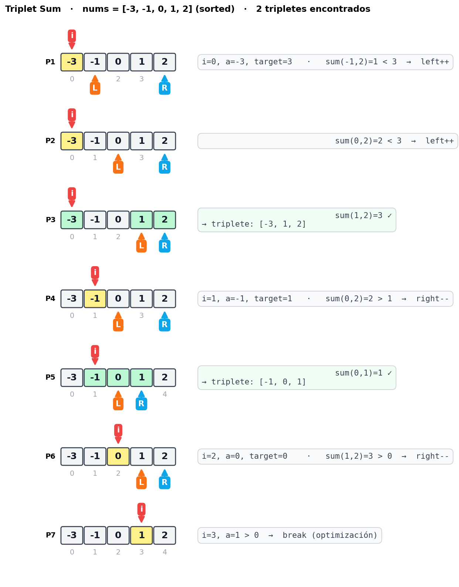
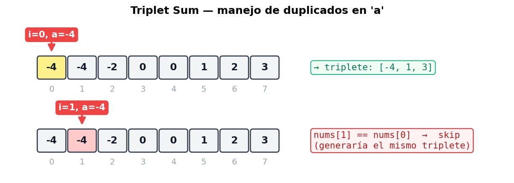
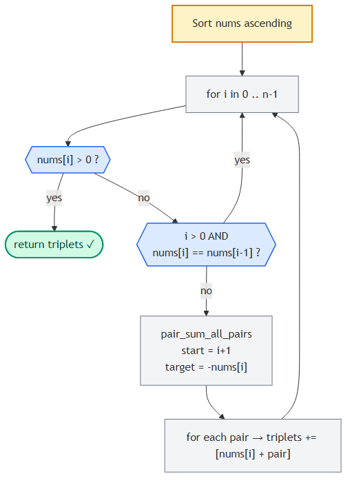

# Triplet Sum (3Sum)

> 📍 **Two Pointers · Problema 2/6** · [⬅ Pair Sum](./pair-sum-sorted.md) · [🏠 Chapter](./introduction.md) · [Largest Container ➡](./largest-container.md) · [📚 KB Index](../../../../README.md)

> **TL;DR** — Encontrar todos los tripletes únicos `[a, b, c]` que sumen 0. Estrategia: **sort** el array, fijar `a` con un loop externo, y aplicar **pair-sum** con two pointers en el sub-array para encontrar `b + c = -a`. Skip de duplicados en `a` y en `b` para no generar tripletes repetidos. **O(n²) tiempo, O(1) espacio extra.**

---

## 📑 In this entry

0. [🎓 For Dummies — empezá por acá](#-for-dummies--empezá-por-acá)
1. [Problema](#problema)
2. [Brute force O(n³) y por qué no alcanza](#brute-force-on-y-por-qué-no-alcanza)
3. [La idea: reducir a Pair Sum](#la-idea-reducir-a-pair-sum)
4. [Manejo de duplicados (caso a y caso b)](#manejo-de-duplicados-caso-a-y-caso-b)
5. [Optimización: cortar cuando a > 0](#optimización-cortar-cuando-a--0)
6. [Trace paso a paso](#trace-paso-a-paso)
7. [Algorithm flowchart](#algorithm-flowchart)
8. [Implementación](#implementación)
9. [Complexity Analysis](#complexity-analysis)
10. [Test Cases](#test-cases)
11. [⭐ Amplification: variantes y follow-ups](#-amplification-variantes-y-follow-ups)
12. [⚠️ Pitfalls](#️-pitfalls)
13. [Interview Tips](#interview-tips)

---

## 🎓 For Dummies — empezá por acá

**Analogía:** imaginá que tenés un montón de **monedas con valores positivos y negativos** (deudas y créditos). Te piden encontrar **todos los grupos de 3 monedas que sumen exactamente 0** (o sea, que se cancelen entre ellas). No querés grupos repetidos.

**Forma boluda:** probás todas las combinaciones de 3. Con 100 monedas son ≈ 100×100×100 = **1.000.000 combinaciones**. Encima tenés que filtrar duplicados a mano. Te morís.

**Forma piola — el truco:** **fijá una moneda** y buscá **un par** entre las demás que cancele esa primera. Si fijás una moneda de valor `-3`, necesitás que las otras dos sumen `+3`. Eso es **exactamente Pair Sum**, que ya sabés resolver en O(n) si el array está ordenado.

**Pasos:**
1. **Ordenás** todas las monedas de menor a mayor.
2. Para cada moneda `a` (loop externo), buscás un par `[b, c]` en lo que queda a la derecha que sume `-a`. Eso es two-pointer inward.
3. Para no generar tripletes duplicados, **salteás** valores repetidos de `a` y de `b`.

**¿Por qué se hace `O(n²)` y no `O(n³)`?** Porque el loop externo es `n`, y para cada `a` la búsqueda de pareja es `O(n)` (two pointers, no doble for). Total: `n × n = n²`.

### Trampas comunes

- ⚠️ **No ordenar el array primero.** Sin sort no podés usar two pointers para `b + c = -a` ni dedupear de forma simple. Ordenar agrega O(n log n), que queda **dominado** por el O(n²) total — no afecta el orden de magnitud.
- ⚠️ **Olvidar el skip de duplicados.** Si `nums = [-1, -1, 0, 1, 1]`, sin skip vas a sacar `[-1, 0, 1]` dos veces (una con cada `-1` como `a`, otra con cada `1` como `c`).
- ⚠️ **Skipear duplicados antes de buscar par en lugar de después de matchearlo.** El skip de `a` se hace **antes** del two-pointer inner; el skip de `b` se hace **después** de matchear, mientras avanzás `left`.

¿Listo para la versión completa? ⬇️

---

## Problema

Dado un array de enteros, devolvé **todos los tripletes** `[a, b, c]` tales que `a + b + c = 0`. La solución **no debe contener tripletes duplicados** (ej: `[1, 2, 3]` y `[2, 3, 1]` son duplicados — el orden interno del triplete no importa). Si no hay tripletes válidos, devolvé `[]`.

### Ejemplo

```
Input:  nums = [0, -1, 2, -3, 1]
Output: [[-3, 1, 2], [-1, 0, 1]]
```

Cada triplete puede salir en cualquier orden, y la lista de tripletes también puede salir en cualquier orden.

---

## Brute force O(n³) y por qué no alcanza

La forma directa: tres for-loops anidados y un set para deduplicar.

```javascript
function tripletSumBruteForce(nums) {
    const n = nums.length;
    const triplets = new Set();
    for (let i = 0; i < n; i++) {
        for (let j = i + 1; j < n; j++) {
            for (let k = j + 1; k < n; k++) {
                if (nums[i] + nums[j] + nums[k] === 0) {
                    // Sort para deduplicar via Set (stringificado).
                    const key = [nums[i], nums[j], nums[k]].sort((a, b) => a - b).join(",");
                    triplets.add(key);
                }
            }
        }
    }
    return [...triplets].map(s => s.split(",").map(Number));
}
```

**Tiempo:** O(n³). **Espacio:** O(número de tripletes únicos) para el set.

Para `n = 1000` ya es **1.000.000.000 operaciones** — inviable. Tenemos que bajar a **O(n²)**.

---

## La idea: reducir a Pair Sum

**Observación clave:** si fijo un valor `a` del triplete, el problema se transforma en *"encontrar un par `[b, c]` que sume `-a`"*. Eso es **Pair Sum - Sorted**, que ya sabemos resolver en **O(n)** si el array está ordenado.

```
Triplete:  a + b + c = 0
                          
Fijo a, queda:  b + c = -a   →  pair sum con target -a
```

**Plan:**
1. **Ordenar** el array. Costo: O(n log n).
2. Loop externo `i` de 0 a n-1. En cada iteración, `a = nums[i]`.
3. Para cada `a`, llamar a una versión modificada de pair-sum que encuentre **todos los pares** `[b, c]` que sumen `-a` en `nums[i+1 .. n-1]`. Ojo: **a la derecha de `i`**, no en todo el array, para no contar el mismo elemento dos veces.
4. Combinar `a` con cada par encontrado para formar tripletes.

**Por qué pair-sum acá busca *todos los pares* (no solo uno):** podemos tener varios `[b, c]` distintos que sumen `-a`. Por ejemplo, con `a = -2` y array `[..., -1, -1, 0, 1, 2, 3]`, los pares válidos son `[-1, 3]`, `[0, 2]`, `[-1, 3]`... varios.

---

## Manejo de duplicados (caso a y caso b)

Hay dos lugares donde aparecen tripletes duplicados. Verlos con un ejemplo.

`nums = [-4, -4, -2, 0, 0, 1, 2, 3]` (ya ordenado).

### Caso 1: `a` repetido

Si `nums[0] = -4` y `nums[1] = -4`, fijar `a` en cualquiera de los dos da **el mismo target** (`-a = 4`) y por lo tanto **los mismos pares**. Los tripletes serían idénticos.

```
[ -4   -4   -2   0   0   1   2   3 ]
  ▲                                         ▲ a = -4 fijo en i=0
       ▲                                    ▲ a = -4 fijo en i=1 → duplica
```

**Solución:** si `nums[i] == nums[i-1]`, **skip** ese `i` y continuá.

```javascript
if (i > 0 && nums[i] === nums[i - 1]) continue;
```

### Caso 2: `b` repetido (dentro del two-pointer inner)

Cuando dentro del two-pointer inner encontramos un par válido y avanzamos `left`, podemos caer en otro elemento con el **mismo valor de `b`**. Eso generaría el mismo `[b, c]` (porque `c = -a - b` también es el mismo).

```
target = -a = 4

[ ..., -2,    0,    0,    1,    2,    2,    3 ]
                     ▲                       ▲
                    left                  right
                    b=0   matchea con c=4 (no existe acá pero ilustra)

después de matchear, left++  →  left cae en otro 0
                                  esto generaría el mismo [b, c]  →  skip
```

**Solución:** después de matchear y hacer `left += 1`, mientras `nums[left] == nums[left - 1]`, seguir avanzando.

```javascript
left++;
while (left < right && nums[left] === nums[left - 1]) left++;
```

### ¿Y `c`? No hay que skipearlo explícitamente

Una vez fijos `a` único y `b` único, `c = -(a + b)` queda **completamente determinado**. Distintos `[a, b]` únicos generan distintos tripletes, así que el dedup en `c` queda **automático**. No necesitás un skip extra.

---

## Optimización: cortar cuando `a > 0`

Como el array está ordenado ascendente, en algún momento `nums[i]` se vuelve **positivo**. A partir de ahí, los otros dos elementos del triplete (que están a su derecha en el sub-array) **también son positivos**. **Tres positivos no pueden sumar 0**, así que podemos cortar el loop:

```javascript
if (nums[i] > 0) break;
```

Esto no cambia la complejidad asintótica pero acelera el caso real bastante.

---

## Trace paso a paso

Ejemplo: `nums = [0, -1, 2, -3, 1]`. Después de ordenar queda `[-3, -1, 0, 1, 2]`.



**Resultado final:** `[[-3, 1, 2], [-1, 0, 1]]` ✓

### Manejo de duplicados (visual)

Cuando `a` se repite, el segundo (y siguientes) hay que saltearlos para no generar tripletes idénticos:



---

## Algorithm flowchart



---

## Implementación

### JavaScript

```javascript
function tripletSum(nums) {
    nums.sort((a, b) => a - b);
    const triplets = [];
    for (let i = 0; i < nums.length; i++) {
        // Optimización: tripletes con solo positivos no suman 0.
        if (nums[i] > 0) break;
        // Skip 'a' duplicado.
        if (i > 0 && nums[i] === nums[i - 1]) continue;
        // Buscar pares [b, c] que sumen -nums[i] en el sub-array nums[i+1 ..].
        const pairs = pairSumAllPairs(nums, i + 1, -nums[i]);
        for (const [b, c] of pairs) {
            triplets.push([nums[i], b, c]);
        }
    }
    return triplets;
}

function pairSumAllPairs(nums, start, target) {
    const pairs = [];
    let left = start, right = nums.length - 1;
    while (left < right) {
        const s = nums[left] + nums[right];
        if (s === target) {
            pairs.push([nums[left], nums[right]]);
            left++;
            // Skip 'b' duplicado.
            while (left < right && nums[left] === nums[left - 1]) left++;
        } else if (s < target) {
            left++;
        } else {
            right--;
        }
    }
    return pairs;
}
```

### C#

```csharp
public IList<IList<int>> TripletSum(int[] nums) {
    Array.Sort(nums);
    var triplets = new List<IList<int>>();
    for (int i = 0; i < nums.Length; i++) {
        // Optimización: tripletes con solo positivos no suman 0.
        if (nums[i] > 0) break;
        // Skip 'a' duplicado.
        if (i > 0 && nums[i] == nums[i - 1]) continue;
        int left = i + 1, right = nums.Length - 1, target = -nums[i];
        while (left < right) {
            int sum = nums[left] + nums[right];
            if (sum == target) {
                triplets.Add(new List<int> { nums[i], nums[left], nums[right] });
                left++;
                // Skip 'b' duplicado.
                while (left < right && nums[left] == nums[left - 1]) left++;
            } else if (sum < target) {
                left++;
            } else {
                right--;
            }
        }
    }
    return triplets;
}
```

---

## Complexity Analysis

| Métrica | Valor | Por qué |
|---------|-------|---------|
| **Tiempo** | O(n²) | Sort: O(n log n). Loop externo: n iteraciones. Cada iteración ejecuta two-pointer inner que es O(n). Total: O(n log n) + O(n × n) = **O(n²)**. |
| **Espacio (sin contar output)** | O(log n) a O(n) | Depende del sort: V8 (Node.js) usa TimSort O(n); .NET `Array.Sort` usa introspective quicksort in-place O(log n) por la pila de recursión. |
| **Espacio (con output)** | O(n²) en peor caso | Puede haber hasta ≈n²/4 tripletes (ej: `[-2, -1, 0, 1, 2]` con muchas combinaciones). Pero por convención se reporta el espacio **adicional**, no el output. |

### Comparación con alternativas

| Approach | Tiempo | Espacio extra | Notas |
|----------|--------|---------------|-------|
| Brute force 3 nested loops + set | O(n³) | O(n²) | Inviable para n > ~500. |
| Hash set para 3rd elemento | O(n²) | O(n) | Por cada par `(i, j)`, buscar `-nums[i]-nums[j]` en hash. Más memoria, mismo tiempo. |
| **Sort + two pointers** | **O(n²)** | **O(1)** o O(log n) por sort | **Approach canónico.** |

---

## Test Cases

| Input | Expected | Descripción |
|-------|----------|-------------|
| `[]` | `[]` | Array vacío. |
| `[0]` | `[]` | Un solo elemento. |
| `[1, -1]` | `[]` | Dos elementos. |
| `[0, 0, 0]` | `[[0, 0, 0]]` | Tres ceros = único triplete. |
| `[1, 0, 1]` | `[]` | Sin tripletes que sumen 0. |
| `[0, 0, 1, -1, 1, -1]` | `[[-1, 0, 1]]` | Con duplicados — el output debe ser único. |
| `[-1, 0, 1, 2, -1, -4]` | `[[-1, -1, 2], [-1, 0, 1]]` | Caso clásico de LeetCode #15. |
| `[-2, 0, 1, 1, 2]` | `[[-2, 0, 2], [-2, 1, 1]]` | Duplicados que SÍ forman triplete válido. |
| `[3, 0, -2, -1, 1, 2]` | `[[-2, -1, 3], [-2, 0, 2], [-1, 0, 1]]` | Caso con varios tripletes. |

---

## ⭐ Amplification: variantes y follow-ups

### Variante 1: 3Sum Closest (LeetCode #16)

*"Encontrá el triplete cuya suma sea **lo más cerca posible** de un target."*

Mismo esqueleto, pero llevás un `closest_sum` que vas actualizando si encontrás algo más cercano:

```javascript
function threeSumClosest(nums, target) {
    nums.sort((a, b) => a - b);
    let closest = Infinity;
    for (let i = 0; i < nums.length; i++) {
        let left = i + 1, right = nums.length - 1;
        while (left < right) {
            const s = nums[i] + nums[left] + nums[right];
            if (Math.abs(s - target) < Math.abs(closest - target)) {
                closest = s;
            }
            if (s < target) left++;
            else if (s > target) right--;
            else return s;  // exacto
        }
    }
    return closest;
}
```

### Variante 2: 4Sum (LeetCode #18)

*"Encontrá todos los cuádruples `[a, b, c, d]` que sumen un target."*

**Patrón general kSum:** dos for-loops externos (fijar `a` y `b`), pair-sum two-pointers en el resto. Tiempo O(n³).

Recursivamente, kSum se generaliza:
```
kSum(nums, target, k):
    if k == 2: return pair_sum_all(nums, target)
    for i in range(len(nums)):
        skip dup
        sub = kSum(nums[i+1:], target - nums[i], k - 1)
        prepend nums[i] to each result
```

### Variante 3: 3Sum con multiplicity (LeetCode #923)

*"Contá cuántos tripletes (no necesariamente únicos) suman el target."*

Acá los duplicados sí cuentan. Dos approaches:
- Hash map de frecuencias + iteración por valores únicos.
- Two pointers con conteo combinatorio cuando `b == c`.

### Follow-ups típicos en entrevista

- *"¿Y si el array es muy grande y solo te importa **saber si existe** un triplete que sume 0 (no listarlos)?"* — Mismo algoritmo pero retornás `True` en el primer match. Sigue siendo O(n²) en el peor caso.
- *"¿Y si los números pueden ser muy grandes y temés overflow?"* — En C# usar `long` para la suma intermedia. En JavaScript los `number` son float64 (safe integers hasta 2⁵³−1); si necesitás más, usar `BigInt`.
- *"¿Y si querés tripletes con índices distintos pero **valores pueden repetirse**?"* — El problema cambia. Si querés "todos los pares de índices (i, j, k) con i<j<k que sumen 0", ya no es 3Sum clásico — es 3Sum with multiplicity, ver LeetCode #923.

---

## ⚠️ Pitfalls

- **Olvidar ordenar el array.** Sin sort, two pointers no aplica.
- **Skip de duplicados mal posicionado:**
  - Skip de `a`: **antes** de llamar a pair-sum.
  - Skip de `b`: **después** de matchear y avanzar `left`.
  - Si invertís el orden, perdés tripletes válidos o duplicás.
- **Empezar `left = 0` en el inner loop.** Tiene que ser `left = i + 1` para no usar `nums[i]` como `b`.
- **Olvidar el break con `nums[i] > 0`.** No es bug, pero sin él perdés performance significativa.
- **Devolver tuplas vs listas.** El problema pide listas. Si usás `tuple(sorted(...))` para dedup interno, convertir al final.
- **Modificar `nums` cuando no debías.** `nums.sort()` es **in-place**. Si el problema dice "no modificar el input", usá `sorted(nums)` (que devuelve una copia).

---

## Interview Tips

**Tip 1 — Explicá la reducción.**
Decí: *"Triplet sum = pair sum + un loop externo. Sort para que pair sum sea O(n)."* Mostrar que **construiste el algoritmo desde un primitivo conocido** vale más que tipear código.

**Tip 2 — Habla de los duplicados ANTES de tipear.**
Casi todos olvidan dedup en la primera iteración. Si decís *"voy a manejar duplicados con skips después de matchear"* desde el principio, mostrás que viste el problema completo.

**Tip 3 — Si hay tiempo, tirá la generalización a kSum.**
Mostrar que tenés un patrón abstracto (kSum recursivo) impresiona, aunque no te lo pidan. Pero **no lo pongas si no te lo piden** — primero la solución del problema, después el azúcar.

**Tip 4 — Aclará constraints.**
- ¿`n` es chico (≤ 100) o grande (≥ 10⁴)?
- ¿Hay duplicados?
- ¿Querés índices o valores?
- ¿Modificar `nums` está permitido?

**Tip 5 — La complexity de 3Sum es O(n²) — sabela en frío.**
Si te preguntan, no dudes. n para el outer + n para el inner = n². El sort es n log n y queda dominado.

---

## References

- LeetCode — [#15 3Sum](https://leetcode.com/problems/3sum/) (problema canónico)
- LeetCode — [#16 3Sum Closest](https://leetcode.com/problems/3sum-closest/)
- LeetCode — [#18 4Sum](https://leetcode.com/problems/4sum/)
- LeetCode — [#923 3Sum With Multiplicity](https://leetcode.com/problems/3sum-with-multiplicity/)
- Coding Interview Patterns — capítulo "Two Pointers" → "Triplet Sum"
- Entradas relacionadas:
  - [Pair Sum - Sorted](./pair-sum-sorted.md) (la base de este algoritmo)
  - [Introduction to Two Pointers](./introduction.md)

---

> 📍 **Two Pointers · Problema 2/6** · [⬅ Pair Sum](./pair-sum-sorted.md) · [🏠 Chapter](./introduction.md) · [Largest Container ➡](./largest-container.md) · [📚 KB Index](../../../../README.md)
