# Chapter 5 — Design Consistent Hashing

[⬅ Back to KB index](../../README.md)

> **TL;DR (added)** — Consistent hashing es una técnica para distribuir keys entre N servers de forma que **al agregar o quitar un server, solo k/n keys se mueven** (no todas). Funciona ubicando servers y keys en un "ring" virtual; cada key se asigna al primer server clockwise. Para distribuir mejor la carga se usan **virtual nodes** (cada server aparece en varias posiciones del ring). Lo usan Dynamo, Cassandra, Discord, Akamai, Maglev.

---

## 📖 In this chapter

0. [🎓 For Dummies — empezá por acá](#-for-dummies--empezá-por-acá) ← **el concepto explicado simple**
1. [The rehashing problem](#the-rehashing-problem)
2. [Consistent hashing](#consistent-hashing)
   - [Hash space and hash ring](#hash-space-and-hash-ring)
   - [Hash servers](#hash-servers)
   - [Hash keys](#hash-keys)
   - [Server lookup](#server-lookup)
   - [Add a server](#add-a-server)
   - [Remove a server](#remove-a-server)
3. [Two issues in the basic approach](#two-issues-in-the-basic-approach)
4. [Virtual nodes](#virtual-nodes)
5. [Find affected keys](#find-affected-keys)
6. [Wrap up](#wrap-up)
7. [⭐ Amplification — Real-world implementations & pitfalls (added)](#-amplification--real-world-implementations--pitfalls-added)
8. [Reference materials](#reference-materials)

---

## 🎓 For Dummies — empezá por acá

### El problema en una frase

Cuando tenés N servers y distribuís keys con `hash(key) % N`, **agregar o quitar un server desordena casi todo**.

🪑 **Analogía — sillas musicales**: 4 amigos sentados en 4 sillas numeradas (servers). Cada uno tiene su lugar fijo. Si sacás 1 silla y volvés a calcular `posición % 3`, **todos** se tienen que cambiar de silla. En sistemas, "cambiar de silla" significa que tu cache se invalida y tenés que ir a buscar todo a la DB. **Storm de cache misses**.

### La solución en una frase

Imaginate un **reloj circular** (el "hash ring"). Tanto servers como keys ocupan posiciones en el reloj según su hash. Para saber qué server tiene una key, **caminás clockwise** desde la key hasta el primer server que encuentres.

🍕 **Analogía — pizza con porteros**: una pizza redonda dividida entre 4 mozos. Cada mozo se para en su punto del círculo. Cuando llega un cliente (key) en cualquier posición, lo atiende **el primer mozo que esté a su derecha** (clockwise). Si agregás un mozo nuevo, **solo le robás clientes al mozo de al lado** — los otros 3 siguen con sus mismos clientes.

### ¿Por qué importa?

| Con `hash % N` | Con consistent hashing |
|---|---|
| Sacar un server → **~todas** las keys cambian de lugar | Sacar un server → **solo 1/N** de las keys cambian |
| Cache se invalida → DB explota | Cache sigue funcionando para 1-1/N |
| No se puede escalar dinámicamente | Podés agregar/quitar servers sin drama |

### Los pasos del algoritmo (super resumido)

1. **El ring**: pensalo como un reloj que va de 0 a 2¹⁶⁰ (el output de SHA-1).
2. **Ubicá servers**: hasheá la IP o nombre de cada server → te da una posición en el ring.
3. **Ubicá keys**: hasheá la key → te da una posición en el ring.
4. **Lookup**: para cada key, **caminá clockwise** hasta el primer server que encuentres. Ese server tiene la key.
5. **Agregar server**: lo ponés en su posición y solo se mueven las keys que caen entre el server anterior y el nuevo.
6. **Sacar server**: las keys que tenía pasan al **siguiente server clockwise**. Las demás keys no se enteran.

### El problema del ring básico (y la solución)

🚨 **Problema 1**: si los servers caen mal distribuidos en el ring, uno puede terminar con muchísimas keys y otros con casi nada.

🚨 **Problema 2**: cuando sacás un server, su vecino clockwise duplica su carga. Cuando agregás uno, le robás todo a un solo vecino.

✅ **Solución — virtual nodes (vnodes)**: cada server real aparece **en varias posiciones del ring** (digamos 100-200 puntos cada uno). En vez de `s0`, tenés `s0_0`, `s0_1`, ..., `s0_99`. Esto hace que la distribución sea mucho más uniforme y que al sacar/agregar un server, las keys se redistribuyan entre **muchos** vecinos, no uno solo.

🍕 **Analogía vnodes**: cada mozo no se para en 1 punto fijo de la pizza — se para en 100 puntos distintos. Si un mozo se va, los clientes de sus 100 puntos se reparten entre todos los demás mozos (no caen sobre uno solo).

### ¿Quién lo usa?

| Sistema | Para qué |
|---------|----------|
| **DynamoDB** (Amazon) | Particionar datos entre nodos |
| **Cassandra** | Partition key → token range |
| **Discord** | Routing de chat (5M usuarios concurrentes) |
| **Akamai** | CDN: qué edge server cachea qué URL |
| **Maglev** (Google) | Network load balancer |

### En palabras simples

> **Sin consistent hashing**: agregar 1 server = "perdón a todos, vuelvan a empezar".
> **Con consistent hashing**: agregar 1 server = "perdón vecinos, les saco un cachito de carga, los demás sigan tranquilos".

### ¿Listo para la versión completa?

Con esto deberías entender el resto del capítulo. ⬇️

---

To achieve horizontal scaling, it is important to distribute requests/data efficiently and evenly across servers. Consistent hashing is a commonly used technique to achieve this goal. But first, let us take an in-depth look at the problem.

## The rehashing problem

If you have n cache servers, a common way to balance the load is to use the following hash method:

```
serverIndex = hash(key) % N
```

where N is the size of the server pool.

Let us use an example to illustrate how it works. As shown in Table 1, we have 4 servers and 8 string keys with their hashes.

### Table 1 — keys distributed via hash % 4

| key  | hash      | hash % 4 |
|------|-----------|----------|
| key0 | 18358617  | 1 |
| key1 | 26143584  | 0 |
| key2 | 18131146  | 2 |
| key3 | 35863496  | 0 |
| key4 | 34085809  | 1 |
| key5 | 27581703  | 3 |
| key6 | 38164978  | 2 |
| key7 | 22530351  | 3 |

To fetch the server where a key is stored, we perform the modular operation `f(key) % 4`. For instance, `hash(key0) % 4 = 1` means a client must contact server 1 to fetch the cached data. Figure 1 shows the distribution of keys based on Table 1.

### Figure 1 — Initial distribution (4 servers)

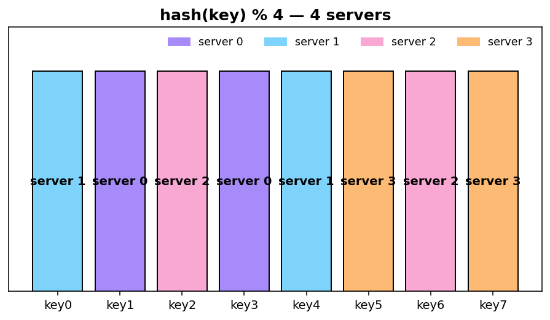

This approach works well when the size of the server pool is fixed, and the data distribution is even. However, problems arise when new servers are added, or existing servers are removed. For example, if server 1 goes offline, the size of the server pool becomes 3. Using the same hash function, we get the same hash value for a key. But applying modular operation gives us different server indexes because the number of servers is reduced by 1. We get the results as shown in Table 2 by applying `hash % 3`:

### Table 2 — keys redistributed via hash % 3

| key  | hash      | hash % 3 |
|------|-----------|----------|
| key0 | 18358617  | 0 |
| key1 | 26143584  | 0 |
| key2 | 18131146  | 1 |
| key3 | 35863496  | 2 |
| key4 | 34085809  | 1 |
| key5 | 27581703  | 0 |
| key6 | 38164978  | 1 |
| key7 | 22530351  | 0 |

Figure 2 shows the new distribution of keys based on Table 2.

### Figure 2 — After server 1 removal — 7 of 8 keys moved!

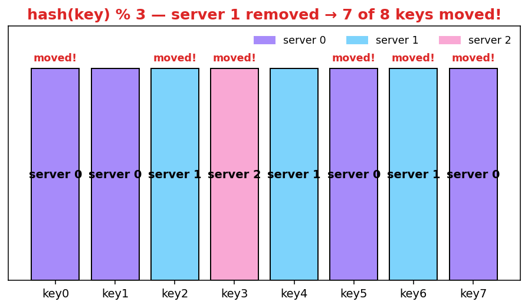

As shown in Figure 2, **most keys are redistributed**, not just the ones originally stored in the offline server (server 1). This means that when server 1 goes offline, most cache clients will connect to the wrong servers to fetch data. **This causes a storm of cache misses.** Consistent hashing is an effective technique to mitigate this problem.

> ### ⭐ Amplification — why this is catastrophic in production
>
> When a single cache server dies and `% N` reshuffles, you can take down your entire data tier:
>
> 1. **Cache miss storm** → all those keys now miss → all those requests slam the DB.
> 2. **DB connection pool saturates** → other queries time out.
> 3. **App threads block** waiting for DB → request queue grows.
> 4. **Healthy upstream services time out** waiting for your app → cascading failure.
>
> This is why consistent hashing isn't an optimization — it's table stakes for any cache or sharded store at scale.

---

## Consistent hashing

Quoted from Wikipedia: *"Consistent hashing is a special kind of hashing such that when a hash table is re-sized and consistent hashing is used, only **k/n keys need to be remapped on average**, where k is the number of keys, and n is the number of slots. In contrast, in most traditional hash tables, a change in the number of array slots causes nearly all keys to be remapped"* [1].

### Hash space and hash ring

Now we understand the definition of consistent hashing, let us find out how it works. Assume **SHA-1** is used as the hash function f, and the output range of the hash function is: x0, x1, x2, x3, …, xn. In cryptography, SHA-1's hash space goes from 0 to 2¹⁶⁰ - 1. That means x0 corresponds to 0, xn corresponds to 2¹⁶⁰ – 1, and all the other hash values in the middle fall between 0 and 2¹⁶⁰ - 1.

Figure 3 shows the hash space (a linear range from x0 to xn). By collecting both ends, we get a hash ring as shown in Figure 4:

### Figure 4 — The hash ring

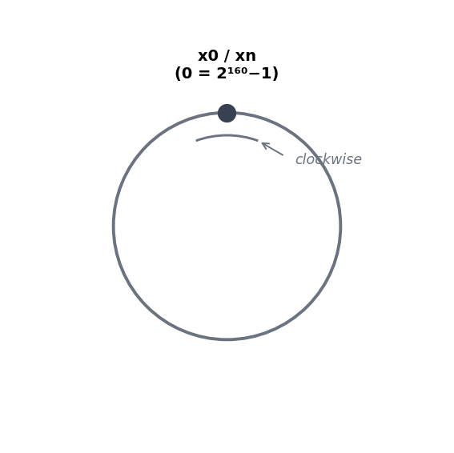

### Hash servers

Using the same hash function f, we map servers based on server IP or name onto the ring. Figure 5 shows that 4 servers are mapped on the hash ring.

### Figure 5 — Servers placed on the ring

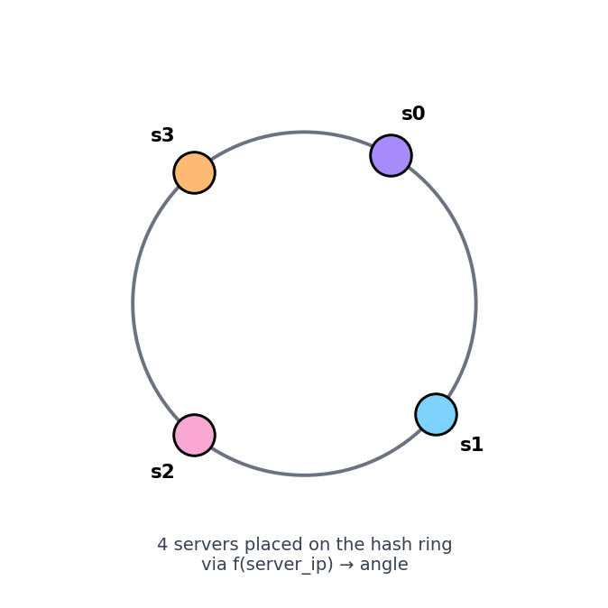

### Hash keys

One thing worth mentioning is that hash function used here is different from the one in "the rehashing problem," and there is **no modular operation**. As shown in Figure 6, 4 cache keys (key0, key1, key2, and key3) are hashed onto the hash ring.

### Figure 6 — Keys placed on the ring

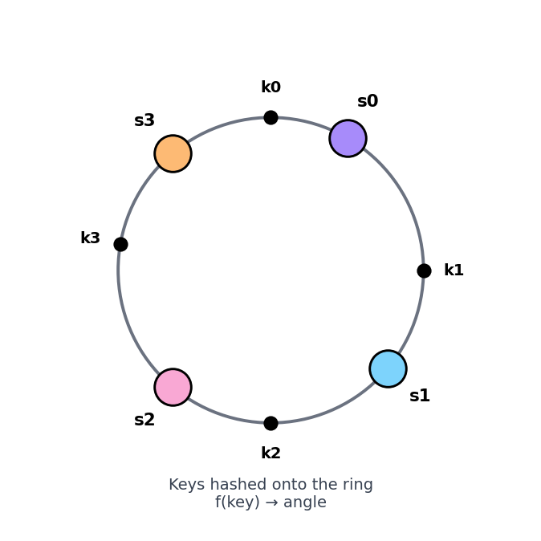

### Server lookup

To determine which server a key is stored on, **we go clockwise from the key position on the ring until a server is found**. Figure 7 explains this process. Going clockwise, key0 is stored on server 0; key1 is stored on server 1; key2 is stored on server 2 and key3 is stored on server 3.

### Figure 7 — Clockwise server lookup

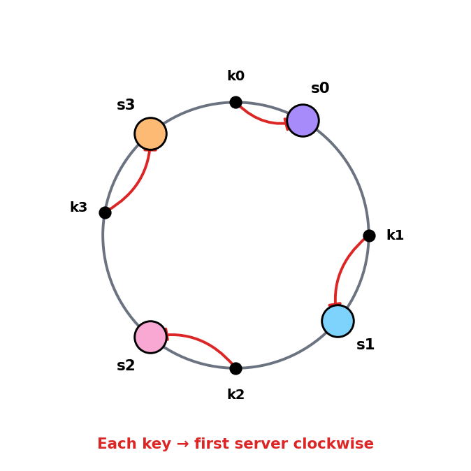

### Add a server

Using the logic described above, **adding a new server will only require redistribution of a fraction of keys**.

In Figure 8, after a new server 4 is added, only key0 needs to be redistributed. k1, k2, and k3 remain on the same servers. Let us take a close look at the logic. Before server 4 is added, key0 is stored on server 0. Now, key0 will be stored on server 4 because server 4 is the first server it encounters by going clockwise from key0's position on the ring. The other keys are not redistributed based on consistent hashing algorithm.

### Figure 8 — Adding s4 — only k0 moves

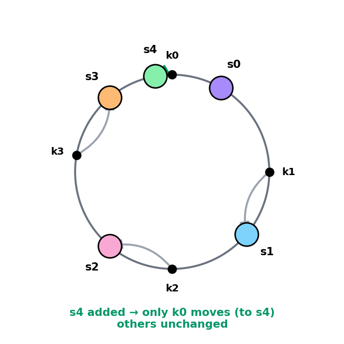

### Remove a server

When a server is removed, only a small fraction of keys require redistribution with consistent hashing. In Figure 9, when server 1 is removed, only key1 must be remapped to server 2. The rest of the keys are unaffected.

### Figure 9 — Removing s1 — only k1 moves

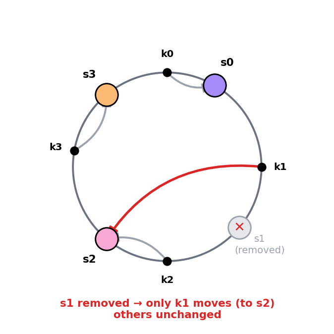

---

## Two issues in the basic approach

The consistent hashing algorithm was introduced by Karger et al. at MIT [1]. The basic steps are:

- Map servers and keys on to the ring using a uniformly distributed hash function.
- To find out which server a key is mapped to, go clockwise from the key position until the first server on the ring is found.

Two problems are identified with this approach.

**First**, it is impossible to keep the same size of partitions on the ring for all servers considering a server can be added or removed. A partition is the hash space between adjacent servers. It is possible that the size of the partitions on the ring assigned to each server is very small or fairly large. In Figure 10, if s1 is removed, s2's partition (highlighted) is twice as large as s0 and s3's partition.

### Figure 10 — Uneven partitions after server removal

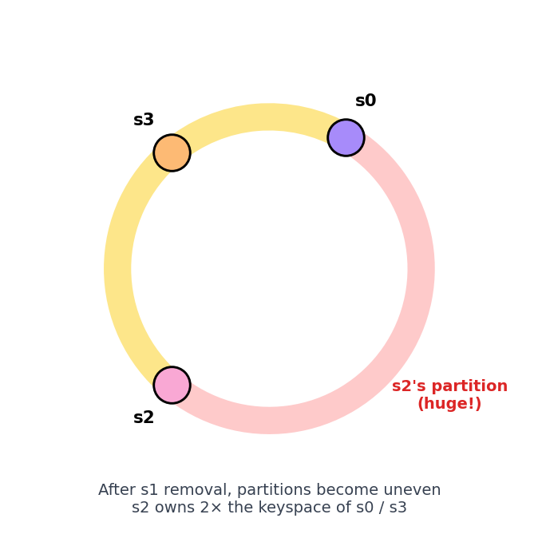

**Second**, it is possible to have a non-uniform key distribution on the ring. For instance, if servers are mapped to positions listed in Figure 11, most of the keys are stored on server 2. However, server 1 and server 3 have no data.

### Figure 11 — Non-uniform key distribution

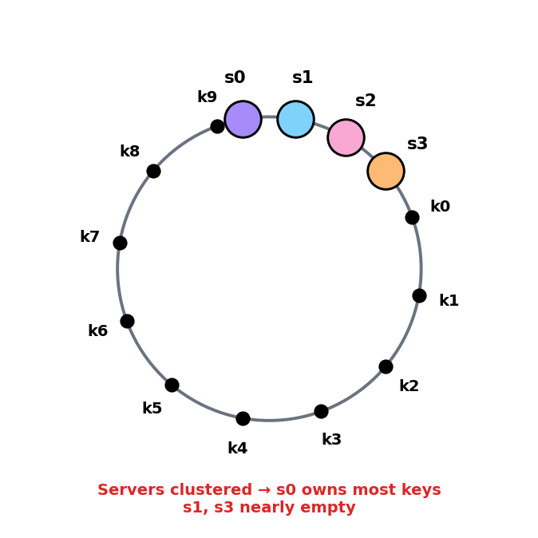

A technique called **virtual nodes** or **replicas** is used to solve these problems.

---

## Virtual nodes

A virtual node refers to the real node, and **each server is represented by multiple virtual nodes on the ring**. In Figure 12, both server 0 and server 1 have 3 virtual nodes. The 3 is arbitrarily chosen; and in real-world systems, the number of virtual nodes is much larger. Instead of using s0, we have s0_0, s0_1, and s0_2 to represent server 0 on the ring. Similarly, s1_0, s1_1, and s1_2 represent server 1 on the ring. With virtual nodes, each server is responsible for multiple partitions. Partitions (edges) with label s0 are managed by server 0. On the other hand, partitions with label s1 are managed by server 1.

### Figure 12 — Virtual nodes (3 vnodes per server)

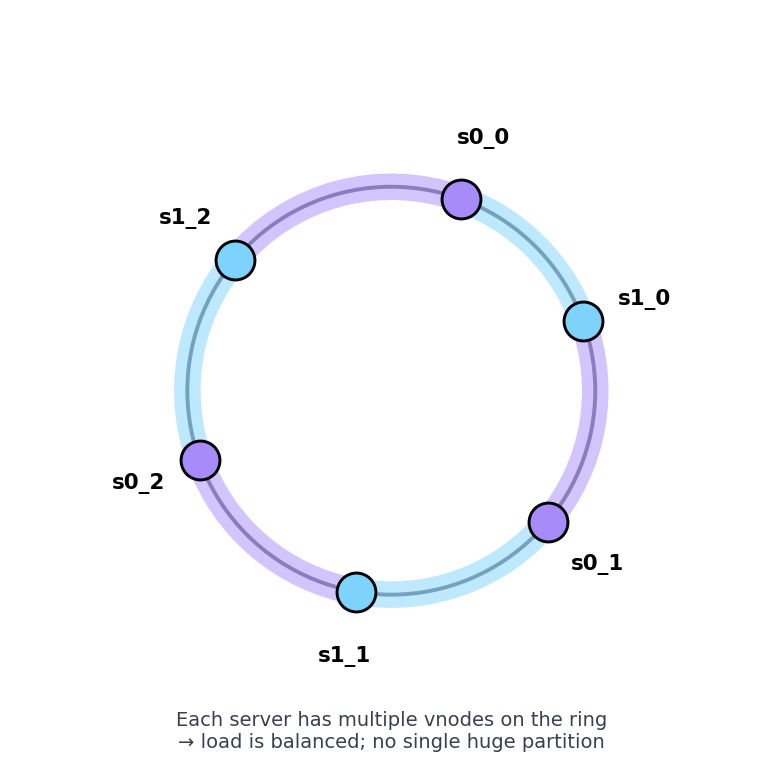

To find which server a key is stored on, we go clockwise from the key's location and find the first virtual node encountered on the ring. In Figure 13, to find out which server k0 is stored on, we go clockwise from k0's location and find virtual node s1_1, which refers to server 1.

### Figure 13 — Vnode lookup (k0 → s1_1 → server 1)

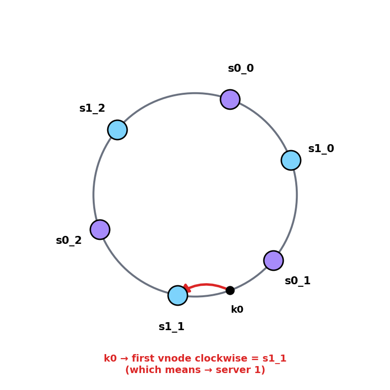

As the number of virtual nodes increases, the distribution of keys becomes more balanced. This is because the standard deviation gets smaller with more virtual nodes, leading to balanced data distribution. Standard deviation measures how data are spread out. The outcome of an experiment carried out by online research [2] shows that with one or two hundred virtual nodes, the standard deviation is between **5% (200 virtual nodes) and 10% (100 virtual nodes)** of the mean. The standard deviation will be smaller when we increase the number of virtual nodes. However, more spaces are needed to store data about virtual nodes. **This is a tradeoff**, and we can tune the number of virtual nodes to fit our system requirements.

> ### ⭐ Amplification — choosing how many vnodes
>
> | # of vnodes per server | Std deviation of load | Memory cost |
> |------------------------|------------------------|-------------|
> | 1 | ~30%+ | tiny |
> | 10 | ~30% | low |
> | 100 | ~10% | medium |
> | 200 | ~5% | medium |
> | 1000 | ~3% | higher |
>
> **Real-world choices**:
> - **Cassandra** default: 256 vnodes per node (`num_tokens: 256`).
> - **DynamoDB**: hidden, but ~hundreds per partition.
> - **Discord**: experimented with thousands.
>
> 💡 **Rule of thumb**: 100–200 vnodes is the sweet spot for most workloads. More than that gives diminishing returns and costs memory.

---

## Find affected keys

When a server is added or removed, a fraction of data needs to be redistributed. How can we find the affected range to redistribute the keys?

In Figure 14, server 4 is added onto the ring. The affected range starts from s4 (newly added node) and **moves anticlockwise** around the ring until a server is found (s3). Thus, keys located between s3 and s4 need to be redistributed to s4.

### Figure 14 — Affected range when adding s4

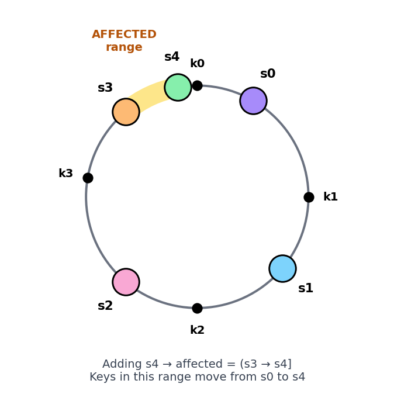

When a server (s1) is removed as shown in Figure 15, the affected range starts from s1 (removed node) and moves anticlockwise around the ring until a server is found (s0). Thus, keys located between s0 and s1 must be redistributed to s2.

### Figure 15 — Affected range when removing s1

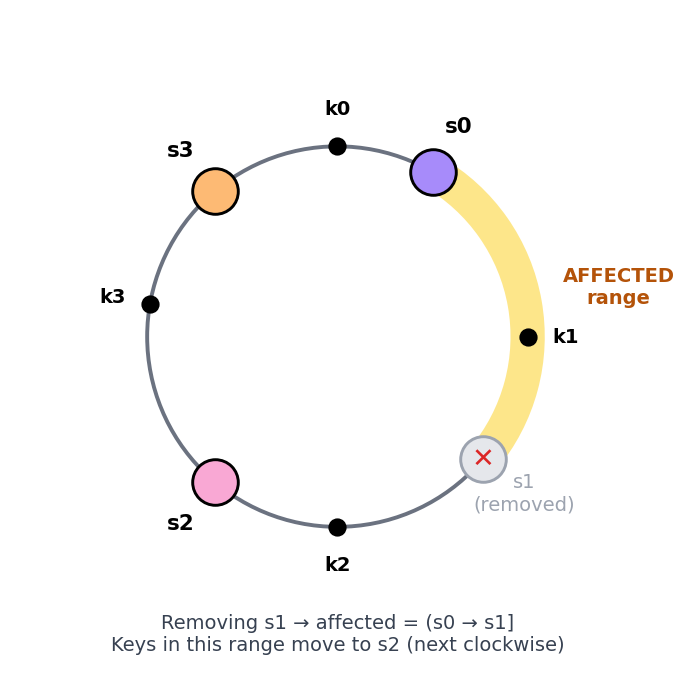

---

## Wrap up

In this chapter, we had an in-depth discussion about consistent hashing, including why it is needed and how it works. The benefits of consistent hashing include:

- **Minimized keys are redistributed when servers are added or removed.**
- **It is easy to scale horizontally** because data are more evenly distributed.
- **Mitigate hotspot key problem.** Excessive access to a specific shard could cause server overload. Imagine data for Katy Perry, Justin Bieber, and Lady Gaga all end up on the same shard. Consistent hashing helps to mitigate the problem by distributing the data more evenly.

Consistent hashing is widely used in real-world systems, including some notable ones:

- **Partitioning component of Amazon's Dynamo database** [3]
- **Data partitioning across the cluster in Apache Cassandra** [4]
- **Discord chat application** [5]
- **Akamai content delivery network** [6]
- **Maglev network load balancer** [7]

Congratulations on getting this far! Now give yourself a pat on the back. Good job!

---

## ⭐ Amplification — Real-world implementations & pitfalls (added)

### 🧪 Pseudo-code — minimal consistent hashing

```python
import hashlib
from sortedcontainers import SortedDict

class ConsistentHash:
    def __init__(self, vnodes_per_server=200):
        self.ring = SortedDict()  # angle → server
        self.vnodes = vnodes_per_server

    def _hash(self, key):
        # 64-bit hash for shorter ring positions (real systems use SHA-1/MD5)
        return int(hashlib.md5(key.encode()).hexdigest(), 16)

    def add_server(self, server):
        for i in range(self.vnodes):
            position = self._hash(f"{server}#{i}")
            self.ring[position] = server

    def remove_server(self, server):
        for i in range(self.vnodes):
            position = self._hash(f"{server}#{i}")
            del self.ring[position]

    def get_server(self, key):
        if not self.ring:
            return None
        position = self._hash(key)
        # Find first server clockwise (next bigger position, wrap around)
        idx = self.ring.bisect_right(position)
        if idx == len(self.ring):
            idx = 0  # wrap around
        return self.ring.values()[idx]
```

### 🚦 The 4 trade-offs to know

| Trade-off | Question | Practical answer |
|-----------|----------|------------------|
| **Vnode count** | More balance vs more memory? | 100-200 default |
| **Hash function** | Quality vs speed? | MD5 / xxHash / Murmur3 — avoid SHA-1 if speed matters |
| **Ring storage** | Sorted array vs tree? | TreeMap / SortedDict for O(log N) lookup |
| **Replication** | Where to put replicas? | Next K successors clockwise (Dynamo-style) |

### 🆚 Consistent hashing vs alternatives

| Approach | When to use | Notes |
|----------|-------------|-------|
| **`hash % N`** | N is fixed forever (it never is) | Simple but breaks on resize |
| **Consistent hashing** | Default for distributed cache / sharding | The "vanilla" choice |
| **Jump consistent hash** (Google) | Very fast, no per-server state | But no easy way to remove arbitrary servers |
| **Rendezvous hashing (HRW)** | Few servers, simple | O(N) per lookup but no ring needed |
| **Maglev hashing** (Google) | Load balancers, even distribution required | Used in Google's frontend LB |

### ⚠️ Production pitfalls

| Pitfall | Symptom | Fix |
|---------|---------|-----|
| **Hot key** | One key getting massive traffic, vnodes don't help | Add per-key cache, replicate hot key across N servers |
| **Server crashes during rebalance** | Partial replication, inconsistent state | Quorum reads (R + W > N), gossip protocol for membership |
| **Replication factor < 3** | Lose data when 2 servers fail simultaneously | Use RF=3 minimum; spread replicas across availability zones |
| **Skewed vnode hashing** | Some vnodes still cluster, uneven load | Use a high-quality hash; `vnode_id = hash(server + vnode_index)` |
| **Stale ring view across clients** | Different clients route to different servers for same key | Centralize ring state in metadata service or use gossip |
| **Cold cache after server add** | New server has empty cache → misses pile up | Preload from neighbors, or accept gradual warmup |

### 📊 What a real Cassandra ring looks like

```
nodetool ring   # output excerpt

Datacenter: us-east-1
==========
Address       Rack  Status  Load        Owns    Token
10.0.1.10     1a    UP      482.3 GB    33.3%   -9223372036854775808
10.0.1.11     1b    UP      481.7 GB    33.3%   -3074457345618258602
10.0.1.12     1c    UP      485.1 GB    33.3%    3074457345618258602
... (256 token entries per node when num_tokens=256)
```

Each node owns 256 ranges (vnodes). The token is the hash position; "Owns" is the % of total keyspace.

### 🎯 Common interview follow-ups

| Question | Key idea to mention |
|----------|---------------------|
| "How would you handle a hot key?" | Vnodes don't fix this — replicate the key itself across multiple servers, or fronting cache (CDN-style) |
| "What if 2 nodes go down at once?" | Replication factor + quorum (Dynamo R+W>N); spread across AZs |
| "How do clients learn the ring?" | Coordinator node + gossip, or central metadata service (ZooKeeper / etcd) |
| "Why use SHA-1 vs MD5?" | For consistent hashing, **distribution quality** matters, not crypto strength. Murmur3 / xxHash are faster and good enough |
| "What happens during a rolling restart?" | Each node leaves the ring → its vnodes' keys move to neighbors → comes back → reclaims them. Brief unavailability per range |

---

## Reference materials

- [1] Consistent hashing (Wikipedia): https://en.wikipedia.org/wiki/Consistent_hashing
- [2] Tom White, Consistent Hashing: https://tom-e-white.com/2007/11/consistent-hashing.html
- [3] Dynamo: Amazon's Highly Available Key-value Store: https://www.allthingsdistributed.com/files/amazon-dynamo-sosp2007.pdf
- [4] Cassandra — A Decentralized Structured Storage System: http://www.cs.cornell.edu/Projects/ladis2009/papers/Lakshman-ladis2009.PDF
- [5] How Discord Scaled Elixir to 5,000,000 Concurrent Users: https://discord.com/blog/how-discord-scaled-elixir-to-5-000-000-concurrent-users
- [6] CS168: The Modern Algorithmic Toolbox — Lecture #1: Introduction and Consistent Hashing: http://theory.stanford.edu/~tim/s16/l/l1.pdf
- [7] Maglev: A Fast and Reliable Software Network Load Balancer: https://static.googleusercontent.com/media/research.google.com/en//pubs/archive/44824.pdf
- Original chapter source: *System Design Interview – An Insider's Guide* (Alex Xu), Chapter 5.
