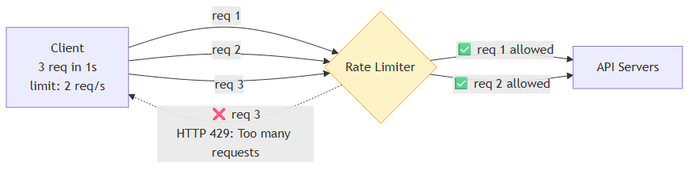
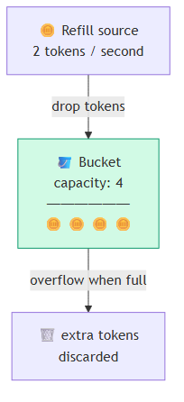
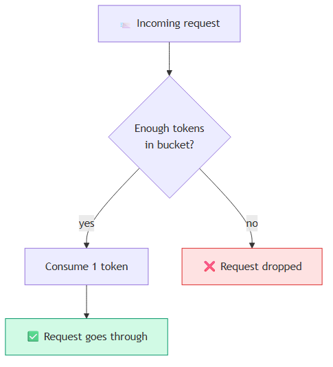
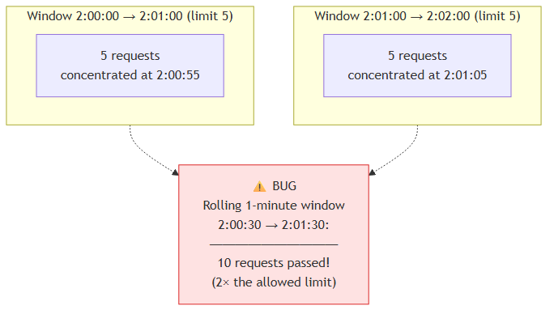
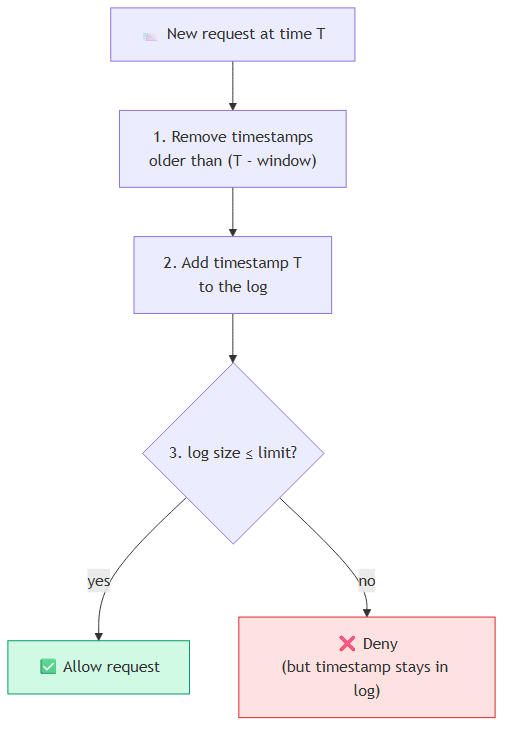
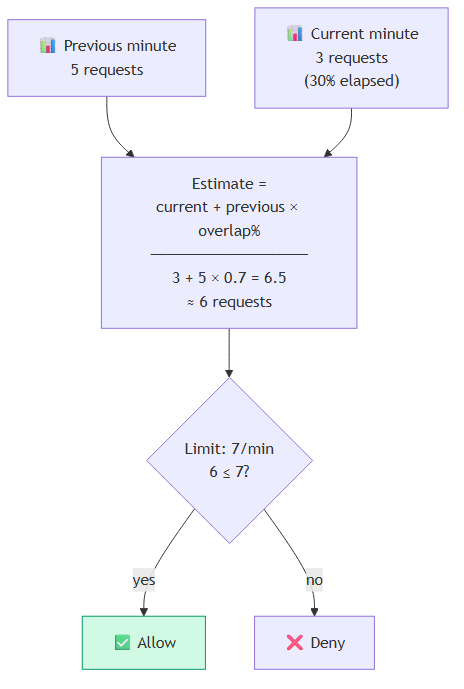
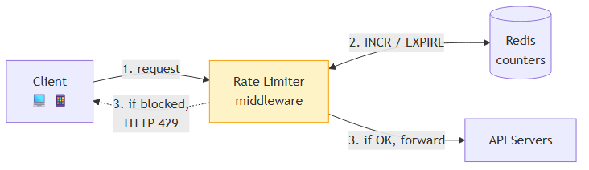
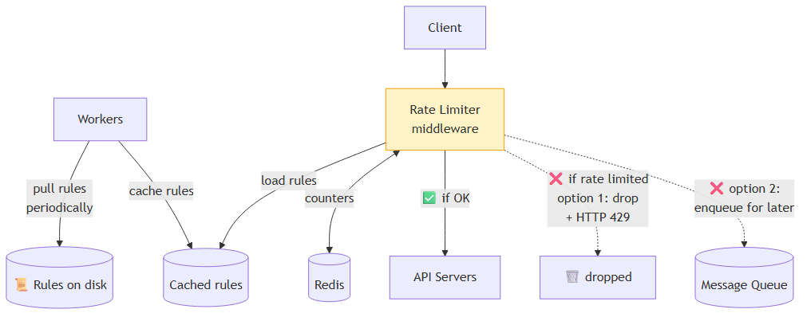
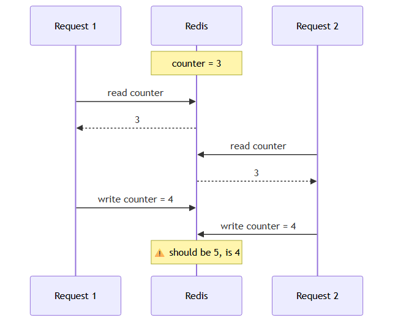
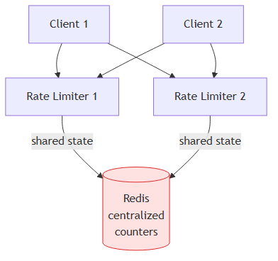

# Chapter 4 — Design A Rate Limiter

[⬅ Back to KB index](../../README.md)

> **TL;DR (added)** — Un rate limiter es un guardia que controla cuántos pedidos por segundo puede hacer un cliente. Sirve para prevenir DoS, reducir costos, y evitar que tus servers se rompan. Hay 5 algoritmos clásicos (token bucket, leaking bucket, fixed window, sliding window log, sliding window counter). En distribuido, el desafío es la sincronización entre instancias — la solución es Redis centralizado con scripts Lua o sorted sets para evitar race conditions.

---

## 📖 In this chapter

0. [🎓 For Dummies — empezá por acá](#-for-dummies--empezá-por-acá) ← **clave: los 5 algoritmos explicados con analogías**
1. [Step 1 - Understand the problem and establish design scope](#step-1---understand-the-problem-and-establish-design-scope)
2. [Step 2 - Propose high-level design and get buy-in](#step-2---propose-high-level-design-and-get-buy-in)
   - [Where to put the rate limiter?](#where-to-put-the-rate-limiter)
   - [Algorithms for rate limiting](#algorithms-for-rate-limiting)
     - [Token bucket](#token-bucket-algorithm)
     - [Leaking bucket](#leaking-bucket-algorithm)
     - [Fixed window counter](#fixed-window-counter-algorithm)
     - [Sliding window log](#sliding-window-log-algorithm)
     - [Sliding window counter](#sliding-window-counter-algorithm)
   - [High-level architecture](#high-level-architecture)
3. [Step 3 - Design deep dive](#step-3---design-deep-dive)
   - [Rate limiting rules](#rate-limiting-rules)
   - [Exceeding the rate limit](#exceeding-the-rate-limit)
   - [Detailed design](#detailed-design)
   - [Rate limiter in a distributed environment](#rate-limiter-in-a-distributed-environment)
   - [Performance optimization](#performance-optimization)
   - [Monitoring](#monitoring)
4. [Step 4 - Wrap up](#step-4---wrap-up)
5. [⭐ Amplification — Algorithm comparison cheat sheet (added)](#-amplification--algorithm-comparison-cheat-sheet-added)
6. [Reference materials](#reference-materials)

---

## 🎓 For Dummies — empezá por acá

### ¿Qué es un rate limiter?

Es un **guardia** que controla cuántos pedidos por segundo puede hacer un cliente.

🎟️ **Analogía**: imaginate un boliche que solo deja entrar 50 personas por hora. El portero (el rate limiter) cuenta cuántas personas entraron. Si llegás cuando ya entraron 50, te dice *"esperá, volvé más tarde"*. Eso es un rate limiter.

En sistemas, en vez de personas son **HTTP requests** y el portero te devuelve un código `HTTP 429: Too many requests`.

### ¿Para qué sirve?

| Razón | Ejemplo |
|-------|---------|
| 🛡️ **Prevenir DoS** | Que un atacante no te tire el server con 1M requests/seg |
| 💰 **Reducir costos** | Si pagás por cada llamada a un API externo (verificar tarjetas, etc.) |
| 🚦 **Proteger servers** | Bots o usuarios que se mandan pueden saturar tu sistema |

### Las preguntas que te hacés

- ¿Cuántos pedidos por segundo permito?
- ¿Quién es "el cliente"? (¿IP, usuario, device, API key?)
- ¿Qué hago si pasa el límite? (¿bloquear? ¿demorar? ¿cobrar más?)

---

### 🎯 Los 5 algoritmos (la parte importante)

Hay 5 formas clásicas de implementar el "portero". Cada una tiene una idea distinta. Las explico con analogías.

#### 1️⃣ Token Bucket — la "billetera de fichas"

🪙 **Analogía**: tenés una **billetera con 10 fichas máximo**. Cada vez que querés hacer un pedido, sacás 1 ficha. Cada minuto, alguien te pone 2 fichas más en la billetera. Si la billetera ya está llena, las fichas extras se pierden.

- ✅ Si tenés fichas → entrás
- ❌ Si no tenés fichas → te rebotan
- 💪 **Permite ráfagas**: si juntaste 10 fichas porque no las gastaste, podés gastarlas todas de una

**Parámetros**: tamaño de la billetera (capacity) + cuántas fichas por segundo te dan (refill rate).

**Lo usan**: Amazon, Stripe.

---

#### 2️⃣ Leaking Bucket — el "balde con pinchazo"

💧 **Analogía**: imaginate un **balde con un pinchazo en el fondo**. Tirás agua (pedidos) al balde lo más rápido que quieras. Por el pinchazo sale 1 gota por segundo (procesamiento a velocidad fija). El balde tiene tamaño máximo — si está lleno y tirás más agua, **se desperdicia**.

- ✅ Si hay lugar en el balde → entrás a la cola
- ❌ Si está lleno → te rebotan
- 🚫 **NO permite ráfagas** — todo sale a velocidad constante

**Implementación real**: una **cola FIFO** (first-in-first-out) que se procesa a rate fijo.

**Lo usa**: Shopify.

**Diferencia clave con Token Bucket**: leaking bucket procesa siempre al mismo ritmo (más predecible). Token bucket te deja explotar de golpe (más flexible).

---

#### 3️⃣ Fixed Window Counter — el "contador que se resetea"

📅 **Analogía**: una **caja registradora** que cuenta cuántas ventas hizo este minuto. Al cambiar el minuto, vuelve a 0.

- Límite: 5 pedidos por minuto
- A las 12:00:30 ya hiciste 5 → te rebotan hasta que el reloj marque 12:01
- A las 12:01:00 → contador a 0, podés volver a pedir 5

**Pro**: súper simple, súper barato (un contador por ventana).

**⚠️ El bug crítico**:
- A las 12:00:55 → 5 pedidos OK (4 al 5 último segundo)
- A las 12:01:01 → 5 pedidos OK (en el primer segundo de la nueva ventana)
- **En total: 10 pedidos en 6 segundos** = ¡el doble del límite permitido!

Por eso este algoritmo es engañoso para casos donde la precisión importa.

---

#### 4️⃣ Sliding Window Log — el "portero que anota todo"

📋 **Analogía**: el portero del boliche anota la **hora exacta** de cada entrada. Cuando llegás, **borra los timestamps de hace más de 1 hora**, cuenta los que quedan, y si pasaste el límite te rechaza.

- ✅ Súper preciso — en cualquier ventana de 1 hora, nunca hay más de N entradas
- ❌ La lista crece mucho — **mucha memoria**, hasta para los pedidos rechazados (sus timestamps también se guardan)

**Implementación**: típicamente un **Redis sorted set** con timestamps como scores.

---

#### 5️⃣ Sliding Window Counter — el "promedio inteligente"

🔄 **Analogía**: híbrido entre fixed window y sliding window log. En vez de anotar cada timestamp, mantiene 2 contadores:
- Cuántos pedidos hubo en el **minuto pasado**
- Cuántos pedidos hubo en el **minuto actual**

Y estima usando el **% del minuto que ya pasó**:

```
estimación = pedidos_actuales + pedidos_anteriores × (1 - % transcurrido)
```

🧪 **Ejemplo**: límite 7/min, hace 30% del minuto actual, hubo 5 el minuto pasado y 3 ahora:
```
3 + 5 × 0.7 = 6.5 ≈ 6 pedidos
6 ≤ 7 → ✅ permitido
```

- ✅ **Suaviza picos** (no tiene el bug del fixed window)
- ✅ **Memoria baja** (2 contadores, no una lista)
- ⚠️ Es una **aproximación** (asume distribución uniforme en el minuto pasado)

Cloudflare midió: solo 0.003% de pedidos mal clasificados sobre 400 millones.

---

### 🆚 Comparación rápida

| Algoritmo | Permite ráfagas | Memoria | Precisión | Difícil de implementar |
|-----------|-----------------|---------|-----------|------------------------|
| Token bucket | ✅ Sí | Baja | Buena | Fácil |
| Leaking bucket | ❌ No (rate fijo) | Baja | Buena | Fácil |
| Fixed window | ✅ Sí (con bug) | Muy baja | ⚠️ Mala en bordes | Muy fácil |
| Sliding window log | ❌ No | 🔴 Alta | ✅ Perfecta | Media |
| Sliding window counter | ✅ Algo | Baja | Muy buena | Media |

### 🎯 ¿Cuál uso?

- **¿Querés permitir ráfagas y simplicidad?** → **Token bucket** (la elección default de la mayoría)
- **¿Querés flujo súper estable, predecible?** → **Leaking bucket**
- **¿Querés precisión perfecta y tenés memoria de sobra?** → **Sliding window log**
- **¿Querés balance entre precisión y eficiencia?** → **Sliding window counter**
- **¿Querés algo dead-simple y no te molesta el bug?** → **Fixed window**

### 🌐 En sistemas distribuidos

Cuando tenés **múltiples servers** corriendo el rate limiter, todos tienen que **compartir el contador**. Si no, cada server cuenta por separado y el límite global se rompe.

🍕 **Analogía**: imaginate 3 porteros en un boliche pero ninguno habla con los otros. Cada uno deja pasar 50 → entran 150 cuando el límite era 50.

**La solución**: una **base de datos compartida (típicamente Redis)** donde todos los rate limiters leen y escriben los contadores.

⚠️ **Race condition**: si 2 requests llegan al mismo tiempo y ambos leen "contador = 3" antes de que ninguno escriba "= 4", los dos van a escribir 4 (debería ser 5). Soluciones: scripts Lua atómicos en Redis, o sorted sets.

---

### ¿Listo para la versión completa?

Con esto deberías entender el resto del capítulo sin problema. Si te perdés en algún algoritmo, volvé acá. ⬇️

---

In a network system, a rate limiter is used to control the rate of traffic sent by a client or a service. In the HTTP world, a rate limiter limits the number of client requests allowed to be sent over a specified period. If the API request count exceeds the threshold defined by the rate limiter, all the excess calls are blocked. Here are a few examples:

- A user can write no more than 2 posts per second.
- You can create a maximum of 10 accounts per day from the same IP address.
- You can claim rewards no more than 5 times per week from the same device.

In this chapter, you are asked to design a rate limiter. Before starting the design, we first look at the benefits of using an API rate limiter:

- **Prevent resource starvation caused by Denial of Service (DoS) attack** [1]. Almost all APIs published by large tech companies enforce some form of rate limiting. For example, Twitter limits the number of tweets to 300 per 3 hours [2]. Google docs APIs have the following default limit: 300 per user per 60 seconds for read requests [3]. A rate limiter prevents DoS attacks, either intentional or unintentional, by blocking the excess calls.

- **Reduce cost.** Limiting excess requests means fewer servers and allocating more resources to high priority APIs. Rate limiting is extremely important for companies that use paid third party APIs. For example, you are charged on a per-call basis for the following external APIs: check credit, make a payment, retrieve health records, etc. Limiting the number of calls is essential to reduce costs.

- **Prevent servers from being overloaded.** To reduce server load, a rate limiter is used to filter out excess requests caused by bots or users' misbehavior.

---

## Step 1 - Understand the problem and establish design scope

Rate limiting can be implemented using different algorithms, each with its pros and cons. The interactions between an interviewer and a candidate help to clarify the type of rate limiters we are trying to build.

> **Candidate**: What kind of rate limiter are we going to design? Is it a client-side rate limiter or server-side API rate limiter?
> **Interviewer**: Great question. We focus on the server-side API rate limiter.
>
> **Candidate**: Does the rate limiter throttle API requests based on IP, the user ID, or other properties?
> **Interviewer**: The rate limiter should be flexible enough to support different sets of throttle rules.
>
> **Candidate**: What is the scale of the system? Is it built for a startup or a big company with a large user base?
> **Interviewer**: The system must be able to handle a large number of requests.
>
> **Candidate**: Will the system work in a distributed environment?
> **Interviewer**: Yes.
>
> **Candidate**: Is the rate limiter a separate service or should it be implemented in application code?
> **Interviewer**: It is a design decision up to you.
>
> **Candidate**: Do we need to inform users who are throttled?
> **Interviewer**: Yes.

### Requirements

Here is a summary of the requirements for the system:

- Accurately limit excessive requests.
- Low latency. The rate limiter should not slow down HTTP response time.
- Use as little memory as possible.
- Distributed rate limiting. The rate limiter can be shared across multiple servers or processes.
- Exception handling. Show clear exceptions to users when their requests are throttled.
- High fault tolerance. If there are any problems with the rate limiter (for example, a cache server goes offline), it does not affect the entire system.

---

## Step 2 - Propose high-level design and get buy-in

Let us keep things simple and use a basic client and server model for communication.

### Where to put the rate limiter?

Intuitively, you can implement a rate limiter at either the client or server-side.

- **Client-side implementation.** Generally speaking, client is an unreliable place to enforce rate limiting because client requests can easily be forged by malicious actors. Moreover, we might not have control over the client implementation.

- **Server-side implementation.** Figure 1 shows a rate limiter that is placed on the server-side.

#### Figure 1 — Server-side rate limiter (inside API servers)


Besides the client and server-side implementations, there is an alternative way. Instead of putting a rate limiter at the API servers, we create a **rate limiter middleware**, which throttles requests to your APIs as shown in Figure 2.

#### Figure 2 — Rate limiter as middleware


Let us use an example in Figure 3 to illustrate how rate limiting works in this design. Assume our API allows 2 requests per second, and a client sends 3 requests to the server within a second. The first two requests are routed to API servers. However, the rate limiter middleware throttles the third request and returns a HTTP status code 429. The HTTP 429 response status code indicates a user has sent too many requests.

#### Figure 3 — HTTP 429 response when limit exceeded



Cloud microservices [4] have become widely popular and rate limiting is usually implemented within a component called **API gateway**. API gateway is a fully managed service that supports rate limiting, SSL termination, authentication, IP whitelisting, servicing static content, etc. For now, we only need to know that the API gateway is a middleware that supports rate limiting.

While designing a rate limiter, an important question to ask ourselves is: where should the rate limiter be implemented, on the server-side or in a gateway? There is no absolute answer. It depends on your company's current technology stack, engineering resources, priorities, goals, etc. Here are a few general guidelines:

- Evaluate your current technology stack, such as programming language, cache service, etc. Make sure your current programming language is efficient to implement rate limiting on the server-side.
- Identify the rate limiting algorithm that fits your business needs. When you implement everything on the server-side, you have full control of the algorithm. However, your choice might be limited if you use a third-party gateway.
- If you have already used microservice architecture and included an API gateway in the design to perform authentication, IP whitelisting, etc., you may add a rate limiter to the API gateway.
- Building your own rate limiting service takes time. If you do not have enough engineering resources to implement a rate limiter, a commercial API gateway is a better option.

> ### ⭐ Amplification — popular API gateways (2026)
>
> | Gateway | Type | Strength |
> |---------|------|----------|
> | **AWS API Gateway** | Managed | Tight AWS integration, built-in throttling |
> | **Kong** | Open source / managed | Plugin ecosystem, on-prem-friendly |
> | **Apigee** (Google) | Managed | Enterprise features, analytics |
> | **Azure API Management** | Managed | Azure stack integration |
> | **Tyk** | Open source | Lightweight, multi-cloud |
> | **Envoy** | Service proxy | Used as base in Istio, sophisticated rate limiting |
> | **NGINX Plus** | Self-hosted | Mature, ubiquitous |

### Algorithms for rate limiting

Rate limiting can be implemented using different algorithms, and each of them has distinct pros and cons. Even though this chapter does not focus on algorithms, understanding them at high-level helps to choose the right algorithm or combination of algorithms to fit our use cases. Here is a list of popular algorithms:

- Token bucket
- Leaking bucket
- Fixed window counter
- Sliding window log
- Sliding window counter

### Token bucket algorithm

The token bucket algorithm is widely used for rate limiting. It is simple, well understood and commonly used by internet companies. Both Amazon [5] and Stripe [6] use this algorithm to throttle their API requests.

The token bucket algorithm work as follows:

A token bucket is a container that has pre-defined capacity. Tokens are put in the bucket at preset rates periodically. Once the bucket is full, no more tokens are added. As shown in Figure 4, the token bucket capacity is 4. The refiller puts 2 tokens into the bucket every second. Once the bucket is full, extra tokens will overflow.

#### Figure 4 — Token bucket overflow



Each request consumes one token. When a request arrives, we check if there are enough tokens in the bucket. Figure 5 explains how it works.

- If there are enough tokens, we take one token out for each request, and the request goes through.
- If there are not enough tokens, the request is dropped.

#### Figure 5 — Token bucket request flow



Figure 6 illustrates how token consumption, refill, and rate limiting logic work. In this example, the token bucket size is 4, and the refill rate is 4 per 1 minute.

> #### Figure 6 — Token bucket over time (described as a table)
>
> | Time | Tokens before | Action | Tokens after |
> |------|---------------|--------|--------------|
> | 1:00:00 | 4 | 1 incoming request → consumed 1 | 3 |
> | 1:00:05 | 3 | 3 incoming requests → consumed 3 | 0 |
> | 1:00:20 | 0 | 1 incoming request → ❌ dropped (no tokens) | 0 |
> | 1:01:00 | 0 | refill of 4 → bucket at capacity | 4 |

The token bucket algorithm takes two parameters:

- **Bucket size**: the maximum number of tokens allowed in the bucket
- **Refill rate**: number of tokens put into the bucket every second

How many buckets do we need? This varies, and it depends on the rate-limiting rules. Here are a few examples.

- It is usually necessary to have different buckets for different API endpoints. For instance, if a user is allowed to make 1 post per second, add 150 friends per day, and like 5 posts per second, 3 buckets are required for each user.
- If we need to throttle requests based on IP addresses, each IP address requires a bucket.
- If the system allows a maximum of 10,000 requests per second, it makes sense to have a global bucket shared by all requests.

**Pros:**

- The algorithm is easy to implement.
- Memory efficient.
- Token bucket allows a burst of traffic for short periods. A request can go through as long as there are tokens left.

**Cons:**

- Two parameters in the algorithm are bucket size and token refill rate. However, it might be challenging to tune them properly.

### Leaking bucket algorithm

The leaking bucket algorithm is similar to the token bucket except that requests are processed at a fixed rate. It is usually implemented with a **first-in-first-out (FIFO)** queue. The algorithm works as follows:

- When a request arrives, the system checks if the queue is full. If it is not full, the request is added to the queue.
- Otherwise, the request is dropped.
- Requests are pulled from the queue and processed at regular intervals.

Figure 7 explains how the algorithm works.

#### Figure 7 — Leaking bucket (FIFO queue, fixed-rate output)


Leaking bucket algorithm takes the following two parameters:

- **Bucket size**: it is equal to the queue size. The queue holds the requests to be processed at a fixed rate.
- **Outflow rate**: it defines how many requests can be processed at a fixed rate, usually in seconds.

Shopify, an ecommerce company, uses leaky buckets for rate-limiting [7].

**Pros:**

- Memory efficient given the limited queue size.
- Requests are processed at a fixed rate therefore it is suitable for use cases that a stable outflow rate is needed.

**Cons:**

- A burst of traffic fills up the queue with old requests, and if they are not processed in time, recent requests will be rate limited.
- There are two parameters in the algorithm. It might not be easy to tune them properly.

### Fixed window counter algorithm

Fixed window counter algorithm works as follows:

- The algorithm divides the timeline into fix-sized time windows and assign a counter for each window.
- Each request increments the counter by one.
- Once the counter reaches the pre-defined threshold, new requests are dropped until a new time window starts.

Let us use a concrete example to see how it works. In Figure 8, the time unit is 1 second and the system allows a maximum of 3 requests per second. In each second window, if more than 3 requests are received, extra requests are dropped.

A major problem with this algorithm is that a burst of traffic at the edges of time windows could cause more requests than allowed quota to go through. Consider the following case:

#### Figure 9 — The edge problem of fixed window



In Figure 9, the system allows a maximum of 5 requests per minute, and the available quota resets at the human-friendly round minute. As seen, there are five requests between 2:00:00 and 2:01:00 and five more requests between 2:01:00 and 2:02:00. **For the one-minute window between 2:00:30 and 2:01:30, 10 requests go through. That is twice as many as allowed requests.**

**Pros:**

- Memory efficient.
- Easy to understand.
- Resetting available quota at the end of a unit time window fits certain use cases.

**Cons:**

- Spike in traffic at the edges of a window could cause more requests than the allowed quota to go through.

### Sliding window log algorithm

As discussed previously, the fixed window counter algorithm has a major issue: it allows more requests to go through at the edges of a window. The sliding window log algorithm fixes the issue. It works as follows:

- The algorithm keeps track of request timestamps. Timestamp data is usually kept in cache, such as **sorted sets of Redis** [8].
- When a new request comes in, remove all the outdated timestamps. Outdated timestamps are defined as those older than the start of the current time window.
- Add timestamp of the new request to the log.
- If the log size is the same or lower than the allowed count, a request is accepted. Otherwise, it is rejected.

We explain the algorithm with an example as revealed in Figure 10.

#### Figure 10 — Sliding window log flow



In this example, the rate limiter allows 2 requests per minute. Usually, Linux timestamps are stored in the log. However, human-readable representation of time is used in our example for better readability.

- The log is empty when a new request arrives at **1:00:01**. Thus, the request is allowed.
- A new request arrives at **1:00:30**, the timestamp 1:00:30 is inserted into the log. After the insertion, the log size is 2, not larger than the allowed count. Thus, the request is allowed.
- A new request arrives at **1:00:50**, and the timestamp is inserted into the log. After the insertion, the log size is 3, larger than the allowed size 2. Therefore, this request is rejected even though the timestamp remains in the log.
- A new request arrives at **1:01:40**. Requests in the range [1:00:40, 1:01:40) are within the latest time frame, but requests sent before 1:00:40 are outdated. Two outdated timestamps, 1:00:01 and 1:00:30, are removed from the log. After the remove operation, the log size becomes 2; therefore, the request is accepted.

**Pros:**

- Rate limiting implemented by this algorithm is very accurate. In any rolling window, requests will not exceed the rate limit.

**Cons:**

- The algorithm consumes a lot of memory because even if a request is rejected, its timestamp might still be stored in memory.

### Sliding window counter algorithm

The sliding window counter algorithm is a hybrid approach that combines the fixed window counter and sliding window log. The algorithm can be implemented by two different approaches. We will explain one implementation in this section and provide reference for the other implementation at the end of the section. Figure 11 illustrates how this algorithm works.

#### Figure 11 — Sliding window counter calculation



Assume the rate limiter allows a maximum of 7 requests per minute, and there are 5 requests in the previous minute and 3 in the current minute. For a new request that arrives at a 30% position in the current minute, the number of requests in the rolling window is calculated using the following formula:

```
Requests in current window + requests in the previous window × overlap percentage
```

Using this formula, we get `3 + 5 × 0.7 = 6.5 requests`. Depending on the use case, the number can either be rounded up or down. In our example, it is rounded down to 6.

Since the rate limiter allows a maximum of 7 requests per minute, the current request can go through. However, the limit will be reached after receiving one more request.

Due to the space limitation, we will not discuss the other implementation here. Interested readers should refer to the reference material [9]. This algorithm is not perfect. It has pros and cons.

**Pros:**

- It smooths out spikes in traffic because the rate is based on the average rate of the previous window.
- Memory efficient.

**Cons:**

- It only works for not-so-strict look back window. It is an approximation of the actual rate because it assumes requests in the previous window are evenly distributed. However, this problem may not be as bad as it seems. According to experiments done by Cloudflare [10], **only 0.003% of requests are wrongly allowed or rate limited among 400 million requests.**

### High-level architecture

The basic idea of rate limiting algorithms is simple. At the high-level, we need a counter to keep track of how many requests are sent from the same user, IP address, etc. If the counter is larger than the limit, the request is disallowed.

Where shall we store counters? Using the database is not a good idea due to slowness of disk access. **In-memory cache** is chosen because it is fast and supports time-based expiration strategy. For instance, **Redis** [11] is a popular option to implement rate limiting. It is an in-memory store that offers two commands: `INCR` and `EXPIRE`.

- `INCR`: It increases the stored counter by 1.
- `EXPIRE`: It sets a timeout for the counter. If the timeout expires, the counter is automatically deleted.

#### Figure 12 — High-level architecture



Figure 12 shows the high-level architecture for rate limiting, and this works as follows:

- The client sends a request to rate limiting middleware.
- Rate limiting middleware fetches the counter from the corresponding bucket in Redis and checks if the limit is reached or not.
- If the limit is reached, the request is rejected.
- If the limit is not reached, the request is sent to API servers. Meanwhile, the system increments the counter and saves it back to Redis.

> ### ⭐ Amplification — Redis commands you'll actually use
>
> ```redis
> # Token bucket-style: increment counter, set expiry on first use
> INCR rate_limit:user:123
> EXPIRE rate_limit:user:123 60   # expire in 60 seconds
>
> # Sliding window log: timestamp-based using sorted sets
> ZADD rate_limit:user:123 1714512345 "req-uuid-1"
> ZREMRANGEBYSCORE rate_limit:user:123 0 1714512285   # remove > 60s old
> ZCARD rate_limit:user:123                            # how many in window?
> ```
>
> The atomic version (no race conditions) uses Lua:
>
> ```lua
> -- atomic INCR + check
> local cur = redis.call('GET', KEYS[1]) or 0
> if tonumber(cur) >= tonumber(ARGV[1]) then return 0 end
> redis.call('INCR', KEYS[1])
> redis.call('EXPIRE', KEYS[1], ARGV[2])
> return 1
> ```

---

## Step 3 - Design deep dive

The high-level design in Figure 12 does not answer the following questions:

- How are rate limiting rules created? Where are the rules stored?
- How to handle requests that are rate limited?

In this section, we will first answer the questions regarding rate limiting rules and then go over the strategies to handle rate-limited requests. Finally, we will discuss rate limiting in distributed environment, a detailed design, performance optimization and monitoring.

### Rate limiting rules

Lyft open-sourced their rate-limiting component [12]. We will peek inside of the component and look at some examples of rate limiting rules:

```yaml
domain: messaging
descriptors:
  - key: message_type
    value: marketing
    rate_limit:
      unit: day
      requests_per_unit: 5
```

In the above example, the system is configured to allow a maximum of 5 marketing messages per day. Here is another example:

```yaml
domain: auth
descriptors:
  - key: auth_type
    value: login
    rate_limit:
      unit: minute
      requests_per_unit: 5
```

This rule shows that clients are not allowed to login more than 5 times in 1 minute. Rules are generally written in configuration files and saved on disk.

### Exceeding the rate limit

In case a request is rate limited, APIs return a HTTP response code 429 (too many requests) to the client. Depending on the use cases, we may **enqueue** the rate-limited requests to be processed later. For example, if some orders are rate limited due to system overload, we may keep those orders to be processed later.

#### Rate limiter headers

How does a client know whether it is being throttled? And how does a client know the number of allowed remaining requests before being throttled? The answer lies in **HTTP response headers**. The rate limiter returns the following HTTP headers to clients:

- `X-Ratelimit-Remaining`: The remaining number of allowed requests within the window.
- `X-Ratelimit-Limit`: It indicates how many calls the client can make per time window.
- `X-Ratelimit-Retry-After`: The number of seconds to wait until you can make a request again without being throttled.

When a user has sent too many requests, a `429 too many requests` error and `X-Ratelimit-Retry-After` header are returned to the client.

### Detailed design

Figure 13 presents a detailed design of the system.

#### Figure 13 — Detailed design



- Rules are stored on the disk. Workers frequently pull rules from the disk and store them in the cache.
- When a client sends a request to the server, the request is sent to the rate limiter middleware first.
- Rate limiter middleware loads rules from the cache. It fetches counters and last request timestamp from Redis cache. Based on the response, the rate limiter decides:
  - if the request is not rate limited, it is forwarded to API servers.
  - if the request is rate limited, the rate limiter returns 429 too many requests error to the client. In the meantime, the request is either dropped or forwarded to the queue.

### Rate limiter in a distributed environment

Building a rate limiter that works in a single server environment is not difficult. However, scaling the system to support multiple servers and concurrent threads is a different story. There are two challenges:

- Race condition
- Synchronization issue

#### Race condition

As discussed earlier, rate limiter works as follows at the high-level:

1. Read the counter value from Redis.
2. Check if `(counter + 1)` exceeds the threshold.
3. If not, increment the counter value by 1 in Redis.

Race conditions can happen in a highly concurrent environment as shown in Figure 14.

#### Figure 14 — Race condition between two requests



Assume the counter value in Redis is 3. If two requests concurrently read the counter value before either of them writes the value back, each will increment the counter by one and write it back without checking the other thread. Both requests (threads) believe they have the correct counter value 4. However, the correct counter value should be 5.

**Locks** are the most obvious solution for solving race condition. However, locks will significantly slow down the system. Two strategies are commonly used to solve the problem: **Lua script** [13] and **sorted sets data structure in Redis** [8]. For readers interested in these strategies, refer to the corresponding reference materials [8] [13].

#### Synchronization issue

Synchronization is another important factor to consider in a distributed environment. To support millions of users, one rate limiter server might not be enough to handle the traffic. When multiple rate limiter servers are used, synchronization is required. For example, on the left side of Figure 15, client 1 sends requests to rate limiter 1, and client 2 sends requests to rate limiter 2. As the web tier is stateless, clients can send requests to a different rate limiter as shown on the right side of Figure 15. **If no synchronization happens, rate limiter 1 does not contain any data about client 2.** Thus, the rate limiter cannot work properly.

One possible solution is to use **sticky sessions** that allow a client to send traffic to the same rate limiter. This solution is not advisable because it is neither scalable nor flexible. A better approach is to use **centralized data stores like Redis**. The design is shown in Figure 16.

#### Figure 16 — Centralized Redis solution



### Performance optimization

Performance optimization is a common topic in system design interviews. We will cover two areas to improve.

**First, multi-data center setup is crucial** for a rate limiter because latency is high for users located far away from the data center. Most cloud service providers build many edge server locations around the world. For example, as of 5/20 2020, Cloudflare has 194 geographically distributed edge servers [14]. Traffic is automatically routed to the closest edge server to reduce latency.

**Second, synchronize data with an eventual consistency model.** If you are unclear about the eventual consistency model, refer to the "Consistency" section in the "Design a Key-value Store" chapter.

### Monitoring

After the rate limiter is put in place, it is important to gather analytics data to check whether the rate limiter is effective. Primarily, we want to make sure:

- The rate limiting algorithm is effective.
- The rate limiting rules are effective.

For example, if rate limiting rules are too strict, many valid requests are dropped. In this case, we want to relax the rules a little bit. In another example, we notice our rate limiter becomes ineffective when there is a sudden increase in traffic like flash sales. In this scenario, we may replace the algorithm to support burst traffic. Token bucket is a good fit here.

---

## Step 4 - Wrap up

In this chapter, we discussed different algorithms of rate limiting and their pros/cons. Algorithms discussed include:

- Token bucket
- Leaking bucket
- Fixed window
- Sliding window log
- Sliding window counter

Then, we discussed the system architecture, rate limiter in a distributed environment, performance optimization and monitoring. Similar to any system design interview questions, there are additional talking points you can mention if time allows:

- **Hard vs soft rate limiting.**
  - Hard: The number of requests cannot exceed the threshold.
  - Soft: Requests can exceed the threshold for a short period.

- **Rate limiting at different levels.** In this chapter, we only talked about rate limiting at the application level (HTTP: layer 7). It is possible to apply rate limiting at other layers. For example, you can apply rate limiting by IP addresses using **Iptables** [15] (IP: layer 3). Note: The Open Systems Interconnection model (OSI model) has 7 layers [16]: Layer 1: Physical layer, Layer 2: Data link layer, Layer 3: Network layer, Layer 4: Transport layer, Layer 5: Session layer, Layer 6: Presentation layer, Layer 7: Application layer.

- **Avoid being rate limited.** Design your client with best practices:
  - Use client cache to avoid making frequent API calls.
  - Understand the limit and do not send too many requests in a short time frame.
  - Include code to catch exceptions or errors so your client can gracefully recover from exceptions.
  - Add sufficient back off time to retry logic.

Congratulations on getting this far! Now give yourself a pat on the back. Good job!

---

## ⭐ Amplification — Algorithm comparison cheat sheet (added)

### Quick decision matrix

| Goal | Algorithm |
|------|-----------|
| Allow burst traffic, simple, popular | **Token bucket** ⭐ default |
| Smooth, constant outflow | **Leaking bucket** |
| Dead simple, OK with edge bug | **Fixed window** |
| Perfect accuracy, memory not a concern | **Sliding window log** |
| Best balance of memory + accuracy | **Sliding window counter** ⭐ |

### Real-world rate limit examples

| Service | Limit |
|---------|-------|
| Twitter API | 300 tweets / 3 hours per user |
| Google Docs API | 300 read req / 60 sec per user |
| GitHub API | 5,000 req / hour (authenticated) |
| Stripe API | ~100 req / sec per account |
| AWS API Gateway default | 10,000 req/sec, burst 5,000 |

### Hard vs soft rate limiting in production

| Type | Behavior | Example |
|------|----------|---------|
| **Hard** | Reject any request beyond limit | Login attempts (5/min strict) |
| **Soft** | Allow temporary excess, throttle gradually | Search API during traffic spike |

### Distributed pitfalls to remember

| Pitfall | Symptom | Mitigation |
|---------|---------|------------|
| Race condition | Counter goes lower than it should | Lua script or Redis sorted sets |
| Stale state across DCs | User can multiply quota by # of DCs | Eventual consistency with token bucket; or central Redis cluster |
| Hot key on Redis | One key getting all traffic | Shard by user-bucket, use Redis Cluster |
| Limiter outage = full site outage | One bug nukes the system | Fail-open (allow request if limiter is down) for non-critical APIs |

### When NOT to use a rate limiter

- 🚫 You have very few users and unbounded throughput is fine.
- 🚫 Your traffic is already throttled upstream (e.g. CDN).
- 🚫 You're charged per request — use a budget alarm instead, or both.
- 🚫 The downstream is naturally rate-limiting itself (e.g. DB connection pool of 20).

### Common interview follow-up questions

| Question | What they want to hear |
|----------|------------------------|
| "How would you handle a celebrity user?" | Per-user buckets + global cap; or graceful degradation |
| "What if Redis goes down?" | Fail-open mode; local fallback bucket; circuit breaker |
| "How would you handle DDoS?" | Layered defense: edge (CDN + WAF) → IP-level (iptables) → app-level rate limit |
| "How do you tune the limits?" | Start permissive, monitor `429` rate vs success rate, tighten gradually |
| "Hard or soft limit for X?" | Critical paths (auth, payments) → hard; UX flows (search) → soft with degradation |

---

## Reference materials

- [1] Rate-limiting strategies and techniques: https://cloud.google.com/solutions/rate-limiting-strategies-techniques
- [2] Twitter rate limits: https://developer.twitter.com/en/docs/basics/rate-limits
- [3] Google docs usage limits: https://developers.google.com/docs/api/limits
- [4] IBM microservices: https://www.ibm.com/cloud/learn/microservices
- [5] Throttle API requests for better throughput: https://docs.aws.amazon.com/apigateway/latest/developerguide/api-gateway-request-throttling.html
- [6] Stripe rate limiters: https://stripe.com/blog/rate-limiters
- [7] Shopify REST Admin API rate limits: https://help.shopify.com/en/api/reference/rest-admin-api-rate-limits
- [8] Better Rate Limiting With Redis Sorted Sets: https://engineering.classdojo.com/blog/2015/02/06/rolling-rate-limiter/
- [9] System Design — Rate limiter and Data modelling: https://medium.com/@saisandeepmopuri/system-design-rate-limiter-and-data-modelling-9304b0d18250
- [10] How we built rate limiting capable of scaling to millions of domains: https://blog.cloudflare.com/counting-things-a-lot-of-different-things/
- [11] Redis website: https://redis.io/
- [12] Lyft rate limiting: https://github.com/lyft/ratelimit
- [13] Scaling your API with rate limiters: https://gist.github.com/ptarjan/e38f45f2dfe601419ca3af937fff574d
- [14] What is edge computing: https://www.cloudflare.com/learning/serverless/glossary/what-is-edge-computing/
- [15] Rate Limit Requests with Iptables: https://blog.programster.org/rate-limit-requests-with-iptables
- [16] OSI model: https://en.wikipedia.org/wiki/OSI_model
- Original chapter source: *System Design Interview – An Insider's Guide* (Alex Xu), Chapter 4.
