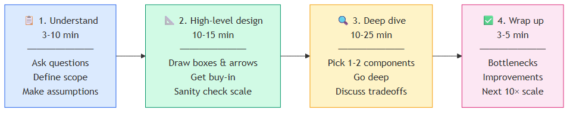
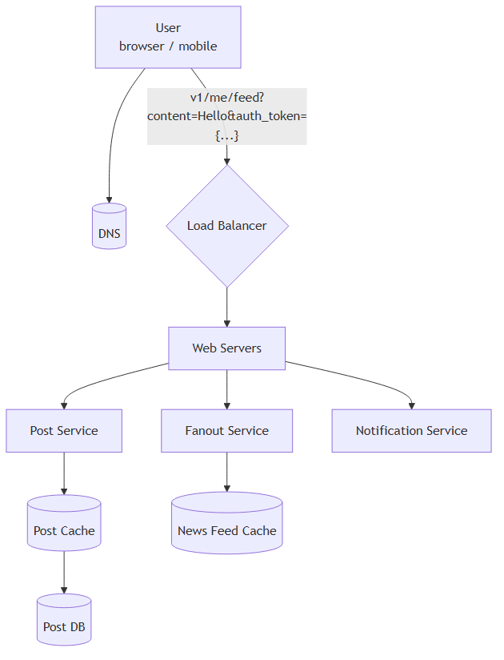
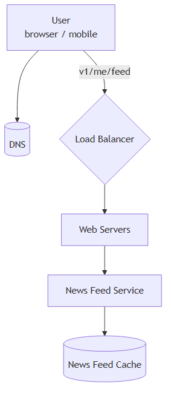
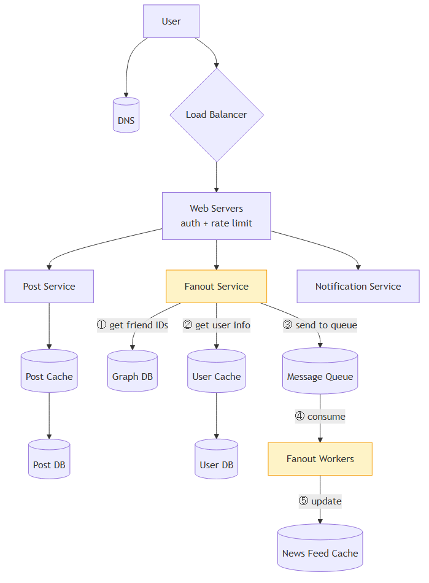
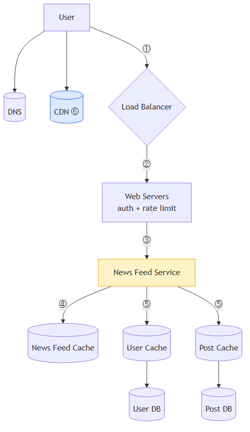
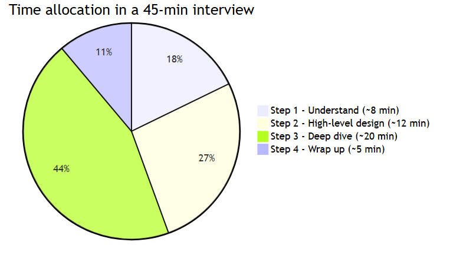

# Chapter 3 — A Framework for System Design Interviews

[⬅ Back to KB index](../../README.md)

> **TL;DR (added)** — System design interviews are not trivia contests. The interviewer wants to see **how you think**, how you collaborate, and how you handle ambiguity — not whether you can rebuild Google in 60 minutes. The recipe is a **4-step framework**: understand → high-level design → deep dive → wrap up. Stick to it, ask questions, think out loud, and avoid over-engineering.

---

## 📖 In this chapter

0. [🎓 For Dummies — empezá por acá](#-for-dummies--empezá-por-acá)
1. [Why system design interviews exist](#why-system-design-interviews-exist)
2. [What interviewers look for](#what-interviewers-look-for)
3. [A 4-step process for effective system design interview](#a-4-step-process-for-effective-system-design-interview)
   - [Step 1 — Understand the problem and establish design scope](#step-1---understand-the-problem-and-establish-design-scope)
   - [Step 2 — Propose high-level design and get buy-in](#step-2---propose-high-level-design-and-get-buy-in)
   - [Step 3 — Design deep dive](#step-3---design-deep-dive)
   - [Step 4 — Wrap up](#step-4---wrap-up)
4. [Time allocation on each step](#time-allocation-on-each-step)
5. [Dos and Don'ts (summary)](#dos-and-donts-summary)
6. [⭐ Amplification — Cheat sheets and templates (added)](#-amplification--cheat-sheets-and-templates-added)

---

## 🎓 For Dummies — empezá por acá

### ¿Qué es una System Design Interview?

Es una entrevista donde te dicen **"diseñá Twitter"** o **"diseñá Uber"** en una hora.

🍕 **Analogía**: imaginate que en una entrevista para chef te dicen *"preparame el menú para un restaurante de 200 personas"*. No esperan que cocines en una hora — quieren ver:
- ¿Hacés preguntas? (¿qué tipo de comida? ¿alérgenos? ¿presupuesto?)
- ¿Pensás organizado? (entradas → principales → postres)
- ¿Sabés del oficio? (para 200 personas necesito 4 cocineros, no 1)

En system design es igual. **No quieren la respuesta — quieren ver cómo pensás.**

### ¿Qué busca el entrevistador?

NO busca:
- ❌ Que sepas la respuesta exacta
- ❌ Que escupas un diseño perfecto en 5 minutos
- ❌ Que uses todas las tecnologías más nuevas (over-engineering = red flag)

SÍ busca:
- ✅ Que **hagas preguntas** antes de diseñar
- ✅ Que **pienses en voz alta** (silent thinking = invisible)
- ✅ Que **colabores** (el entrevistador es tu compañero, no juez)
- ✅ Que **manejes ambigüedad** sin frustrarte
- ✅ Que **identifiques tradeoffs** (no hay diseño perfecto)

### Los 4 pasos (la fórmula a memorizar)

| Paso | Tiempo | Qué hacés |
|------|--------|-----------|
| **1. Entender** | 3-10 min | Hacé preguntas. ¿Qué features? ¿Cuántos usuarios? ¿Mobile o web? |
| **2. Diseño alto nivel** | 10-15 min | Dibujá cajas y flechas. Validá con el entrevistador. |
| **3. Deep dive** | 10-25 min | Profundizá en 1-2 componentes críticos. |
| **4. Wrap up** | 3-5 min | Bottlenecks, mejoras, cómo escalarías a 10×. |

### Las 3 trampas más comunes

⚠️ **Saltar a la respuesta** — Si te preguntan "diseñá YouTube" y arrancás tirando tecnologías sin preguntar nada, perdiste. Calmate. Hacé preguntas primero.

⚠️ **Over-engineering** — Agregar microservicios, message queues, sharding, multi-region a una app que tiene 100 usuarios. Es un red flag gigante. Diseñá para el escenario que te dieron, no para uno hipotético.

⚠️ **Pensar en silencio** — El entrevistador no es vidente. Si pensás callado, no ve nada. Hablá todo el tiempo, aunque dudes.

### Las preguntas mágicas para el Paso 1

Aprendételas y disparalas en cualquier entrevista:

1. ¿Qué features son prioritarios? ¿Cuáles son MVP vs nice-to-have?
2. ¿Cuántos usuarios? ¿Crecimiento esperado en 3, 6, 12 meses?
3. ¿Mobile, web, ambos?
4. ¿Dominan las lecturas o las escrituras? (típicamente 10:1 en favor de lecturas)
5. ¿Tiempo real o se banca delay?
6. ¿Qué stack/servicios existentes puedo usar?
7. ¿Necesitamos auth, rate limiting, multi-region?

### ¿Listo para la versión completa?

Con esto en la cabeza, lo que sigue es ampliar cada paso con detalles. ⬇️

---

## Why system design interviews exist

System design interviews can feel intimidating. They're often phrased vaguely — *"design a well-known product X?"* — and the questions can seem ambiguous and unreasonably broad. That reaction is understandable. After all, how could anyone design a popular product in an hour that has taken hundreds (if not thousands) of engineers to build?

The good news: **no one expects you to.** Real-world system design is extremely complicated. Google search, for example, is deceptively simple on the surface, but the technology underneath is astonishing. So if no one expects you to design a real system in an hour, what is the point of the interview?

The system design interview simulates **real-life problem solving**, where two co-workers collaborate on an ambiguous problem and produce a solution that meets a set of goals. The problem is open-ended, and there is no perfect answer. **The final design matters less than the process you go through.** This format lets you demonstrate your design skill, defend your choices, and respond to feedback constructively.

## What interviewers look for

It helps to flip the perspective and consider what the interviewer is thinking about as the session begins. The interviewer's primary goal is to **accurately assess your abilities**. The worst outcome for the interviewer is an inconclusive evaluation — a session that produced no clear signal one way or the other.

A common misconception is that system design interviews are only about technical design skill. They are much more than that. An effective system design interview reveals strong signals about a candidate's ability to:

- **Collaborate** with another engineer on a fuzzy problem
- **Work under pressure** without freezing up
- **Resolve ambiguity** constructively, by asking and proposing
- **Ask good questions** — many interviewers specifically watch for this

A good interviewer also looks for **red flags**:

- **Over-engineering** — many engineers love design purity and ignore tradeoffs. They are often unaware of the compounding costs of over-engineered systems, and many companies pay a high price for that ignorance. You don't want to come across as someone who builds for purity rather than business outcomes.
- **Narrow-mindedness** — refusing to consider alternative approaches.
- **Stubbornness** — sticking with a bad idea after the interviewer has hinted at problems.

In this chapter, we go over useful tips and introduce a simple, effective framework for solving system design interview problems.

---

## A 4-step process for effective system design interview

Every system design interview is different. A great one is open-ended and has no one-size-fits-all solution. Even so, **there are predictable steps and common ground** to cover in every session.

### Step 1 — Understand the problem and establish design scope

There's a stereotype of the eager student who blurts out the first answer that comes to mind. In school that earns gold stars. **In a system design interview, it does the opposite.**

Giving a fast answer without thinking earns you no bonus points. Answering before you understand the requirements is a major red flag — the interview is not a trivia contest, and there is no single right answer.

So: **don't jump in with a solution. Slow down. Think deeply. Ask questions** to clarify requirements and assumptions. This is extremely important.

As engineers, we love solving hard problems and racing to a final design. But that approach often produces the wrong system. One of the most important engineering skills is **asking the right questions, making the proper assumptions, and gathering the information you need** before building. Don't be afraid to ask.

When you ask, the interviewer will either answer directly or ask you to make an assumption. If they push assumptions back to you, **write them down** on the whiteboard or paper — you'll need them later.

#### What kind of questions to ask?

Ask anything that helps you nail down the actual requirements. Starter list:

- **What specific features are we building?**
- **How many users does the product have?**
- **How fast does the company expect to scale?** What's anticipated in 3, 6, and 12 months?
- **What's the company's technology stack?** What existing services can I leverage to simplify the design?

#### Example — designing a news feed system

If asked to design a news feed, your dialogue might look like this:

> **Candidate**: Is this a mobile app, web app, or both?
> **Interviewer**: Both.
>
> **Candidate**: What are the most important features?
> **Interviewer**: Ability to make a post and see friends' news feed.
>
> **Candidate**: Is the feed sorted in reverse chronological order, or with custom weighting (e.g., posts from close friends ranked higher)?
> **Interviewer**: Keep it simple — reverse chronological order.
>
> **Candidate**: How many friends can a user have?
> **Interviewer**: 5,000.
>
> **Candidate**: What's the traffic volume?
> **Interviewer**: 10 million daily active users (DAU).
>
> **Candidate**: Can the feed contain images, videos, or just text?
> **Interviewer**: Media files — images and videos.

Those are sample questions. The point: **understand the requirements and clarify ambiguities before drawing anything.**

### Step 2 — Propose high-level design and get buy-in

In this step, the goal is to develop a high-level design and **reach agreement with the interviewer** on it. Collaborate during the process — don't go silent.

- Come up with an initial blueprint. **Ask for feedback.** Treat the interviewer as a teammate. Many good interviewers love to get involved.
- Draw box diagrams with key components on the whiteboard or paper. This might include clients (mobile/web), APIs, web servers, data stores, cache, CDN, message queue, etc.
- Do **back-of-the-envelope calculations** to evaluate if your blueprint fits the scale constraints. Think out loud. Communicate with the interviewer about whether back-of-the-envelope is needed before diving in.
- If possible, walk through a few **concrete use cases**. This helps frame the high-level design, and often surfaces edge cases you hadn't considered.
- Should you include API endpoints and database schema here? **It depends.** For "Design Google search engine," that's too low-level. For "Design the backend for a multiplayer poker game," it's fair game. Communicate.

#### Example — high-level design for the news feed

Take "Design a news feed system" as an example. (Detail covered in the *Design A News Feed System* chapter.)

At the high level, the design splits into two flows:

- **Feed publishing** — when a user publishes a post, the data is written to cache/database, and the post propagates into friends' news feeds.
- **News feed building** — the news feed is built by aggregating friends' posts in reverse chronological order.

##### Figure 1 — Feed publishing (high-level)

##### Figure 2 — News feed retrieval (high-level)

### Step 3 — Design deep dive

By this point, you and the interviewer should have:

- Agreed on the overall goals and feature scope
- Sketched out a high-level blueprint
- Gotten feedback from the interviewer on that blueprint
- Identified initial areas to focus on in the deep dive

You'll work together to **identify and prioritize components** in the architecture. Every interview is different. Sometimes the interviewer signals interest in high-level design. For senior candidates, the discussion may shift to system performance characteristics, bottlenecks, and resource estimation. Most often, the interviewer wants you to dig into specific components:

- For a **URL shortener**, the hash function design is interesting.
- For a **chat system**, latency reduction and online/offline status handling are good topics.

**Time management is essential** — it's easy to get carried away on minute details that don't show your abilities. You need to give the interviewer signals. Avoid unnecessary depth: explaining Facebook's EdgeRank algorithm in detail wastes precious time and doesn't prove you can design a scalable system.

#### Example — deep dive on the news feed

We have agreed on the high-level design and the interviewer is satisfied. Now we investigate two key use cases:

1. Feed publishing
2. News feed retrieval

##### Figure 3 — Feed publishing (deep dive, with numbered flow)

##### Figure 4 — News feed retrieval (deep dive, with numbered flow)

### Step 4 — Wrap up

In this final step, the interviewer might ask follow-up questions or give you space to discuss other points. Useful directions:

- The interviewer might want you to **identify system bottlenecks** and discuss potential improvements. Never claim your design is perfect — there's always something to improve. This is a great opportunity to show critical thinking and leave a strong final impression.
- It can be useful to **recap your design**, especially if you proposed multiple solutions. Refreshing the interviewer's memory after a long session helps.
- **Error cases** (server failure, network loss, etc.) are interesting to talk about.
- **Operational issues** are worth mentioning. How do you monitor metrics and error logs? How do you roll the system out?
- **The next scale curve** is also interesting. If your current design supports 1 million users, what changes do you need to support 10 million?
- Propose other **refinements** you would do if you had more time.

---

## Time allocation on each step

System design questions are usually very broad, and 45 minutes or an hour isn't enough to cover the entire design. Time management is essential. The following is a rough guide for distributing your time in a 45-minute session — actual distribution depends on the problem scope and the interviewer's signals.

| Step | Time |
|------|------|
| Step 1 — Understand the problem and establish design scope | **3 – 10 minutes** |
| Step 2 — Propose high-level design and get buy-in | **10 – 15 minutes** |
| Step 3 — Design deep dive | **10 – 25 minutes** |
| Step 4 — Wrap up | **3 – 5 minutes** |

---

## Dos and Don'ts (summary)

### ✅ Dos

- **Always ask for clarification.** Do not assume your assumption is correct.
- **Understand the requirements** of the problem.
- There is neither a right answer nor a best answer. A solution for a young startup differs from one for an established company with millions of users. **Make sure you understand the requirements.**
- **Let the interviewer know what you're thinking.** Communicate constantly.
- **Suggest multiple approaches** when possible.
- Once you agree with the interviewer on the blueprint, **go into details on each component. Design the most critical components first.**
- **Bounce ideas off the interviewer.** A good interviewer works with you as a teammate.
- **Never give up.**

### ❌ Don'ts

- Don't be unprepared for typical interview questions.
- Don't jump into a solution without clarifying the requirements and assumptions.
- Don't go into too much detail on a single component too early. Give the high-level design first, then drill down.
- If you get stuck, don't hesitate to **ask for hints**.
- Communicate. Don't think in silence.
- Don't think your interview is done once you've given the design. **You're not done until the interviewer says you're done.** Ask for feedback early and often.

---

## ⭐ Amplification — Cheat sheets and templates (added)

### 📋 Step 1 — clarifying questions cheat sheet

Memorize this list. Adapt to the question, but always ask at least 5–7 of these:

| Category | Question |
|----------|----------|
| **Scope** | What features are in scope? Which are MVP vs nice-to-have? |
| **Users** | How many DAU / MAU? Expected growth? |
| **Platforms** | Mobile, web, both? Native or responsive? |
| **Geography** | Single region or global? Latency requirements? |
| **Read/write ratio** | Read-heavy, write-heavy, or balanced? |
| **Latency** | Real-time, near-real-time, or batch? |
| **Consistency** | Strong, eventual, or read-your-writes acceptable? |
| **Data size** | Average payload size? Retention period? |
| **Auth** | Required? OAuth, SSO, internal-only? |
| **Rate limiting** | Per user, per IP, per API key? |
| **Existing stack** | What can I leverage (DBs, queues, services)? |
| **SLA** | What uptime target? |

### 🧰 Step 2 — common high-level components

When drawing the box diagram, you'll typically pick from these building blocks:

| Layer | Components |
|-------|------------|
| **Edge** | DNS, CDN, WAF, anycast |
| **Entry** | Load balancer (L4/L7), API gateway |
| **Web tier** | Stateless app servers (auto-scaled) |
| **Caching** | Redis, Memcached, in-memory L1, CDN cache |
| **Data tier** | Relational DB (Postgres, MySQL), NoSQL (Dynamo, Cassandra), object store (S3) |
| **Async / decouple** | Message queue (Kafka, SQS, RabbitMQ), Pub/Sub |
| **Search/analytics** | Elasticsearch, OpenSearch, Druid, Snowflake |
| **Batch / streaming** | Spark, Flink, Kinesis, Dataflow |
| **Observability** | Logs (ELK), metrics (Prometheus), tracing (Jaeger) |
| **Auth** | OAuth provider, identity service, token cache |

### 🎯 Step 3 — common deep-dive topics by problem type

| Problem | Likely deep-dive |
|---------|------------------|
| **URL shortener** | Hash function, collision handling, base62 encoding |
| **Chat system** | WebSocket vs long polling, online/offline state, message ordering |
| **News feed** | Push vs pull fanout, hybrid for celebrities |
| **Search** | Inverted index, ranking, query parsing, autocomplete |
| **Video streaming** | CDN strategy, adaptive bitrate, transcoding pipeline |
| **Ride-sharing** | Geo-spatial index (S2/H3), matching algorithm, ETA service |
| **Notifications** | Fanout, retry/backoff, dedup, delivery receipts |
| **Payments** | Idempotency keys, double-entry ledger, reconciliation |
| **Rate limiter** | Token bucket vs sliding window, distributed counters in Redis |

### 🔁 Step 4 — wrap-up checklist

Before the interview ends, hit these points:

- [ ] **Bottlenecks** — what would break first under 10× load?
- [ ] **Recap** — quick summary if the design has many moving parts
- [ ] **Failure modes** — server down, network partition, data corruption
- [ ] **Monitoring** — how do you know it's working? Key metrics?
- [ ] **Deployment** — rollout strategy, canary, rollback plan
- [ ] **Next scale curve** — what changes from 1M → 10M users?
- [ ] **Things you'd do with more time** — show self-awareness

### ⚠️ Red flags to avoid

| Behavior | Why it's bad |
|----------|--------------|
| Diving into code/schema in the first 5 min | Skipped scope clarification |
| Adding microservices for a 100-user app | Over-engineering signal |
| Defending a bad choice after a hint | Stubborn / coachability concern |
| Going silent for >30 sec | Invisible thinking — interviewer can't grade |
| Saying "this design is perfect" | Lack of self-critique |
| Quoting specific algorithms by name in too much detail | Time-wasting / signaling over substance |
| Ignoring tradeoffs | Doesn't recognize the discipline of engineering |

### 🧪 Practice routine

A solid weekly practice plan:

1. Pick a system (Twitter, Uber, YouTube, WhatsApp, etc.)
2. Set a 45-minute timer
3. Walk through all 4 steps **out loud** (or whiteboard with a friend)
4. Compare your solution to a reference (e.g., this book's later chapters)
5. Note what you missed; iterate next week

Common practice problems to cycle through:

- Design Twitter / Instagram / TikTok feed
- Design WhatsApp / Slack chat
- Design Uber / Lyft / DoorDash
- Design Google Drive / Dropbox
- Design YouTube / Netflix
- Design URL shortener / TinyURL
- Design web crawler
- Design notification system
- Design distributed key-value store
- Design proximity service / Yelp

---

## Reference materials

- Original chapter source: *System Design Interview – An Insider's Guide* (Alex Xu), Chapter 3.
- Companion chapters in this KB: [Ch. 1 — Scaling from Zero to Millions](scaling-from-zero-to-millions.md), [Ch. 2 — Back-of-the-envelope Estimation](back-of-the-envelope-estimation.md).

